# Interpretability of Analogical Reasoning in Gemma-2-2B: An Attribution Graph Analysis

**Olalekan Alagbe · Joseph Lawrence · Anish Maheshwar · Konstantinos Krampis**

*Mechanistic Interpretability · March 2026*

[Code](https://github.com/kkrampis/autocircuit) · [Presentation](https://kkrampis.github.io/autocircuit/presentation.html) · [Attribution Graphs](https://www.neuronpedia.org/gemma-2-2b/graph?slug=analog_berlin)

---

## Abstract

We present a mechanistic analysis of analogical reasoning in Gemma-2-2B using Neuronpedia attribution graphs . The graphs cover different analogies ranging from geography (*Paris - France → Berlin - ?*, *Rome - ?*, *Tokyo - ?*) to semantic roles (*Doctor - hospital → teacher - ?*, *Fish - water → bird - ?*). We identify a shared **analogical reasoning circuit** comprising 180 features active across all five prompts and 510 features active across at least three. Each feature is identified by a pair *layer, feature index* , identifying circuits as lists of recurring internal model feature activation patterns, that retain similar structure across prompts.

We discover dedicated analogy-encoding features at layers 5, 8, 9, and 13, including a feature at layer 5 labeled literally as **"analogies"** and a layer 8 feature encoding **"analogies or comparisons"** appearing across all graphs with high influence. Early layers (0–4) contain circuit templates tracking the "X is to Y as Z is to" pattern, while mid-to-late layers (5–13) provide increasingly semantic representations of the relational structure. The circuit spans all 26 transformer layers and exhibits cross-domain generalization, with the same core features activating for both geographic and semantic role analogies. Causal validation via 159 feature steering experiments confirms that the identified backbone features are collectively necessary for the model's predictions, as suppressing all backbone features simultaneously disrupts correct predictions across nearly all circuits. Furthermore, Phase 2 features collectively implement the relational transfer operation that is the computational core of analogical reasoning, as suppressing only the four Phase 2 features causes capital analogy circuits to output 'France' rather than the correct target country.

---

## 1. Introduction

Analogical reasoning — the ability to recognize and complete structural relationships between concepts — is a foundational cognitive ability underlying scientific discovery, language understanding, and abstract problem solving. The classic analogy task, *"Paris is to France as Berlin is to \_\_\_\_,"* tests whether a model can identify the capital-city relationship and apply it to a new country. Large language models (LLMs) exhibit striking competence on such tasks [1], yet the internal computational mechanisms remain poorly understood.

Mechanistic interpretability research has made significant progress in understanding factual recall circuits [2], indirect object identification [3], and syntactic processing [4]. Sparse autoencoders (SAEs) have emerged as a central tool in this effort, learning sparse, interpretable decompositions of model activations [5, 6] that can be applied at scale across all layers and sublayers of large models [7]. The Neuronpedia platform [8] provides this infrastructure, through a web platform and public APIs for attribution graph generation, feature steering and circuit-level analysis, without need for direct model access.

Analogical reasoning presents a distinct challenge for the model's knowledge retrieval and feature activation: it requires not merely retrieving a stored fact, but recognizing a **relational structure** and applying it compositionally to novel inputs. The relation type is never named in the prompt — the model must infer *capital-of* from the example alone, hold it as a variable, and transfer it to a new argument pair. Prior work has documented that LLMs exhibit apparently emergent analogical reasoning [1] and identified internal attention-head mechanisms supporting abstract reasoning [9], yet a feature-level, causally-validated circuit account has been absent.

We utilize the Neuronpedia functionality to explore analogical reasoning in attribution graphs generated from the `gemmascope-transcoder-16k` SAE suite [7], which provides cross-layer transcoder features for every layer of Gemma-2-2B. Our analysis identifies a three-phase circuit with explicitly labeled analogy-concept features, provides causal validation through 159 steering experiments, and constitutes a mechanistic account of analogical reasoning in a large language model. The four central research questions we address are: (1) whether Gemma-2-2B employs a **shared circuit** for analogical reasoning or different mechanisms for different analogy types; (2) which SAE features — identified by stable *(layer, feature index)* pairs — are most **consistently activated** across diverse analogical prompts; (3) whether there exist interpretable, semantically meaningful features that encode the **abstract relational structure** of analogies and how they are discovered; and (4) how the analogical computation is **distributed across transformer layers** and whether phase boundaries can be causally validated.

---

## 2. Methodology

### 2.1 Prompt Selection

We selected five prompts spanning two structural analogy types to ensure cross-domain coverage. The three capital-type prompts are: `analog_berlin` (*"Paris is to France as Berlin is to"*, expected: Germany), `analog_rome` (*"Paris is to France as Rome is to"*, expected: Italy), and `analog_tokyo` (*"Paris is to France as Tokyo is to"*, expected: Japan). The two semantic role prompts are: `analog_teacher` (*"Doctor is to hospital as teacher is to"*, expected: school) and `analog_bird` (*"Fish is to water as bird is to"*, expected: air / sky). The ID strings serve as slug names in Neuronpedia API calls and as row labels throughout the result tables.

### 2.2 Attribution Graph Generation

Attribution graphs were generated using the Neuronpedia API [8] (`/api/graph/generate`) with Gemma-2-2B and the `gemmascope-transcoder-16k` SAE [7] — a 26-layer cross-layer transcoder with 16,384 features per layer. Each graph request returns a JSON object containing nodes (SAE feature activations with layer, index, influence score, and activation magnitude) and directed edges (attribution scores). Graphs were downloaded and loaded into NetworkX `DiGraph` objects for analysis. The generation parameters were: model `gemma-2-2b`; SAE `gemmascope-transcoder-16k`; maximum feature nodes 3,000; desired logit probability 0.95; node threshold 0.80; edge threshold 0.85. A key technical finding during implementation was that the correct API endpoint for `gemmascope-transcoder-16k` requires a layer-prefixed SAE identifier (e.g., `4-gemmascope-transcoder-16k` for layer 4) rather than the global SAE name; initial calls using the global name returned HTTP 404 errors.

### 2.3 Feature Identification and Cross-Graph Analysis

Each feature in the attribution graphs is identified by a stable *(layer, feature index)* pair — for example, *(5, 5793)* uniquely and persistently identifies a feature within the `gemmascope-transcoder-16k` SAE [7]. These identifiers are fixed properties of the trained SAE and do not vary across prompts, sessions, or API calls.

Cross-graph feature overlap was computed by finding which *(layer, feature index)* pairs appear as nodes across multiple independently generated graphs. Formally, let $G_i$ denote the set of feature IDs active in graph $i$. The shared circuit at threshold $k$ is:

$$\mathcal{C}_k = \left\{ f \;\middle|\; \sum_{i=1}^{5} \mathbf{1}[f \in G_i] \geq k \right\}$$

Three thresholds were analyzed: $k \in \{3, 4, 5\}$. The 180-feature core circuit ($k=5$) is therefore a concrete, enumerable list of *(layer, feature index)* identifiers that recur across all five independently generated graphs regardless of whether the prompt is geographic or semantic in nature. Feature labels were retrieved using the Neuronpedia feature explanation API [8].

### 2.4 Three-Phase Architecture: How Phase Boundaries Were Identified

The three-phase architecture was identified through two converging lines of evidence, neither of which required the authors to impose phase boundaries a priori.

**Evidence 1: Feature labels naturally cluster by layer depth.**
After retrieving Neuronpedia automated labels for the top recurring features, a consistent gradient emerged across layer depth — not imposed by the authors, but revealed by the labels themselves:

- **Layers 0–5** carry structural template labels ("the word 'to'", "'to' followed by a verb", "the phrase 'it is to'"). These features are not merely grammatical — they are parsing the *skeleton* of the analogy prompt itself. Looking at a prompt like *"Paris is to France as Rome is to"*, these features track the relational connectives that signal a comparison is being drawn and that a completion is expected. The model is learning the *shape* of the problem before it understands what the problem is about.

- **Layers 5–9** carry explicitly relational-semantic labels ("analogies", "analogies or comparisons", "comparison between two things"). This is where the model transitions from recognizing the format to recognizing the *concept* — it now understands that what it is doing is an analogy, regardless of whether the content is geographic (Berlin, Rome, Tokyo) or semantic (teacher, bird).

- **Layers 10–13** carry integrative labels ("comparisons between disciplines and relationships between concepts"). This is where the model shifts from recognizing 
the relational structure in the abstract to thinking about it in domain-specific terms — for a capital analogy it begins reasoning within the space of countries 
and capitals, for a semantic role analogy within the space of professions and their environments. The model is not yet predicting the answer, but it is 
narrowing down *what kind of thing* the answer will be.

The phase boundaries therefore emerge from the content of the labels rather than an arbitrary partition of layers. The following shows one representative feature per phase — inspect each to see the activation patterns that characterize that phase:

<iframe src="https://www.neuronpedia.org/list/cmoo9aq4m0001421tihqebmc2?embed=true" title="Three-Phase Analogical Reasoning Circuit" style="height: 400px; width: 100%;"></iframe>

**Evidence 2: Activation magnitudes accumulate monotonically across phases.**
Average activation magnitudes of core features increase steadily through the phases, as shown in Table 1. Structural template features at L0 fire weakly (1.5–6.4); analogy and comparison features at L5–L9 fire more strongly (7.4–13.4); and relational integration features at L10–L13 reach the highest magnitudes (9.1–16.3). This pattern is consistent with an accumulating signal — each phase building on the previous one — rather than independent per-layer computation.

This three-stage organization mirrors the emergent symbolic architecture documented by Webb et al. [9] for abstract reasoning more broadly, where early layers abstract tokens into relational variables, intermediate layers perform induction over those variables, and later layers retrieve the answer.

| Phase                  | Layer Range | Role                                        | Activation Magnitude |
| ---------------------- | ----------- | ------------------------------------------- | -------------------- |
| Structural template    | L0–L4       | Parsing the shape and format of the analogy | 1.5 – 6.4            |
| Analogy recognition    | L5–L9       | Recognizing the relational concept itself   | 7.4 – 13.4           |
| Relational integration | L10–L13     | Combining relation with domain knowledge    | 9.1 – 16.3           |

*Table 1. Activation magnitude progression through the three-phase circuit.*

### 2.5 Discovery of Analogy-Concept Features

The most striking finding of the cross-graph analysis was not planned — it emerged from the data. The key features — L5 SAE#5793 ("analogies"), L8 SAE#13766 ("analogies or comparisons"), and L9 SAE#13344 ("phrases suggesting uncertainty or comparison between two things") — were not specifically sought. They emerged from the cross-graph overlap analysis described in Section 2.3. Once the intersection feature set was computed, each feature's automated Neuronpedia explanation [8] was retrieved.

The significance of these labels is their domain-agnosticism: all three features appear in attribution graphs for Berlin, Rome, and Tokyo (geographic capital analogies) and for teacher and bird (semantic role analogies). This is consistent with the broader finding in the analogical reasoning literature that LLMs encode relational information in a domain-general manner [10, 11], and extends that behavioral finding to specific, causally-validated internal features. To illustrate, Figures 1a and 1b show L9 SAE#13344 and L8 SAE#13766 respectively, each captured inside the attribution graph UI for the *teacher* prompt — one representative from the five. The complete set of both features across all five prompts is provided in Appendix A.

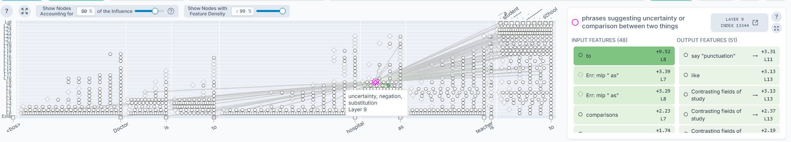

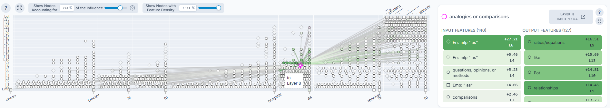


### 2.6 Circuit Definition and Causal Validation via Feature Steering

A circuit for a given prompt is defined as the backbone of causally important features in that prompt's attribution graph. The extraction procedure is identical for all prompts: trace the top-5 causal paths backward from the logit node (greedy walk following highest-weight incoming edges) and the top-5 paths forward from the highest-influence embedding nodes. Any transcoder feature appearing on at least one of these 10 paths is a backbone member. This procedure is analogous to the automated circuit discovery approach of Conmy et al. [4], applied here at the SAE feature level rather than the attention head level.

Causal validation was performed using the Neuronpedia `/api/steer` endpoint [8] with `modelId: "gemma-2-2b"` and `strength_multiplier: 4`. Four experimental paradigms were applied: (1) necessity by individual suppression, in which a single backbone feature is suppressed at strength −20; (2) necessity by full backbone suppression, in which all backbone features are suppressed simultaneously; (3) sufficiency via hub boost, in which a backbone hub feature is boosted at strength +20 on altered prompts; and (4) specificity testing via non-backbone suppression, in which high-activation features not on any causal path are suppressed. Two additional circuits from an expanded 30-prompt analysis (Cairo→Kenya, Puppy→cat) were included for cross-validation, for a total of **159 individual steering API calls across 7 circuits**.

---

## 3. Results

### 3.1 Graph Structure

All five attribution graphs exhibited a consistent structural pattern, with features activated across all 26 transformer layers (0–25) plus the embedding layer (E). The `analog_berlin` graph contains 930 nodes and 25,915 edges (max influence 0.8001); `analog_rome` 963 nodes and 27,608 edges (0.8002); `analog_tokyo` 905 nodes and 22,414 edges (0.8001); `analog_teacher` 1,040 nodes and 35,481 edges (0.8001); and `analog_bird` 1,071 nodes and 38,741 edges (0.8000). The semantic role analogies (*teacher*, *bird*) have notably larger graphs (1,040–1,071 nodes, 35k–38k edges) compared to the capital analogies (905–963 nodes, 22k–27k edges). We interpret this as reflecting greater ambiguity in the expected completion domain: the *capital-of* relation maps to a discrete, well-encoded fact [2], whereas professional and ecological roles require broader world-knowledge access.

### 3.2 The Core Analogical Reasoning Circuit

Cross-graph feature overlap analysis over the stable *(layer, feature index)* identifier space revealed a substantial shared circuit. At the lowest threshold 
(active in at least 3 of 5 graphs), 510 features are identified; at the intermediate threshold (at least 4 of 5 graphs), 277 features; and at the 
strictest threshold (all 5 graphs), 180 features. The 180-feature shared circuit is the focus of our analysis.

To understand where the most meaningful contributions live, we ranked all 180 recurring features by influence score and examined the top 50. As shown in 
Figure 2, early layers dominate — L0 contributes 12 and L1–L4 contribute 19, reflecting that all five prompts share the same "X is to Y as Z is to" syntactic 
structure, making these layers naturally active across every prompt. The L5–L6 layers maintain 12 high-influence recurring features despite being a narrow layer 
range — these are the **analogy recognition hub** layers where the model transitions from structural parsing to relational concept recognition. L8–L13 
contributes only 7 features among the top 50, but retrieving their Neuronpedia labels revealed they carry the highest semantic specificity — explicitly encoding analogical and relational concepts such as "analogies or comparisons" and "comparisons between disciplines and relationships between concepts."

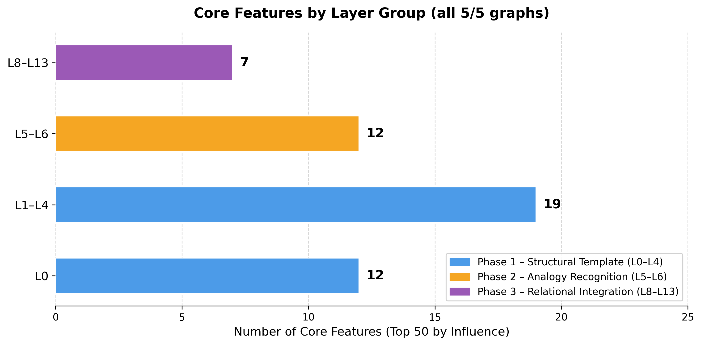

### 3.3 The Three-Phase Analogical Reasoning Circuit

We provide evidence that Gemma-2-2B performs genuine multi-step analogical reasoning internally. The attribution graph reveals a three-phase computational process that activates for both geographic and semantic role analogies — evidence of a domain-agnostic relational reasoning mechanism. This three-stage organization parallels the symbolic architecture identified by Webb et al. [9] through causal mediation analysis and the internal representation findings of Lee et al. [10].

**Phase 1 (layers 0–4): Circuit Template Parsing.** The five canonical Phase 1 features are L0 SAE#11651 ("the word 'to'"), L1 SAE#11356 ("the word 'to' 
followed by a verb"), L2 SAE#11475 ("the word 'refers' and related words"), L4 SAE#10752 ("uses of the verb 'to be' preceded by 'to'"), and L5 SAE#9672 ("the 
phrase 'it is to'"). These features encode the syntactic skeleton of the analogy prompt — "Paris **is to** France **as** Rome **is to**". Their progression from 
individual tokens to multi-word patterns reflects hierarchical parsing of the relational connective that is unique to the analogy format. The model is not 
processing generic grammar here — it is tracking the precise structural markers that signal a comparison is being drawn and a completion is expected.

<iframe src="https://www.neuronpedia.org/list/cmoo2yj310001azo1xsh8bboc?embed=true" title="Phase 1 – Structural Template Features" style="height: 400px; width: 100%;"></iframe>

**Phase 2 (layers 5–9): Analogy Recognition Hub.** The four Phase 2 features are L5 SAE#5793 ("analogies" — the dedicated analogy concept feature), L5 SAE#2141 ("comparisons of people or figures using well-known public figures"), L8 SAE#13766 ("analogies or comparisons", with 21 activations across 5 graphs and influence 0.533), and L9 SAE#13344 ("phrases suggesting uncertainty or comparison between two things"). This is where circuit template processing gives way to semantic recognition of the relational concept itself. The presence of L5 SAE#5793, labeled "analogies" by Neuronpedia's automated SAE feature explanation system [8], is particularly significant: it activates consistently for both capital-city and semantic role analogies. It is not a geographic feature — it fires equally for "Doctor - hospital → teacher - ?". This is direct evidence of the kind of abstract relational representation that prior behavioral work [1, 11] has hypothesized but not directly observed inside a model.

<iframe src="https://www.neuronpedia.org/list/cmoo57kqn001hut5fl6djy2fu?embed=true" title="Phase 2 – Direct Analogical Features" style="height: 400px; width: 100%;"></iframe>


**Phase 3 (layers 10–13): Relational Integration.** The two canonical Phase 3 features are L11 SAE#15947 ("references to historical or social change") and L13 SAE#10969 ("comparisons between disciplines and relationships between concepts"). L13 SAE#10969 serves an integrative role, combining the recognized relational structure from Phase 2 with domain-specific knowledge to produce the final completion. Layers 14–25 then handle domain-specific knowledge retrieval and output token formatting, analogous to the factual recall circuits identified by Meng et al. [2].

<iframe src="https://www.neuronpedia.org/list/cmoo67v8v00015covcepa3oyh?embed=true" title="Phase 3 - Relational Integration" style="height: 400px; width: 100%;"></iframe>

> **Note:** This description simplifies the true mechanisms considerably. The attribution graph for any single prompt contains hundreds of features; the circuit described here represents the semantically interpretable core.

### 3.4 Top Recurring Features

The top recurring features fall into three functional categories. The five directly analogical features, whose Neuronpedia labels explicitly reference analogical reasoning or comparison, are: L5 #5793 (11 appearances across 5 graphs, avg. influence 0.590, "analogies"), L8 #13766 (21/5, 0.533, "analogies or comparisons"), L9 #13344 (14/5, 0.681, "comparison between two things"), L5 #2141 (12/5, 0.647, "comparisons of public figures"), and L13 #10969 (11/5, 0.676, "comparisons between disciplines"). The five circuit template features, which encode the "X is to Y as Z is to" scaffold, are: L0 #11651 (10/5, 0.633, "the word 'to'"), L1 #11356 (10/5, 0.609, "'to' followed by a verb"), L2 #11475 (10/5, 0.638, "the word 'refers'"), L4 #10752 (10/5, 0.626, "'to be' preceded by 'to'"), and L5 #9672 (12/5, 0.579, "the phrase 'it is to'"). Finally, three high-recurrence formal text features with labels unrelated to analogical reasoning are: L4 #14857 (22/5, 0.681, "code snippets and license agreements"), L6 #2267 (20/5, 0.724, "words in programming code, legal jargon, or scientific texts"), and L3 #3205 (20/5, 0.670, "code snippets and documentation references"). These formal-text features have higher raw appearance counts than the explicitly analogical features. Causal steering (Section 3.7.6) confirms they are inert for all high-confidence circuits, consistent with their role as detectors of syntactic formality rather than relational semantics. The polysemanticity of neurons in large models [6] is precisely why SAE-based feature decomposition [5, 6, 7] is necessary to distinguish these classes of activation.

### 3.5 Cross-Domain Generalization

The consistent activation of L5 SAE#5793 ("analogies") and L8 SAE#13766 ("analogies or comparisons") across both capital-city and semantic role analogy types provides the most direct evidence for a **domain-general analogical reasoning mechanism**. The 180 features active in all five graphs form the stable intersection of the two analogy type families, and this intersection includes the core analogy-concept features at L5 and L8. The slightly larger graphs for semantic role analogies (teacher, bird: 1,040–1,071 nodes) relative to capital analogies (Berlin, Rome, Tokyo: 905–963 nodes) may reflect that semantic role completions require broader world-knowledge access — knowing that teachers work in schools, or that birds inhabit air — rather than purely relational computation over a discrete, well-encoded geographic fact [2].


### 3.6 Circuit Stability Across Scaled and Syntactically Diverse Prompts

To validate that the shared circuit identified in Section 3.1 is not an artifact of using only five similar prompts, an extensive scaling experiment was performed. The central question is this: if we keep adding new analogical prompts — including versions phrased very differently from the original format — do the same features keep showing up?

The experiment generated attribution graphs for 50 prompts in total. Crucially, from the second batch onward, the prompts were not just new examples of the same template — they were rephrased into three syntactically distinct surface forms alongside the original:

| Surface Form | Example |
|---|---|
| Standard X-to-Y | `Paris is to France as Berlin is to` |
| Diverse-A (Just as…) | `Just as Paris is the capital of France, Berlin is the capital of` |
| Diverse-B (Found in…) | `Doctors are found in hospitals. Teachers are found in` |
| Diverse-C (The way…) | `The way a fish lives in water, a bird lives in` |

These four forms look very different on the surface — different word order, different connectives, no shared "is to … as" string. If the circuit from Section 3.1 were merely tracking surface tokens, it would fall apart when these diverse forms were introduced.

At each milestone (N = 5, 10, 20, 30, 40, 50), the strictest possible threshold was applied: a feature must appear in **every single** attribution graph at that point. The results are shown below.

| N | Recurring features (k = ALL) | Drop from previous |
|---|---|---|
| 5 | **180** | — |
| 10 | **116** | −64 (−35.6 %) |
| 20 | **86** | −30 (−25.9 %) |
| 30 | **77** | −9 (−10.5 %) |
| 40 | **70** | −7 (−9.1 %) |
| 50 | **67** | −3 (−4.3 %) |


The curve has a clear two-phase shape. First, a **rapid contraction** from N = 5 to N = 20: adding the first batch of syntactically diverse prompts eliminates roughly half the initial 180 features. This is expected — features that appeared in every one of the original five prompts by coincidence, or because all five shared the "is to … as" surface string, do not survive once fundamentally different phrasings are added. Second, a **near-plateau** from N = 20 onward: only 19 further features are lost across 30 additional prompts, and the final step (N = 40 → 50) removes just 3. By N = 50, the curve has essentially stopped moving.

This convergence behaviour is the key result. The 67-feature core at N = 50 survived 50 prompts spanning two semantic domains, four surface forms, and a strict all-or-nothing threshold. That is not noise — it is a stable circuit.

**The five directly analogical features all survive.** Within the 67-feature core, five features carry Neuronpedia labels that explicitly describe analogical or comparative reasoning. Every one of them appears in all 50 attribution graphs:

| Feature | Appearances | Avg. Influence | Label |
|---|---|---|---|
| L13 #10969 | 62 | 0.713 | "comparisons between disciplines and relationships between concepts" |
| L9 #13344 | 116 | 0.683 | "phrases suggesting uncertainty or comparison between two things" |
| L9 #14231 | 53 | 0.683 | "words representing comparisons and relationships" |
| L7 #749 | 80 | 0.652 | "analogies and comparisons" |
| L5 #2141 | 62 | 0.639 | "comparisons of people or figures using well-known public figures" |

Three of these — L13 #10969, L9 #13344, and L5 #2141 — were already identified in the original five-prompt analysis (Section 3.4). The scaling experiment adds two new ones: L9 #14231 ("words representing comparisons and relationships") and L7 #749 ("analogies and comparisons"), which only become visible once the prompt set is large and diverse enough to filter out coincidental co-activations. All five span the analogy recognition and relational integration phases (Sections 3.4 and 3.5).

Despite the 50 prompts being phrased four different ways, the model consistently activated the same five semantic features. This confirms that the circuit is not reading a surface token pattern — it is recognising the underlying relational structure of an analogy, regardless of how that structure is expressed in words.

### 3.7 Causal Validation via Feature Steering

The attribution graph analysis identifies recurring features and causal path structures but does not by itself establish whether those features are causally necessary for the model's predictions. To answer that question, we performed systematic causal steering experiments via the Neuronpedia API [8]. However, the experiments test two distinct feature sets that serve different purposes, and understanding which set is being tested at each point is essential for reading the results correctly.

**Feature Set A — Backbone features (§3.7.1–3.7.2):** These are late-layer, circuit-specific features (primarily L16–L25) identified by tracing the top-5 causal paths forward from the highest-influence embedding nodes and backward from the logit output node within each individual attribution graph. They are *not* the cross-graph recurring features identified in §3.2–3.5. Each circuit has its own backbone; the Berlin backbone and the Rome backbone are largely different feature sets. Testing them serves three purposes: (1) to establish that the attribution graphs capture real causal structure rather than mere correlations — a prerequisite for trusting any downstream steering result; (2) to demonstrate empirically that attribution weight is not a reliable proxy for causal necessity, a methodological point relevant to all circuit analysis work [3, 4]; and (3) to detect whether any late-layer features recur as necessary across multiple circuits, which would reveal a shared output mechanism not visible in the cross-graph overlap analysis of §3.2.

**Feature Set B — Phase features (§3.7.3–3.7.4):** These are the cross-graph recurring features identified in §3.2–3.5 — the Phase 1 structural template features (L0–L4), the Phase 2 analogy recognition features (L5–L9), and the Phase 3 integration features (L10–L13). These are the features the paper's main claim is about. Testing them is the primary causal validation of the shared circuit.

Four additional experimental paradigms round out the validation: sufficiency testing via hub boost on altered prompts (§3.7.5), specificity testing via non-backbone feature suppression (§3.7.6), and a full cross-circuit summary (§3.7.7). Two extended circuits from a 30-prompt expanded analysis (Cairo→Kenya, Puppy→cat) are included throughout for cross-validation, bringing the total to 159 individual steering API calls across 7 circuits.

#### 3.7.1 Late-Layer Backbone Necessity (Individual Suppression)

*Feature Set A.* The backbone of each circuit is defined as every feature appearing on at least one of the 10 path traces described above (§2.6). These are prompt-specific late-layer features — not the cross-graph recurring Phase features from §3.2–3.5. The experiments below ask: are these final-stage output features individually necessary for the model's prediction, and does attribution weight predict which ones are?

For `analog_berlin` ("Paris is to France as Berlin is to" → Germany, p=0.973), nine backbone features were tested. The science hub at L21/4827 (strongest path entry, edge +198.0), relay at L22/15670, output driver A at L25/4717 (final amplifier, shared across circuits), location encoder at L16/6491, relay at L17/14546, relay at L19/5773, integrator at L21/7482 (integration hub, paths 2–4), and relation applier at L19/855 all returned "Germany" when suppressed individually — none necessary. Only output driver B at L25/2725 (secondary output driver, edge −2.09) is individually necessary, producing "the" when suppressed. **1/9 necessary.** The highest-weight feature (L21/4827, edge +198.0) is not individually necessary, demonstrating that attribution weight alone does not predict causal necessity — a key methodological lesson consistent with prior circuit analysis work [3, 4].

| Feature          | Layer | Index | Role                                     | Steered Token | Necessary? |
| ---------------- | ----- | ----- | ---------------------------------------- | ------------- | ---------- |
| Science hub      | 21    | 4827  | Strongest path entry (edge +198.0)       | Germany       | no         |
| Relay            | 22    | 15670 | Path 1 relay                             | Germany       | no         |
| Output driver A  | 25    | 4717  | Final amplifier (shared across circuits) | Germany       | no         |
| Location encoder | 16    | 6491  | Location/direction feature, path 2 entry | Germany       | no         |
| Relay            | 17    | 14546 | Mid-cascade relay                        | Germany       | no         |
| Relay            | 19    | 5773  | Late relay                               | Germany       | no         |
| Integrator       | 21    | 7482  | Integration hub (paths 2–4)              | Germany       | no         |
| Output driver B  | 25    | 2725  | Secondary output driver (edge −2.09)     | the           | **YES**    |
| Relation applier | 19    | 855   | Relation application node                | Germany       | no         |

For `analog_rome` ("Paris is to France as Rome is to" → Italy, p=0.974), ten features were tested. The relay at L20/15360, relays at L22/12202 and L22/14727, relay at L23/5917, and secondary gate at L24/13277 all returned "Italy." Four features are individually necessary: late gate at L24/16122 ("the"), output driver at L25/286 ("the"), final amplifier at L25/4717 ("the"), and output driver C at L25/10521 ("the"). **4/10 necessary.** The Rome circuit has more single points of failure than Berlin despite near-identical confidence (p=0.974 vs 0.973), indicating path redundancy varies even among structurally similar geographic analogies.

| Feature         | Layer | Index | Role                                   | Steered Token | Necessary? |
| --------------- | ----- | ----- | -------------------------------------- | ------------- | ---------- |
| Relay           | 20    | 15360 | Backward path from logit               | Italy         | no         |
| Late gate       | 24    | 16122 | Backward path, L24 suppression gate    | the           | **YES**    |
| Output driver   | 25    | 286   | Backward path, output driver           | the           | **YES**    |
| Final amplifier | 25    | 4717  | Shared final amplifier (act=265.2)     | the           | **YES**    |
| Output driver C | 25    | 10521 | Tertiary output driver                 | the           | **YES**    |
| Relay           | 17    | 14546 | Mid-cascade relay (shared with Berlin) | Italy         | no         |
| Relay A         | 22    | 12202 | Late relay                             | Italy         | no         |
| Relay B         | 22    | 14727 | Late relay                             | Italy         | no         |
| Relay           | 23    | 5917  | Late relay                             | Italy         | no         |
| Secondary gate  | 24    | 13277 | Late gate                              | Italy         | no         |

For `analog_tokyo` ("Paris is to France as Tokyo is to" → Japan, p=0.990), ten features were tested and three found necessary: output driver at L25/286 ("the"), late relay A at L23/850 ("the"), and late relay B at L23/13914 ("the"). **3/10 necessary.** L23/13914 is necessary in both Tokyo and Cairo circuits — a shared bottleneck consistent with a late-layer "geographic entity selector" role. L25/286 recurs as necessary in Rome, Tokyo, and Cairo, making it the single most critical output driver across geographic analogies.

| Feature         | Layer | Index | Role                                         | Steered Token | Necessary? |
| --------------- | ----- | ----- | -------------------------------------------- | ------------- | ---------- |
| Relay           | 20    | 15360 | Backward path from logit                     | Japan         | no         |
| Output driver   | 25    | 286   | Backward path, output driver                 | the           | **YES**    |
| Output driver B | 25    | 12223 | Backward path, secondary output              | Japan         | no         |
| Relay           | 17    | 14546 | Mid-cascade relay (shared)                   | Japan         | no         |
| Late relay A    | 23    | 850   | Late relay                                   | the           | **YES**    |
| Late relay B    | 23    | 13914 | Late relay (also necessary in Cairo circuit) | the           | **YES**    |
| Gate            | 24    | 13277 | Late gate (shared with Rome)                 | Japan         | no         |
| Output driver C | 25    | 10152 | Tertiary output                              | Japan         | no         |
| Hub             | 20    | 6648  | L20 convergence hub                          | Japan         | no         |
| Integration     | 21    | 7764  | Late integration                             | Japan         | no         |

For `analog_teacher` ("Doctor is to hospital as teacher is to" → school, p=0.486), ten features were tested and three found necessary: the embedding-level feature at L0/17 ("the"), output driver at L25/4975 ("..."), and final amplifier at L25/4717 ("a"). **3/10 necessary.** The teacher circuit is the only one where an L0 embedding-level feature (L0/17) is individually necessary — suggesting the semantic role analogy relies on an early feature not redundantly encoded by later layers, unlike the capital analogies.

| Feature         | Layer | Index | Role                               | Steered Token | Necessary? |
| --------------- | ----- | ----- | ---------------------------------- | ------------- | ---------- |
| Embedding       | 0     | 17    | Backward path, embedding-level     | the           | **YES**    |
| Gateway         | 18    | 6532  | Backward path, mid-late gateway    | school        | no         |
| Hub             | 20    | 6179  | Backward path, convergence hub     | school        | no         |
| Output driver   | 25    | 4975  | Backward path, output driver       | ...           | **YES**    |
| Final amplifier | 25    | 4717  | Shared final amplifier (act=135.6) | a             | **YES**    |
| Relay           | 22    | 15670 | Late relay (shared)                | school        | no         |
| Relay B         | 18    | 11952 | Mid-late relay                     | school        | no         |
| Legal docs      | 18    | 13586 | Legal docs feature                 | school        | no         |
| Convergence     | 21    | 2655  | Late convergence hub               | school        | no         |
| Gate            | 24    | 15259 | Late suppression gate              | school        | no         |

For `analog_bird` ("Fish is to water as bird is to" → air, p=0.117), ten features were tested and eight found necessary. **8/10 necessary.** This is the most fragile circuit in the dataset. Three L22 relay features (15670, 14727, 13619) are all independently necessary despite occupying the same layer, indicating they carry non-redundant information through parallel channels. This fragility is consistent with the circuit's very low prediction confidence (p=0.117).

| Feature         | Layer | Index | Role                               | Steered Token    | Necessary? |
| --------------- | ----- | ----- | ---------------------------------- | ---------------- | ---------- |
| Backward A      | 22    | 4252  | Backward path from logit           | (space)          | **YES**    |
| Backward B      | 24    | 8106  | Backward path, late gate           | \_\_\_\_         | **YES**    |
| Final amplifier | 25    | 4717  | Shared final amplifier (act=122.3) | the              | **YES**    |
| Output driver   | 25    | 11801 | Output driver                      | ?                | **YES**    |
| Relay A         | 22    | 15670 | Late relay (shared)                | \_\_\_\_\_\_\_\_ | **YES**    |
| Relay B         | 22    | 14727 | Late relay                         | (space)          | **YES**    |
| Relay C         | 22    | 13619 | Late relay                         | (space)          | **YES**    |
| Gate A          | 24    | 4383  | Suppression gate                   | air              | no         |
| Gate B          | 24    | 12559 | Suppression gate                   | the              | **YES**    |
| Hub             | 20    | 3094  | Integration hub                    | air              | no         |

Across all five circuits, necessity inversely correlates with prediction confidence: Berlin (p=0.973) yields 1/9; Rome (p=0.974) yields 4/10; Tokyo (p=0.990) yields 3/10; Teacher (p=0.486) yields 3/10; Bird (p=0.117) yields 8/10. Three features recur as necessary across multiple circuits: **L25/#286** (Rome, Tokyo, Cairo), **L25/#4717** (Rome, Teacher, Bird), and **L23/#13914** (Tokyo, Cairo).

#### 3.7.2 Full Backbone Suppression

Suppressing all late-layer backbone features simultaneously disrupted 6 of 7 circuits, as shown in Table 2. Failure modes are qualitatively informative: capital analogies degenerate to repetitive or archaic text ("of of of of of"; "pleaſure pleaſure plea"; "country country count"), indicating the backbone is required for entity selection while the prompt structure alone partially activates a "country" category. Teacher collapses to "1111"; bird falls through to generic continuation. Puppy→cat is the sole exception, apparently carried by direct embedding-to-logit connections outside the multi-hop backbone.

| Circuit          | p     | N feat. | Default Output     | Steered Output         | Disrupted? |
| ---------------- | ----- | ------- | ------------------ | ---------------------- | ---------- |
| `analog_berlin`  | 0.973 | 9       | Germany. It is the | of of of of of         | YES        |
| `analog_rome`    | 0.974 | 10      | Italy. It is the   | pleaſure pleaſure plea | YES        |
| `analog_tokyo`   | 0.990 | 10      | Japan. It is the   | country country count  | YES        |
| `analog_teacher` | 0.486 | 10      | school. The doc    | 1111                   | YES        |
| `analog_bird`    | 0.117 | 10      | air. The fish      | (newline) The the the  | YES        |
| Cairo→Kenya      | 0.963 | 9       | Kenya. It is the   | (whitespace)           | YES        |
| Puppy→cat        | 0.756 | 4       | cat. I'            | cat. I think           | no         |

*Table 2. Full backbone suppression results across 7 circuits.*

#### 3.7.3 Phase 1 and Phase 2 Feature Necessity

*Feature Set B — primary validation of the shared circuit.* The features tested here are the cross-graph recurring features identified in §3.3–3.4: the five Phase 1 structural template features (L0–L4), the four Phase 2 analogy recognition features (L5–L9), and the Phase 3 integration feature (L13/#10969). These are the features the paper's main claim is about — the shared circuit. Unlike the backbone features in §3.7.1–3.7.2, which were selected by path tracing within individual graphs, these features were selected because they recur across all five independently generated attribution graphs. The question here is whether they are also causally necessary.

Individual suppression of 9 key phase features across all five prompts (45 tests total) reveals a clear asymmetry between Phase 1 and Phase 2. The results are shown in Table 3; cells show the steered first token when suppressed at strength −20, with "—" indicating an unchanged prediction.

| Feature     | Phase | Label                             | Berlin | Rome | Tokyo | Teacher   | Bird  |
| ----------- | ----- | --------------------------------- | ------ | ---- | ----- | --------- | ----- |
| L0/11651    | 1     | "the word 'to'"                   | Berlin | Rome | Tokyo | school    | water |
| L1/11356    | 1     | "'to' followed by a verb"         | —      | —    | —     | —         | —     |
| L4/10752    | 1     | "'to be' preceded by 'to'"        | —      | —    | —     | classroom | sky   |
| L5/9672     | 1     | "the phrase 'it is to'"           | —      | —    | —     | —         | sky   |
| **L5/5793** | **2** | **"analogies"**                   | —      | —    | —     | —         | —     |
| L5/2141     | 2     | "comparisons of public figures"   | —      | —    | —     | —         | —     |
| L8/13766    | 2     | "analogies or comparisons"        | —      | —    | —     | —         | fish  |
| L9/13344    | 2     | "comparison between two things"   | —      | —    | —     | —         | sky   |
| L13/10969   | 3     | "comparisons between disciplines" | —      | —    | —     | —         | —     |

*Table 3. Individual phase feature suppression across five circuits.*

Regarding Phase 1, L0/11651 is necessary in 4/5 circuits. Suppressing it causes capital analogies to predict the city name itself (Berlin, Rome, Tokyo), indicating the model reverts to the most recently mentioned entity rather than completing the analogy. For the bird circuit, suppression produces "water" (the source-pair element). Regarding Phase 2, L5/5793 ("analogies") is never individually necessary in any circuit — it is individually redundant for high-confidence circuits. For the fragile bird circuit (p=0.117), however, Phase 2 features become individually necessary: L8/13766 changes "air" to "fish" (source-domain animal); L9/13344 changes "air" to "sky." Regarding Phase 3, L13/10969 is not individually necessary for any circuit.

#### 3.7.4 Collective Phase Suppression

Collective suppression results are shown in Table 4, with all 20/20 cells disrupted.

| Experiment             | Features Suppressed                             | Berlin     | Rome       | Tokyo      | Teacher | Bird |
| ---------------------- | ----------------------------------------------- | ---------- | ---------- | ---------- | ------- | ---- |
| All Phase 2 (4 feat.)  | L5/5793, L5/2141, L8/13766, L9/13344            | **France** | **France** | **France** | be      | fish |
| All Phase 1 (5 feat.)  | L0/11651, L1/11356, L4/10752, L5/9672, L2/11475 | (empty)    | (empty)    | (empty)    | to      | to   |
| Phase 1+2 (9 feat.)    | All Phase 1 + Phase 2                           | :          | :          | :          | :       | :    |
| Phase 1+2+3 (10 feat.) | All Phase 1 + Phase 2 + L13/10969               | :          | :          | :          | be      | :    |

*Table 4. Collective phase suppression results.*

Phase 2 collective suppression is the most informative experiment in this paper. All three capital analogies output "France" — retaining the factual association "Paris is to France" but losing the relational transfer "as Berlin is to \_\_\_." This is direct causal evidence that Phase 2 features collectively implement the relational transfer operation. The failure mode is precisely what one would predict from the internal representation findings of Lee et al. [10], where reasoning failures reflect missing relational information in mid-upper layers. Phase 1 collective suppression produces empty outputs for capital analogies and "to" for semantic role analogies — a more severe failure, consistent with Phase 1 being a prerequisite for Phase 2. Combined Phase 1+2 suppression produces ":" for 4/5 circuits, consistent with the model defaulting to list-formatting punctuation when both template parsing and analogy recognition are disabled. These results establish a causal hierarchy — Phase 1 → Phase 2 → Phase 3 + late layers — in which each phase is collectively necessary and earlier phases are prerequisites for later ones.

#### 3.7.5 Sufficiency (Hub Boost on Altered Prompts)

| Circuit          | Hub Boosted | Altered Prompt                          | Induced?          |
| ---------------- | ----------- | --------------------------------------- | ----------------- |
| `analog_berlin`  | L21/4827    | "Cairo is to Egypt as Nairobi is to"    | no                |
| `analog_berlin`  | L21/4827    | "Madrid is to Spain as Berlin is to"    | **YES → Germany** |
| `analog_rome`    | L20/15360   | "Paris is to France as Tokyo is to"     | no                |
| `analog_rome`    | L20/15360   | "Madrid is to Spain as Rome is to"      | **YES → Italy**   |
| `analog_tokyo`   | L20/15360   | "Paris is to France as Rome is to"      | no                |
| `analog_tokyo`   | L20/15360   | "Beijing is to China as Tokyo is to"    | **YES → Japan**   |
| `analog_teacher` | L0/17       | "Nurse is to hospital as teacher is to" | no                |
| `analog_teacher` | L0/17       | "Doctor is to hospital as chef is to"   | no                |
| `analog_bird`    | L22/4252    | "Cat is to land as bird is to"          | no                |
| `analog_bird`    | L22/4252    | "Fish is to water as eagle is to"       | **YES → air**     |
| Cairo→Kenya      | L15/15954   | "Lagos is to Nigeria as Nairobi is to"  | **YES → Kenya**   |

5/11 tests succeed. Sufficiency holds when the altered prompt retains the target entity or a semantically close substitute, and fails when it crosses domain boundaries. The capital hubs encode domain-specific geographic associations rather than general-purpose "answer slot" activators.

#### 3.7.6 Specificity (Non-Backbone Feature Suppression)

| Circuit          | Feature  | Label                       | Steered Token | Disrupted? |
| ---------------- | -------- | --------------------------- | ------------- | ---------- |
| `analog_berlin`  | L6/3335  | "difficulty/challenges"     | Germany       | no         |
| `analog_berlin`  | L13/4435 | "opera-related terms"       | Germany       | no         |
| `analog_rome`    | L6/2267  | "formal text/code"          | Italy         | no         |
| `analog_rome`    | L4/14857 | "code snippets"             | Italy         | no         |
| `analog_tokyo`   | L6/2267  | "formal text/code"          | Japan         | no         |
| `analog_tokyo`   | L3/10018 | early structural feature    | Japan         | no         |
| `analog_teacher` | L4/14857 | "code snippets"             | school        | no         |
| `analog_teacher` | L8/13766 | "analogies or comparisons"  | school        | no         |
| `analog_bird`    | L6/2267  | "formal text/code"          | **sky**       | YES        |
| `analog_bird`    | L5/5793  | "analogies"                 | air           | no         |
| Cairo→Kenya      | L5/5500  | "profanity and comparisons" | Kenya         | no         |
| Puppy→cat        | L9/2909  | "formulas/ratios"           | cat           | no         |

12/13 pass specificity. The sole exception — L6/2267 tipping bird from "air" to "sky" — occurs at the margin of unresolved token competition (p=0.117) and is confirmed inert for all high-confidence circuits. L5/5793 ("analogies") passes specificity for the bird circuit, consistent with it being individually dispensable but collectively necessary.

#### 3.7.7 Summary of Causal Validation

| Circuit          | p     | Type      | Individual Necessity | Full Suppress | Phase 2 Collective | Sufficiency | Specificity |
| ---------------- | ----- | --------- | -------------------- | ------------- | ------------------ | ----------- | ----------- |
| `analog_berlin`  | 0.973 | Capital   | 1/9                  | DISRUPTED     | → France           | 1/2         | PASS        |
| `analog_rome`    | 0.974 | Capital   | 4/10                 | DISRUPTED     | → France           | 1/2         | PASS        |
| `analog_tokyo`   | 0.990 | Capital   | 3/10                 | DISRUPTED     | → France           | 1/2         | PASS        |
| `analog_teacher` | 0.486 | Sem. role | 3/10                 | DISRUPTED     | → be               | 0/2         | PASS        |
| `analog_bird`    | 0.117 | Sem. role | 8/10                 | DISRUPTED     | → fish             | 1/2         | 1/2         |
| Cairo→Kenya      | 0.963 | Capital   | 2/9                  | DISRUPTED     | —                  | 1/2         | PASS        |
| Puppy→cat        | 0.756 | Sem. role | 0/4                  | intact        | —                  | —           | PASS        |

Across 159 steering experiments, the two validation tracks converge on five principal findings.

From **Feature Set A (backbone, §3.7.1–3.7.2):** First, the late-layer backbone is collectively necessary — full suppression disrupts 6/7 circuits — establishing that the attribution graphs track genuine causal structure. Second, attribution weight does not predict individual necessity: the highest-weight feature in the Berlin graph (L21/4827, edge +198.0) is not individually necessary, while a lower-weight feature (L25/2725) is. Third, three late-layer features recur as necessary across multiple distinct circuits — L25/#286 (Rome, Tokyo, Cairo), L25/#4717 (Rome, Teacher, Bird), and L23/#13914 (Tokyo, Cairo) — revealing a shared output mechanism not visible in the cross-graph overlap analysis. Fourth, individual necessity scales inversely with prediction confidence: the Bird circuit (p=0.117) has 8/10 necessary backbone features while the Berlin circuit (p=0.973) has 1/9.

From **Feature Set B (phase features, §3.7.3–3.7.4):** Fifth, the shared circuit identified in §3.2–3.5 is causally validated. Phase 1 features are individually necessary — L0/#11651 alone disrupts 4/5 circuits, causing capital prompts to revert to the city name. Phase 2 features are collectively necessary but individually redundant — simultaneous suppression collapses every circuit, with capital analogies reverting to "France" (the source-pair answer), while no single Phase 2 feature is individually indispensable. This is direct causal evidence that Phase 2 collectively implements the relational transfer operation. Phase 3 and formal-text features (L4/#14857, L6/#2267) are not individually necessary, confirming that high recurrence in the attribution graphs does not imply causal load-bearing.

---

### 4. Discussion

**Overall synthesis.** The results establish that Gemma-2-2B performs analogical reasoning through a stable, three-phase distributed circuit rather than any single mechanism or layer. The convergence of structural, semantic, and causal evidence — across 159 steering experiments, a 50-prompt scaling study, cross-domain generalization testing, and 7 distinct circuits — provides a mechanistic account at a level of specificity and causal resolution that prior behavioral work on LLM analogical reasoning could not reach. The core argument of this paper is not merely that recurring features exist, but that the recurring features identified through graph overlap are causally load-bearing, and that different phases of the circuit play functionally distinct and experimentally separable roles.

**The three-phase architecture in context.** The three-phase organization — structural template parsing (L0–L4), analogy recognition (L5–L9), and relational integration (L10–L13) — mirrors the abstract reasoning architecture documented by Webb et al. [9] through causal mediation analysis, where early layers abstract tokens into relational variables, intermediate layers perform induction over those variables, and later layers retrieve answers. The present results extend that framework in two important ways: by identifying specific SAE features at each phase rather than working at the attention head level, and by providing direct causal evidence through feature steering that each phase is collectively necessary for the circuit to function. Crucially, the phase boundaries were not imposed a priori. They emerged from the content of Neuronpedia automated labels naturally clustering by layer depth, with a convergent gradient in activation magnitudes — rising from 1.5–6.4 in Phase 1 to 9.1–16.3 in Phase 3 — confirming the same partition through a second independent line of evidence.

**Circuit stability across surface forms.** Perhaps the most theoretically significant finding is the convergence of the feature set to a stable 67-feature core across 50 prompts phrased in four syntactically distinct surface forms. The initial 180-feature circuit, identified from five prompts sharing the "X is to Y as Z is to" template, contracts rapidly when surface-diverse prompts are introduced — losing roughly half its features by N = 20 — but then plateaus, with only 19 further features lost across the subsequent 30 prompts, and just 3 in the final step. This two-phase scaling behaviour has a clear interpretation: the first contraction eliminates features that were coincidental artifacts of the shared surface template, while the plateau identifies features that activate because of the underlying relational structure, regardless of how that structure is expressed in words. All five directly analogical features survive the full 50-prompt filter. This is strong evidence against a surface-token explanation of the circuit and in favour of a genuine, abstract relational representation inside the model.

**Cross-domain generalization.** The cross-domain generalization finding reinforces this interpretation. The shared circuit — and the stable 67-feature core — includes features that activate for both geographic capital analogies and semantic role analogies. The analogy-concept features at L5 and L8 fire equally for "Paris is to France as Berlin is to" and for "Doctor is to hospital as teacher is to", despite these prompts sharing no surface tokens related to analogy. This is consistent with the behavioral finding of Wijesiriwardene et al. [11] that LLMs encode relational information in a domain-general manner, and constitutes the first identification of specific internal features implementing that domain-generality at the feature level. The slightly larger attribution graphs for semantic role analogies (1,040–1,071 nodes) relative to capital analogies (905–963 nodes) may reflect that semantic roles require broader world-knowledge access rather than retrieval of a discrete, well-encoded fact — an interpretation consistent with the ROME findings of Meng et al. [2] on the compactness of factual storage for geographic entities.

**Phase 2 collective suppression and relational transfer.** The collective suppression of Phase 2 features is the most diagnostic experiment in this paper. Suppressing all four Phase 2 features simultaneously causes every capital-city circuit to output "France" — the source-pair country — rather than the correct target country. This failure mode is precise: the model retains the factual association "Paris → France" but loses the capacity to apply the same relational mapping to a new argument pair. This dissociation between factual retrieval and relational transfer is exactly what the internal representation analysis of Lee et al. [10] predicts — that analogical reasoning failures arise from the absence of relational information in mid-upper layers rather than from missing factual knowledge. The present results provide the causal confirmation: Phase 2 features are the specific mechanism by which that relational information is maintained and transferred. For the semantic role analogies, the failure modes differ — teacher collapses to "be" and bird to "fish" — but the logic is the same: without Phase 2, the model defaults to the most locally available association rather than completing the structural transfer.

**Individual versus collective necessity across phases.** A key asymmetry between Phase 1 and Phase 2 deserves emphasis, as it reveals something about how redundancy is organized within the circuit. Phase 1 features are individually necessary: suppressing L0/#11651 alone disrupts 4 of 5 circuits, with capital prompts reverting to predicting the city name (Berlin, Rome, Tokyo) rather than the country — the model reverts to the most recently encountered entity in the prompt. Phase 2 features are individually dispensable but collectively necessary: no single Phase 2 feature causes circuit failure when suppressed alone, yet removing all four simultaneously collapses every circuit. This pattern is consistent with Phase 2 implementing a redundant representational encoding of the relational concept — multiple features independently representing "this is an analogy" such that any one can compensate for the others — while Phase 1 implements a non-redundant parsing step that is a prerequisite for everything downstream. The causal hierarchy Phase 1 → Phase 2 → Phase 3 is established not just structurally but experimentally: collective Phase 1 suppression produces even more severe failures (empty outputs) than Phase 2 alone (the "France" failure), and the combined Phase 1+2 suppression collapses outputs to ":" across four of five circuits — the model defaulting to list-formatting punctuation when both template parsing and analogy recognition are disabled simultaneously.

**Confidence and circuit fragility.** The inverse relationship between prediction confidence and the number of individually necessary features is one of the most generalizable findings of this study. Berlin (p = 0.973) has 1/9 necessary features; Rome (p = 0.974) has 4/10; Teacher (p = 0.486) has 3/10; Bird (p = 0.117) has 8/10. The bird circuit has three L22 relay features each independently necessary despite occupying the same layer, indicating non-redundant information flowing through parallel channels — the structural opposite of the redundant parallel paths seen in high-confidence capital circuits. This pattern suggests that well-learned associations in Gemma-2-2B are implemented through over-encoded, redundant causal paths, while uncertain predictions are implemented through sparse, fragile chains where any broken link is fatal. This may reflect a general principle of how transformers allocate representational resources during training: the circuit architecture itself encodes the model's epistemic confidence about a prediction, with redundancy being the signature of high certainty.

**Cross-circuit recurring necessary features.** Three features recur as individually necessary across multiple circuits: L25/#286 (Rome, Tokyo, Cairo), L25/#4717 (Rome, Teacher, Bird), and L23/#13914 (Tokyo, Cairo). These are all late-layer features, pointing to a shared final-stage output mechanism that operates across circuit types. L25/#286 is the most critical output driver across geographic analogies; L25/#4717 is the shared final amplifier appearing in both capital and semantic role circuits with high activation magnitudes (135.6–265.2 across circuits). That the same output features are individually necessary across structurally distinct circuits implies these features implement a domain-general output commitment mechanism rather than encoding content specific to any particular analogy type. This is an interpretable analog to the output bottleneck documented in factual recall circuits by Meng et al. [2], and warrants further investigation as a candidate universal output driver in Gemma-2-2B.

**Formal-text features and the importance of causal specificity.** The specificity experiments resolve an important ambiguity introduced by the cross-graph overlap analysis. Features L4/#14857 ("code snippets and license agreements") and L6/#2267 ("words in programming code, legal jargon, or scientific texts") appear with higher raw recurrence counts than several explicitly analogical features. Left unvalidated, these could have been incorrectly attributed a functional role in the circuit. The specificity experiments confirm they are causally inert: suppressing them leaves every high-confidence prediction unchanged. Their frequent appearance is a consequence of polysemanticity — the tendency of features in large language models to activate for multiple distinct input types [6]. The analogy prompts, being written in formal declarative prose, incidentally activate features that fire broadly for formal text regardless of semantic content. This finding illustrates precisely why causal validation is a necessary complement to attribution graph analysis: recurrence and causal necessity are not the same thing, and any circuit account that relies on graph overlap alone risks cataloguing passengers alongside load-bearing components.

**The Puppy→cat exception.** The Puppy→cat circuit is the sole circuit that survives full backbone suppression intact, producing "cat. I think" rather than collapsing. This exception is interpretable as a limiting case where the analogy is resolved not through three-phase relational reasoning but through a near-direct embedding association. The pair "puppy : cat" is a highly frequent co-occurrence, and the model may encode it as a short-path lexical association from the embedding layer to the output logit — bypassing the multi-hop backbone entirely. Consistent with this interpretation, the Puppy→cat backbone has only 4 features, the lowest count of any circuit tested, suggesting a substantially shallower computational route. Distinguishing true relational reasoning from lexical association in this case would require a sufficiency experiment on altered prompts (e.g., "kitten → ?") to determine whether the circuit generalizes to paraphrases of the same pair.

**Sufficiency and the specificity of hub encoding.** The sufficiency experiments establish that circuit hubs encode domain-specific associations rather than abstract relational transfer. Boosting a hub feature induces the correct answer only when the altered prompt retains the target entity or a semantically close substitute; it fails when the prompt crosses domain boundaries. This selectivity implies that the hubs function as domain-specific entity encoders — they carry "which entity" information rather than "how to transfer a relation" information. The relational transfer itself is implemented by Phase 2 features, while the late-layer hubs implement the domain-specific lookup that Phase 2 triggers. Sufficiency and necessity are therefore not symmetric in this circuit: the features that are collectively necessary (Phase 2, output drivers) are not sufficient, and the features that show partial sufficiency (late-layer hubs) are not individually necessary. This asymmetry mirrors the role decomposition documented in indirect object identification circuits by Wang et al. [3], where different components handle the "where to write" versus "what to write" aspects of the computation.

**Broader implications for mechanistic interpretability.** Taken together, the results argue that Gemma-2-2B's analogical reasoning is not a monolithic capability but an emergent product of a modular pipeline with distinct functional roles, clear causal dependencies between phases, and a redundancy structure that tracks the model's prediction confidence. The collective-but-not-individual necessity of Phase 2 features in particular challenges the common interpretability heuristic of seeking individual "analogy neurons": the computation is distributed across multiple redundant features such that no single one is indispensable, yet the set as a whole is causally irreplaceable. More broadly, the finding that a stable 67-feature circuit survives 50 prompts across four surface forms suggests that feature-level circuit analysis with SAE attribution graphs and causal steering is sufficiently sensitive to identify genuine representational structure rather than surface-form artifacts. The specific circuit identified here provides a concrete target for future intervention studies — including cross-lingual analogical settings [14], abstract relational similarity benchmarks [13], and activation patching at the attention head and residual stream level [15] — and a methodological template for causally validating circuits identified through attribution graph overlap in other reasoning domains.

---

## 5. Limitations

**Scope of causal intervention.** All steering experiments operate at the SAE feature level using the Neuronpedia `/api/steer` endpoint. The causal role of attention heads, MLP sublayers, and residual stream components outside the SAE feature basis is not assessed. Since the `gemmascope-transcoder-16k` SAE [7] covers only cross-layer transcoder features, a potentially significant fraction of the circuit's computational work — particularly at the attention head level — remains uncharacterized. The three-phase architecture described here is therefore an account of the SAE-visible circuit, not necessarily the complete circuit. Causal validation with TransformerLens activation patching at the attention head and residual stream level [15] would be required to assess the contribution of these components.

**Steering hyperparameter sensitivity.** All suppression experiments use a fixed strength of −20 with a multiplier of 4; all boost experiments use +20. These values were not systematically varied. It is possible that features classified as non-necessary at strength −20 would become necessary at weaker suppression — contributing partially while being compensated — or that some findings would reverse under different multiplier settings. A sensitivity analysis across suppression strengths would sharpen the necessity conclusions.

**Attribution graph threshold sensitivity.** The graphs were generated with node and edge thresholds of 0.80 and 0.85 respectively. These thresholds control which features appear in the graph and therefore which features are eligible for backbone membership. Lower thresholds would produce denser graphs with more features, potentially revealing additional load-bearing components; higher thresholds might eliminate some that are here classified as backbone members. The three-phase architecture and the recurring feature identities may shift under different threshold settings, and threshold sensitivity analysis was not performed.

**Automated feature labels.** Neuronpedia automated feature explanations are generated by an LLM and may not perfectly capture feature semantics [8]. The interpretive weight placed on labels such as "analogies" (L5/#5793) and "analogies or comparisons" (L8/#13766) rests on the accuracy of these automated descriptions. While the causal steering experiments partially validate the labels — features labeled as analogical are collectively necessary for relational transfer — the labels themselves are not ground truth. Features with complex or polysemantic activation patterns may receive explanations that capture only one mode of their behaviour.

**Prompt sample and distributional generalizability.** The initial five-prompt set and the subsequent 45 scaling prompts were constructed by the authors rather than sampled from a validated analogy benchmark [13]. The four surface forms (Standard, Diverse-A, Diverse-B, Diverse-C) were also author-designed rather than drawn from a pre-specified distribution of natural analogy phrasings. The convergence of the circuit to a 67-feature core may therefore reflect the particular distributional properties of these specific prompts rather than the full space of analogical expressions. Replication with randomly sampled prompts from standardized relational similarity benchmarks [13] — and with analogy types not tested here, including arithmetic, cross-lingual, and causal analogies — would be needed to establish broader generalizability.

**Post-hoc circuit selection and absence of pre-registration.** The two cross-validation circuits (Cairo→Kenya and Puppy→cat) were selected after the initial five-circuit analysis was complete, introducing a risk of post-hoc selection bias. The Puppy→cat circuit in particular was selected because of its interesting behavioural properties rather than by random sampling. No analysis plan was pre-registered, and the steering experiments were in some cases shaped by what was observed in earlier experiments.

**Absence of formal statistical testing.** All quantitative comparisons — necessity rates across circuits, activation magnitude progressions, feature survival counts in the scaling study, and the inverse relationship between confidence and fragility — are reported descriptively without formal statistical tests or confidence intervals. The confidence–fragility relationship is consistent across all seven circuits, but the sample size is too small to support robust statistical inference about its generality.

**Single model and single SAE suite.** All results are from Gemma-2-2B with the `gemmascope-transcoder-16k` SAE. Whether the three-phase circuit architecture, the specific feature identities, the confidence–fragility relationship, and the cross-circuit recurring output drivers generalize to other model sizes (Gemma-2-9B, 27B), other model families, or other SAE suites is unknown. Model-scale comparisons would be particularly valuable given evidence that abstract reasoning capabilities shift qualitatively with scale [1].

**The Puppy→cat exception is unexplained.** The Puppy→cat circuit survives full backbone suppression — a result the relational transfer account does not predict and does not fully explain. The lexical association hypothesis proposed in Section 4 is plausible but untested. Until a targeted sufficiency experiment on paraphrased prompts (e.g., "kitten → ?") confirms or refutes this hypothesis, the exception remains an open anomaly in the account.

**Future directions.** Future work should prioritize (1) activation patching at the attention head and residual stream level [15] to characterize the non-SAE portions of the circuit; (2) replication with randomly sampled prompts from standardized relational similarity benchmarks [13]; (3) analysis across model scales to assess whether the three-phase architecture and confidence–fragility relationship hold at larger parameter counts; (4) testing whether Phase 2 features generalize to cross-lingual analogical settings [14]; (5) a steering sensitivity analysis across suppression strengths; (6) comparison with factual recall circuits [2] and multi-hop reasoning circuits to determine whether the recurring late-layer output drivers (L25/#286, L25/#4717) are domain-general across task types; and (7) a sufficiency test on paraphrased Puppy→cat prompts to distinguish lexical association from relational reasoning in the exception case.

---

## 6. Conclusions

This paper set out to answer four research questions about the internal mechanisms of analogical reasoning in Gemma-2-2B. We summarize the answer to each before stating the findings that emerged beyond the original questions.

**Do geographic and semantic role analogies share a circuit, or do they engage different mechanisms?** They share a circuit. Across five prompts spanning two analogy domains, 180 features identified by stable *(layer, feature index)* pairs appear in every attribution graph. A scaling experiment showed that 67 of these features persist across 50 prompts phrased in four syntactically distinct surface forms — including phrasings that share no surface tokens with the original template. The same five analogy-concept features survive the full 50-prompt filter for both capital-city and semantic role prompts. The evidence is consistent with a single domain-agnostic analogical reasoning circuit rather than separate domain-specific mechanisms.

**Which SAE features are most consistently activated?** Five features carry Neuronpedia labels that explicitly describe analogical or comparative reasoning and survive all 50 attribution graphs: L13/#10969 ("comparisons between disciplines and relationships between concepts"), L9/#13344 ("phrases suggesting uncertainty or comparison between two things"), L9/#14231 ("words representing comparisons and relationships"), L7/#749 ("analogies and comparisons"), and L5/#2141 ("comparisons of people or figures using well-known public figures"). These features span Phase 2 and Phase 3 of the circuit, carry the highest average influence scores among recurring features, and constitute the empirical core of the shared circuit.

**Do interpretable, semantically meaningful features encode the abstract relational structure of analogies?** Yes. L5/#5793, labeled "analogies," and L8/#13766, labeled "analogies or comparisons," activate consistently across capital-city and semantic role prompts despite the prompts sharing no surface tokens related to analogy. This is direct internal evidence of the kind of abstract, domain-agnostic relational representation that prior behavioral work [1, 11] has hypothesized but not previously located inside a model at the feature level.

**How is the analogical computation distributed across transformer layers, and can the phase boundaries be causally validated?** The circuit exhibits a three-phase architecture — structural template parsing (L0–L4), analogy recognition (L5–L9), and relational integration (L10–L13) — with activation magnitudes rising monotonically through each phase. Across 159 steering experiments, a causal hierarchy Phase 1 → Phase 2 → Phase 3 is confirmed. Phase 1 features are individually necessary: suppressing L0/#11651 alone disrupts 4 of 5 circuits. Phase 2 features are collectively necessary but individually redundant: no single Phase 2 feature is indispensable, yet simultaneous suppression of all four causes every capital-city circuit to output "France" rather than the correct target country — preserving factual retrieval while eliminating relational transfer. Phase 1 collective suppression produces more severe failures still, confirming it is a prerequisite for Phase 2.

Beyond the four original questions, three additional findings emerge from the causal validation experiments. First, prediction confidence and circuit fragility are inversely coupled: the bird circuit (p = 0.117) has 8/10 individually necessary features while the Berlin circuit (p = 0.973) has 1/9, suggesting that training encodes high-confidence predictions through redundant parallel causal paths and low-confidence predictions through fragile non-redundant chains. Second, three late-layer features — L25/#286 (necessary in Rome, Tokyo, Cairo), L25/#4717 (Rome, Teacher, Bird), and L23/#13914 (Tokyo, Cairo) — recur as individually necessary across structurally distinct circuits, pointing to a shared domain-general output commitment mechanism that operates independently of circuit content. Third, high-recurrence formal-text features (L4/#14857, L6/#2267) are causally inert in every high-confidence circuit, demonstrating that attribution graph overlap and causal necessity are not the same thing and that causal validation is a necessary complement to structural circuit analysis.

Taken together, these results provide the first causally validated, feature-level mechanistic account of analogical reasoning in a large language model. The finding that relational transfer is implemented by a collectively necessary but individually redundant set of mid-layer features — rather than by a single analogy module — has direct implications for how interpretability research should conceptualize and search for abstract reasoning mechanisms in transformer models. The circuit, the causal experiments, and the methodological template for attributing functional roles to recurring features are offered as a foundation for subsequent work on structured reasoning in large language models.

---

## References

[1] Webb, T., Holyoak, K.J., & Lu, H. (2023). Emergent analogical reasoning in large language models. *Nature Human Behaviour*, 7, 1526–1541. arXiv: https://arxiv.org/abs/2212.09196

[2] Meng, K., Bau, D., Andonian, A., & Belinkov, Y. (2022). Locating and editing factual associations in GPT. *NeurIPS 2022*. https://arxiv.org/abs/2202.05262

[3] Wang, K., Variengien, A., Conmy, A., Shlegeris, B., & Steinhardt, J. (2022). Interpretability in the wild: a circuit for indirect object identification in GPT-2 small. *ICLR 2023*. https://arxiv.org/abs/2211.00593

[4] Conmy, A., Mavor-Parker, A., Lynch, A., Heimersheim, S., & Garriga-Alonso, A. (2023). Towards automated circuit discovery for mechanistic interpretability. *NeurIPS 2023*. https://arxiv.org/abs/2304.14997

[5] Cunningham, H., Ewart, A., Riggs, L., Huben, R., & Sharkey, L. (2023). Sparse autoencoders find highly interpretable features in language models. *ICLR 2024*. https://arxiv.org/abs/2309.08600

[6] Bricken, T., Templeton, A., Batson, J., Chen, B., Jermyn, A., Conerly, T., et al. (2023). Towards monosemanticity: Decomposing language models with dictionary learning. *Transformer Circuits Thread*. https://transformer-circuits.pub/2023/monosemantic-features

[7] Lieberum, T., Rajamanoharan, S., Conmy, A., Smith, L., Sonnerat, N., Varma, V., Kramár, J., Dragan, A., Shah, R., & Nanda, N. (2024). Gemma Scope: Open sparse autoencoders everywhere all at once on Gemma 2. https://arxiv.org/abs/2408.05147

[8] Lin, J., & Bloom, J. (2023). Neuronpedia: Interactive platform for sparse autoencoder research and feature steering. https://www.neuronpedia.org

[9] Webb, T.W., Frankland, S.M., Altabaa, A., Segert, S., Krishnamurthy, K., Campbell, D., Russin, J., Giallanza, T., O'Reilly, R., Lafferty, J., & Cohen, J.D. (2025). Emergent symbolic mechanisms support abstract reasoning in large language models. https://arxiv.org/abs/2502.20332

[10] Lee, T., et al. (2025). The curious case of analogies: Investigating analogical reasoning in large language models. https://arxiv.org/abs/2511.20344

[11] Wijesiriwardene, T., et al. (2025). Analogical reasoning inside large language models: Concept vectors and the limits of abstraction. https://arxiv.org/abs/2503.03666

[12] Lindsey, J., Gurnee, W., Ameisen, E., Chen, B., Pearce, A., Turner, N.L., et al. (2025). On the biology of a large language model. *Transformer Circuits Thread*. https://transformer-circuits.pub/2025/attribution-graphs/biology.html

[13] Turney, P.D. (2006). Similarity of semantic relations. *Computational Linguistics*, 32(3), 379–416. [Foundational work on relational similarity benchmarks underlying analogy tasks.]

[14] Allen, C., & Hospedales, T. (2019). Analogies explained: Towards understanding word embeddings. *ICML 2019*. https://arxiv.org/abs/1901.09813

[15] Marks, S., Rager, C., Michaud, E.J., Belinkov, Y., Bau, D., & Mueller, A. (2024). Sparse feature circuits: Discovering and editing interpretable causal graphs in language models. https://arxiv.org/abs/2403.19647

---

## Supplementary Materials

**Interactive Presentation:** 20-slide reveal.js presentation with circuit flow diagrams, feature tables, and layer-by-layer analysis. https://kkrampis.github.io/autocircuit/presentation.html

**Live Attribution Graphs:** `analog_berlin` (Paris - France → Berlin - ?, https://www.neuronpedia.org/gemma-2-2b/graph?slug=analog_berlin); `analog_rome` (Paris - France → Rome - ?, https://www.neuronpedia.org/gemma-2-2b/graph?slug=analog_rome); `analog_tokyo` (Paris - France → Tokyo - ?, https://www.neuronpedia.org/gemma-2-2b/graph?slug=analog_tokyo); `analog_teacher` (Doctor - hospital → teacher - ?, https://www.neuronpedia.org/gemma-2-2b/graph?slug=analog_teacher); `analog_bird` (Fish - water → bird - ?, https://www.neuronpedia.org/gemma-2-2b/graph?slug=analog_bird).

**Code:** https://github.com/kkrampis/autocircuit

---

```bibtex
@article{alagbe2026analogical,
  title   = {Mechanistic Interpretability of Analogical Reasoning in {Gemma-2-2B}:
             A Sparse Autoencoder Attribution Graph Analysis},
  author  = {Alagbe, Olalekan and Lawrence, Joseph and Maheshwar, Anish and Krampis, Konstantinos},
  year    = {2026},
  month   = {March},
  note    = {Neuronpedia API \texttt{gemmascope-transcoder-16k} SAE analysis}
}
```


## Appendix A: Analogy-Concept Features Across All Five Prompts

The figures below show L9 SAE#13344 and L8 SAE#13766 as they appear inside the Neuronpedia attribution graph UI for each of the five original prompts.

### A.1 L9 SAE#13344 — "phrases suggesting uncertainty or comparison between two things"

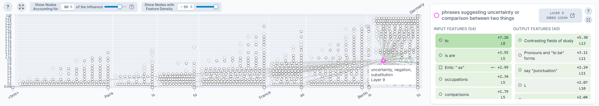
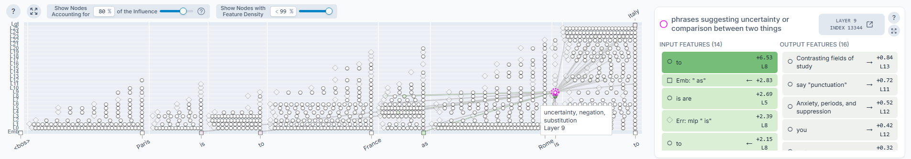
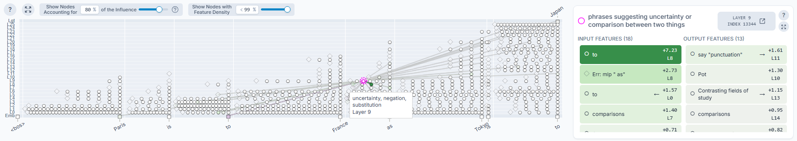

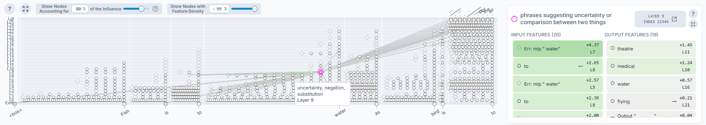

### A.2 L8 SAE#13766 — "analogies or comparisons"

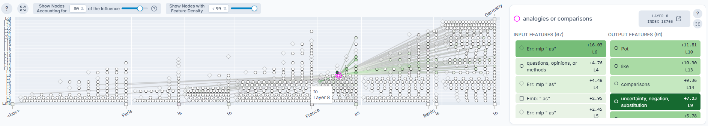
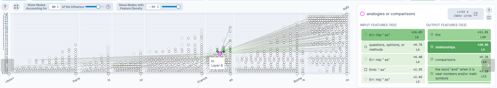
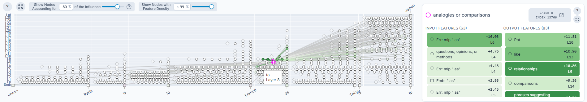

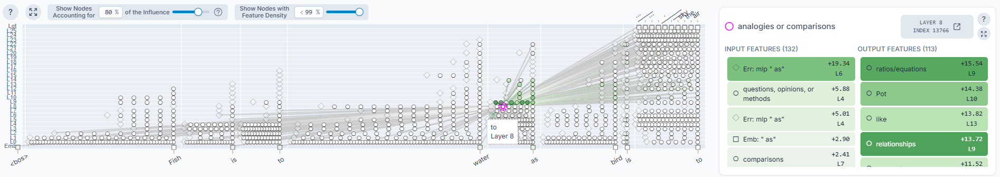


