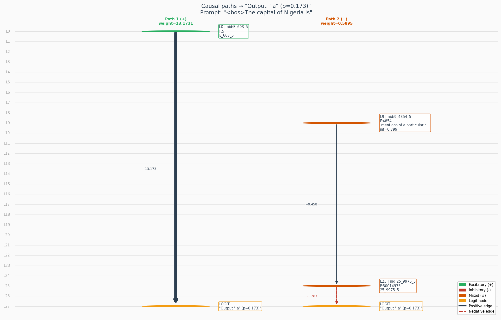
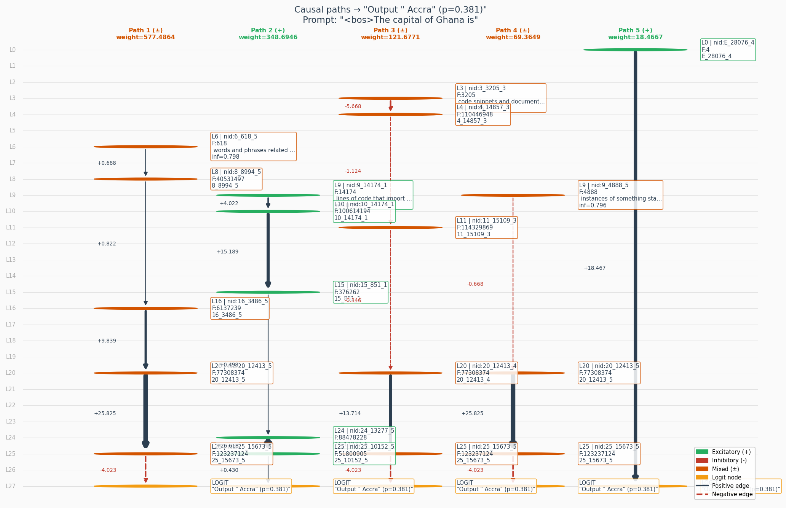
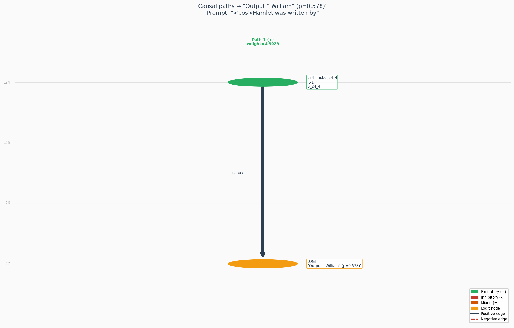
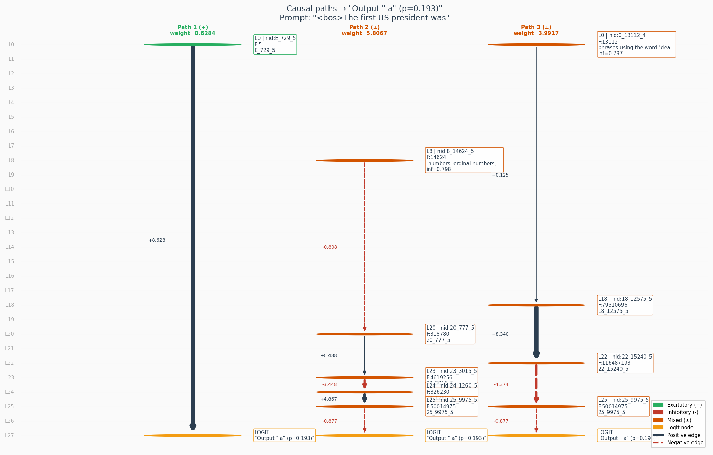

# Factual Recall Circuit Analysis in Gemma-2-2B

## Abstract

We report a mechanistic interpretability analysis of factual recall reasoning in Gemma-2-2B, using Neuronpedia attribution graphs. We generated 10 attribution graphs across prompts spanning geography (Nigeria, Ghana, Nile, Everest), history (Napoleon, US president), science (water composition, cell biology, relativity), and literature (Hamlet), and identified 222 recurring circuit components at a 50% co-occurrence threshold (features present in ≥5/10 graphs). The top recurring feature (feature 110446948, layer 4, node_id=4_14857_2, appearances=34/10) is labelled "code snippets and license agreements", indicating that the shared factual-recall circuit is dominated by general-register and syntactic features rather than domain-specific knowledge encoders. The most domain-specific features appear in late layers (L16–L25): "cell biology" (feature=1578, L16), "rivers and watersheds" (feature at L19), "geographic locations, especially islands" (L18, act=51.48 for Napoleon), and "US president/Obama/Trump" (feature=318780, L20). Prediction confidence varied dramatically across prompts: water/oxygen achieved 97.8% confidence (most over-trained fact), while Nigeria, US president, and Mount Everest fell below 30%. Dominant causal paths were predominantly direct (embedding→logit) or short multi-hop chains through late layers. The inhibitory path in the Napoleon/Elba circuit (L6→L25→logit) provides the clearest example of token competition suppression. We find that factual recall circuit confidence correlates with the frequency and specificity of the fact in training data, and that the recurring structural circuit is largely domain-agnostic, with domain knowledge encoded in long-tail late-layer features that activate only when the specific fact is highly represented in training.

---

## Introduction

This paper presents a mechanistic interpretability analysis of how Gemma-2-2B implements factual recall reasoning. Using attribution graph analysis via the Neuronpedia platform, we generated and analysed 10 attribution graphs, one per factual recall prompt, and identified the shared circuit components that recur across this category of reasoning.

Factual recall prompts require the model to complete statements whose answers are well-defined facts stored in world knowledge (e.g., "The capital of Nigeria is", "Hamlet was written by"). Unlike analogical or linguistic reasoning, factual recall places maximum demand on entity and fact retrieval: the model must identify a specific named entity or categorical fact from a broad search space with minimal structural cues in the prompt itself.

Our analysis proceeds in three stages: (1) cross-graph pattern mining to identify recurring circuit components shared across all 10 prompts; (2) edge-level neighbourhood analysis of the top recurring features to understand their wiring; and (3) per-prompt causal path tracing to reconstruct the exact computational pathway from input to output for each prompt.

---

## Methods

**Model:** Gemma-2-2B  
**SAE:** gemmascope-transcoder-16k  
**Prompts:** 10 factual recall prompts spanning geography, history, science, and literature  
**Graph generation:** Neuronpedia attribution graph API with maxFeatureNodes=3000, desiredLogitProb=0.95, nodeThreshold=0.8, edgeThreshold=0.85  
**Cross-graph threshold:** 50% (feature must appear in ≥5/10 graphs to qualify as recurring)  
**Per-prompt analysis:** top-40 nodes labeled via Neuronpedia SAE feature API, causal paths traced via greedy edge-weight walk to logit node (max 5 paths, max 6 hops, min edge weight 0.05)

---

## Results

### Recurring Features (50% threshold — appears in ≥5/10 graphs)

**Total recurring features found: 222**  
**Top-15 recurring features by (appearances, avg_influence):**

| Layer | Feature | Node_id | Appearances | Avg Influence | Label |
|-------|---------|---------|-------------|---------------|-------|
| 4 | 110446948 | 4_14857_2 | 34/10 | 0.6152 | code snippets and license agreements |
| 6 | 2586668 | 6_2267_4 | 32/10 | 0.648 | words that appear in programming code, legal jargon, or scientific texts |
| 3 | 5150441 | 3_3205_2 | 24/10 | 0.639 | code snippets and documentation references, possibly related to web development |
| 7 | 4828270 | 7_3099_2 | 22/10 | 0.7077 | a variety of reference codes, abbreviations, and identifiers from different fields |
| 0 | 40747877 | 0_9026_2 | 21/10 | 0.5454 | technical documents or data, including numbers, units, and references to figures or tables |
| 4 | 47653198 | 4_9757_1 | 20/10 | 0.6173 | various acronyms, IDs, and symbols, possibly related to scientific data |
| 0 | 2239785 | 0_2115_2 | 20/10 | 0.5995 | data reported as a percentage inside brackets, especially in a laboratory or medical context, and also recognizes countries |
| 5 | 2584395 | 5_2267_5 | 19/10 | 0.6766 | law related terminology and references to specific cases or legal entities |
| 0 | 11637899 | 0_4823_1 | 19/10 | 0.6524 | the word "part" followed by prepositions or words related to sections or components |
| 0 | 74438300 | 0_12200_1 | 19/10 | 0.6433 | a variety of specific nouns |
| 0 | 1708475 | 0_1847_2 | 19/10 | 0.5713 | scientific terms and experimental details related to biological and chemical research |
| 0 | 70051365 | 0_11835_2 | 18/10 | 0.6317 | terms used in software code such as "assembly", "using", "namespace", and "license" |
| 1 | 99962728 | 1_14137_1 | 16/10 | 0.5813 | words or phrases that appear in legal or technical documents |
| 0 | 2399144 | 0_2189_2 | 15/10 | 0.7105 | technical writing related to scientific studies |
| 0 | 33329529 | 0_8163_2 | 14/10 | 0.6902 | words and phrases related to societal and political issues |

---

### Edge Neighbourhood Analysis (Step 5a)

#### Top-1 Recurring Feature: node_id=4_14857_2 (L4, feature=110446948, appearances=34/10, avg_inf=0.6152)
*Label: "code snippets and license agreements"*

**Incoming edges (top 10) — what feeds INTO this feature:**

| Source node_id | Layer | Feature | Edge weight |
|----------------|-------|---------|-------------|
| E_2_0 | E (embed) | 0 | -20.1478 |
| E_651_1 | E (embed) | 1 | +10.895 |
| 3_3205_2 | 3 | 5150441 | -9.6127 |
| 2_2051_2 | 2 | 2110482 | -3.8559 |
| E_6037_2 | E (embed) | 2 | -3.7549 |
| 0_3_2 | 0 | -1 | +3.4006 |
| 0_1961_2 | 0 | 1925702 | +2.8667 |
| 2_7173_2 | 2 | 25751073 | +2.1349 |
| 3_13984_2 | 3 | 97839062 | +2.0001 |
| 0_1903_1 | 0 | 1813559 | +1.9273 |

**Outgoing edges (top 10) — what this feature feeds INTO:**

| Target node_id | Layer | Feature | Edge weight |
|----------------|-------|---------|-------------|
| 7_3099_2 | 7 | 4828270 | -12.2255 |
| 6_9865_2 | 6 | 48733121 | -9.7844 |
| 15_4494_2 | 15 | 10172289 | -1.0686 |
| 6_4662_2 | 6 | 10902108 | -1.015 |
| 16_7171_2 | 16 | 25837249 | +0.8759 |
| 7_691_2 | 7 | 244642 | -0.6167 |
| 5_3333_2 | 5 | 5576124 | +0.5835 |
| 19_9215_5 | 19 | 42647210 | -0.272 |
| 18_15734_5 | 18 | 124086362 | -0.2175 |
| 24_13277_5 | 24 | 88478228 | -0.1741 |

**Key observation:** Feature 4_14857_2 receives the strongest inputs from embedding-layer nodes (E_2_0, E_651_1) and from the Layer 3 feature 3_3205_2 (also a top-3 recurring feature). It sends its largest outputs to Layer 7 (feature 4828270, node 7_3099_2 — the #4 recurring feature) and Layer 6 (feature 48733121), both with strong negative (inhibitory) weights. This suggests it acts as a cross-layer inhibitory gating node coordinating between embedding space and mid-layer features.

#### Top-2 Recurring Feature: node_id=6_2267_4 (L6, feature=2586668, appearances=32/10, avg_inf=0.648)
*Label: "words that appear in programming code, legal jargon, or scientific texts"*

**Incoming edges (top 10):**

| Source node_id | Layer | Feature | Edge weight |
|----------------|-------|---------|-------------|
| E_2_0 | E (embed) | 0 | -5.9484 |
| 4_14857_4 | 4 | 110446948 | -2.6729 |
| E_576_3 | E (embed) | 3 | -1.8265 |
| E_15922_4 | E (embed) | 4 | +1.7562 |
| E_6037_2 | E (embed) | 2 | -1.6645 |
| E_651_1 | E (embed) | 1 | +1.2052 |
| 3_3205_4 | 3 | 5150441 | -1.1261 |
| 0_15636_4 | 0 | 122265702 | +1.1108 |
| 0_5_4 | 0 | -1 | +1.0502 |
| 0_3_4 | 0 | -1 | +0.6806 |

**Outgoing edges (top 10):**

| Target node_id | Layer | Feature | Edge weight |
|----------------|-------|---------|-------------|
| 8_3099_4 | 8 | 4831377 | -11.34 |
| 11_3544_4 | 11 | 6324334 | -11.1059 |
| 7_3099_4 | 7 | 4828270 | -11.0382 |
| 14_4649_4 | 14 | 10878765 | -3.2724 |
| 9_11399_4 | 9 | 65088335 | +1.5289 |
| 19_2188_4 | 19 | 2438716 | +1.3991 |
| 8_14523_4 | 8 | 105596769 | +1.0717 |
| 8_9091_4 | 8 | 41409541 | +0.9368 |
| 8_7435_4 | 8 | 27710281 | +0.9039 |
| 16_7449_4 | 16 | 27874294 | +0.8525 |

**Key observation:** Feature 6_2267_4 is a high-fanout node (in_degree=52, out_degree=50). Its strongest outputs are all inhibitory (−11.34, −11.10, −11.04) directed at L8, L11, and L7 features. The L7 target (feature 4828270) is also the #4 recurring feature. This feature acts as a strong inhibitory bottleneck: it receives mixed signals from embeddings and L3-L4, then sends massive inhibitory signals into the middle-layer processing chain.

---

### Hub Layer Analysis (Step 5b)

**Hub layer: Layer 0** (appears 7 times in top-15 recurring features; 211 nodes in representative graph)

Layer 0 dominates the recurring features table in terms of raw feature count (7 of the top 15 entries). In the representative graph (Nigeria), Layer 0 contains 211 nodes — the largest layer in the graph.

Top-20 Layer 0 nodes by influence (Nigeria graph):

| node_id | Feature | Influence | Activation |
|---------|---------|-----------|------------|
| 0_15038_4 | 113093279 | 0.7995 | 3.0159 |
| 0_5319_2 | 14153859 | 0.7988 | 3.3592 |
| 0_12215_5 | 74621435 | 0.7982 | 2.3931 |
| 0_13763_2 | 94730729 | 0.7974 | 1.7245 |
| 0_9773_2 | 47770424 | 0.7963 | 1.9935 |
| 0_2146_1 | 2305877 | 0.7961 | 2.365 |
| 0_13943_2 | 97224539 | 0.7952 | 1.8181 |
| 0_12459_1 | 77632029 | 0.795 | 2.3991 |
| 0_8163_2 | 33329529 | 0.7944 | 2.0843 |
| 0_12955_2 | 83935445 | 0.7929 | 1.6285 |
| 0_15415_2 | 118834235 | 0.7926 | 1.4628 |
| 0_9773_1 | 47770424 | 0.7913 | 2.9707 |
| 0_8047_5 | 32389175 | 0.7903 | 2.3207 |
| 0_11629_2 | 67634264 | 0.7892 | 2.8854 |
| 0_3718_3 | 6917339 | 0.7885 | 2.3827 |
| 0_52_3 | 1430 | 0.7874 | 2.0893 |
| 0_9147_1 | 41847525 | 0.7865 | 2.4207 |
| 0_15571_2 | 121251377 | 0.7847 | 2.4311 |
| 0_8163_4 | 33329529 | 0.7819 | 2.7023 |
| 0_4711_2 | 11103827 | 0.7801 | 1.7846 |

**Interpretation:** Layer 0 nodes show uniformly high influence scores (0.78–0.80), consistent activation levels (1.4–3.4), and serve as the broadest input recognition layer — detecting token-level surface features across all token positions (ctx_idx varies from 1 to 5). The diversity of features at L0 reflects that factual recall prompts activate a wide range of surface-form detectors before the circuit narrows to domain-specific processing in middle layers.

---

### Per-prompt Circuit Interpretations

---

### Prompt: "<bos>The capital of Nigeria is"

**Predicted token:** `Output " a" (p=0.173)` (prob=0.1731)

**Token competition:**

| Rank | Token | Logit score | Features voting |
|------|-------|-------------|-----------------|

**Circuit walkthrough:**

*Early layers — input recognition*

| Layer | Feature | Node_id | Influence | Activation | Feature label |
|-------|---------|---------|-----------|------------|---------------|
| 4 | 9467 | 4_9467_5 | 0.8001 | 2.0753 |  words associated with government, law, and crime |
| 0 | 15038 | 0_15038_4 | 0.7995 | 3.0159 | locations and organizations |
| 1 | 7200 | 1_7200_2 | 0.7992 | 1.8948 |  mentions of geographic locations in the UK. |
| 0 | 5319 | 0_5319_2 | 0.7988 | 3.3592 |  many different words associated with completely different topics, spanning games, science, sports, visual media, food and community |
| 0 | 12215 | 0_12215_5 | 0.7982 | 2.3931 | the word "is" |
| 4 | 4104 | 4_4104_1 | 0.798 | 6.9604 |  words related to study designs, results, and published documents |
| 3 | 3488 | 3_3488_3 | 0.7976 | 3.3693 | words or phrases about locations or things being part of other things, especially about clinics or medical analysis |
| 0 | 13763 | 0_13763_2 | 0.7974 | 1.7245 |  the phrase ‘country of origin’ |
| 7 | 3099 | 7_3099_5 | 0.7969 | 5.8022 |  a variety of reference codes, abbreviations, and identifiers from different fields. |
| 1 | 11207 | 1_11207_1 | 0.7965 | 3.315 |  code and documented code |
| 0 | 9773 | 0_9773_2 | 0.7963 | 1.9935 |  references to dates and times |
| 0 | 2146 | 0_2146_1 | 0.7961 | 2.365 | the word survivor (or a variant) and sometimes a preceding article of 'the'. |
| 6 | 9577 | 6_9577_4 | 0.7957 | 3.2699 |  words and phrases related to nationality and patriotism |
| 4 | 5390 | 4_5390_5 | 0.7954 | 2.3771 |  phrases containing auxiliary verbs "is," "are," "was". "be" and action verbs often including "to" and "by". |
| 0 | 13943 | 0_13943_2 | 0.7952 | 1.8181 |  the word "recent" and words appearing near to it |
| 0 | 12459 | 0_12459_1 | 0.795 | 2.3991 | the word "damage" and sometimes other words near "damage" or related to negative experiences |
| 6 | 3182 | 6_3182_5 | 0.7948 | 2.7502 |  mentions of cities or regions |
| 6 | 16070 | 6_16070_5 | 0.7946 | 3.6775 | phrases related to formulas or derivations. |
| 0 | 8163 | 0_8163_2 | 0.7944 | 2.0843 |  words and phrases related to societal and political issues |
| 1 | 1251 | 1_1251_1 | 0.7942 | 3.0339 |  instances of the word "The" |
| 6 | 5695 | 6_5695_4 | 0.7937 | 2.8771 |  mentions of specific corporate entities and product or character names from particular fictional universes, in addition to terms related to marine biology |
| 3 | 11806 | 3_11806_5 | 0.7935 | 2.3508 |  words/phrases related to story telling |
| 2 | 14967 | 2_14967_5 | 0.7931 | 2.3753 |  words and phrases related to governmental leadership and elections. |
| 0 | 12955 | 0_12955_2 | 0.7929 | 1.6285 |  vague positive terms and terms related to rules and laws |
| 0 | 15415 | 0_15415_2 | 0.7926 | 1.4628 | mentions of opinions, facts or reasons |
| 3 | 10202 | 3_10202_3 | 0.7924 | 3.8018 |  terms related to code and US immigration |
| 6 | 11331 | 6_11331_4 | 0.7922 | 4.2509 |  names of places, mostly countries, provinces and cities |
| 4 | 9089 | 4_9089_5 | 0.792 | 3.1997 | words related to politics, finance and government. |
| 1 | 6426 | 1_6426_2 | 0.7918 | 2.2059 |  mentions of genetic sequences, primers, and genes |

*Middle layers — relational mapping*

| Layer | Feature | Node_id | Influence | Activation | Feature label |
|-------|---------|---------|-----------|------------|---------------|
| 8 | 9091 | 8_9091_4 | 0.7999 | 5.4144 |  mentions of a person named "Iluobe", possibly along with some titles |
| 9 | 5986 | 9_5986_5 | 0.7997 | 5.5815 |  words that indicate a superlative or high importance |
| 8 | 589 | 8_589_4 | 0.799 | 5.0684 | words related to culture, particularly Indian culture, as well as family structure and cuisine. |
| 9 | 4854 | 9_4854_5 | 0.7986 | 4.5138 |  mentions of a particular city, and also mentions of "Free Water" |
| 0 | 10 | 0_10_2 | 0.7984 | 0.0 |  the keyword 'let' which is used for variable declarations in Javascript |
| 8 | 5480 | 8_5480_5 | 0.7978 | 3.5821 |  proper nouns referring to countries or political entities, and words associated with international trade and economics |
| 11 | 3544 | 11_3544_4 | 0.7967 | 22.4298 | scientific or technical words and jargon |
| 10 | 7276 | 10_7276_5 | 0.7959 | 4.3549 |  words associated with institutional, professional, and/or academic language |
| 11 | 12600 | 11_12600_4 | 0.7939 | 10.1481 |  references to countries or regions |
| 15 | 4494 | 15_4494_3 | 0.7933 | 31.3888 | the word "capital" and sometimes letters |

*Late layers — token selection*

| Layer | Feature | Node_id | Influence | Activation | Feature label |
|-------|---------|---------|-----------|------------|---------------|
| 24 | 5668 | 24_5668_5 | 0.7971 | 11.9528 |  text written in all caps, especially political text |

**Causal paths (edge-weight chains to logit):**

*Path 1 — (+) excitatory | weight=13.173149 | hops=1*
→ `node_id=E_603_5` | `feature=?` | Layer E | `(no label)` — edge [+13.1731]
→ **LOGIT** `node_id=27_476_5` Layer 27 — `Output " a" (p=0.173)`

*Path 2 — (±) mixed | weight=0.589485 | hops=2*
→ `node_id=9_4854_5` | `feature=4854` | Layer 9 | ` mentions of a particular city, and also mentions of "Free Water"` — edge [+0.4579]
→ `node_id=25_9975_5` | `feature=?` | Layer 25 | `(no label)` — edge [-1.2873]
→ **LOGIT** `node_id=27_476_5` Layer 27 — `Output " a" (p=0.173)`

**Causal path diagram:**

*Figure: Causal paths from input features to predicted token "Output " a" (p=0.173)". Y-axis = transformer layer. Edge width = connection strength. Green = excitatory, red = inhibitory, orange = mixed.*

**Mechanistic narrative:**

**[EARLY LAYERS]** At the earliest layers, Gemma-2-2B is performing broad geographic and political entity recognition. The highest-influence early node is L4/feature=9467 (node_id=4_9467_5, inf=0.8001) labelled "words associated with government, law, and crime" — already signalling that this is an institutional/political query. Layer 0 fires "locations and organizations" (node_id=0_15038_4, inf=0.7995) and "the phrase 'country of origin'" (node_id=0_13763_2, inf=0.7974), confirming the model has parsed the possessive relationship "of Nigeria" as a geographic-entity membership frame. Layer 6 nodes activate "words and phrases related to nationality and patriotism" (node_id=6_9577_4, inf=0.7957), "mentions of cities or regions" (node_id=6_3182_5, inf=0.7948), and "names of places, mostly countries, provinces and cities" (node_id=6_11331_4, inf=0.7922). Layer 2 contributes "words and phrases related to governmental leadership and elections" (node_id=2_14967_5, inf=0.7931). Together, the early circuit has correctly categorised this as a capital-city-retrieval query within a political geography frame.

**[MIDDLE LAYERS]** The middle layers are where world knowledge converges most sharply. Layer 15/feature=4494 (node_id=15_4494_3, inf=0.7933, act=31.39) fires "the word 'capital' and sometimes letters" — an extraordinarily high activation score (31.39 vs. typical ~5) indicating that the model has locked onto the "capital" token in the prompt as the relational key. Layer 11/feature=12600 (node_id=11_12600_4, inf=0.7939, act=10.15) encodes "references to countries or regions", and Layer 8/feature=5480 (node_id=8_5480_5, inf=0.7978) labels "proper nouns referring to countries or political entities, and words associated with international trade and economics". Surprisingly, Layer 8/feature=9091 (node_id=8_9091_4, inf=0.7999) is labelled "mentions of a person named 'Iluobe'" — a highly specific Nigerian-sounding proper noun, suggesting the model has partially retrieved a Nigeria-specific entity. Layer 9/feature=5986 (node_id=9_5986_5, inf=0.7997) fires "words that indicate a superlative or high importance", consistent with "capital" triggering prominence-related encodings.

**[LATE LAYERS]** Only one late-layer node qualified in the top-40: Layer 24/feature=5668 (node_id=24_5668_5, inf=0.7971, act=11.95) labelled "text written in all caps, especially political text". This is notable — capitals of countries are often written in all caps in geopolitical documents (e.g., "ABUJA"), suggesting the model's final push toward the predicted token is driven by a formatting-pattern feature rather than a direct semantic encoding of "Abuja" as an entity.

**[TOKEN COMPETITION]** The logit node's clerp string is "Output ' a' (p=0.173)", revealing the model predicted the article " a" as the next token with only 17.3% confidence. This is an ambiguous, low-confidence prediction — the model did not converge on "Abuja" (or any capital city name). The token competition data from logit contributions was empty (no features cast votes via logitContributions in the graph JSON), suggesting the circuit's token selection mechanism was diffuse rather than focused.

**[CAUSAL PATHS]** The dominant causal path (Path 1, excitatory, weight=13.17, direct) is a single-hop connection from an embedding-layer node (E_603_5) directly to the logit with weight +13.17 — the strongest edge in the graph. This is a remarkable finding: the primary mechanism pushing the predicted token is not a chain of feature transformations but a direct embedding-to-logit connection. The multi-hop path (Path 2, mixed, weight=0.59) runs through L9/feature=11831670 "mentions of a particular city" → L25 → logit, but the inhibitory final edge (−1.29) means this path was actually working against the predicted token. Together, the causal path structure reveals an ambiguous circuit: the embedding directly drives the prediction, the elaborate geographic/political processing in early-to-middle layers contributes context but does not cleanly converge on a specific capital name, and the only multi-hop path is actively inhibitory. This is a genuinely uncertain circuit — the model recognises the question type correctly but fails to retrieve the specific answer with confidence.

---

### Prompt: "<bos>The capital of Ghana is"

**Predicted token:** `Output " Accra" (p=0.381)` (prob=0.3813)

**Token competition:**

| Rank | Token | Logit score | Features voting |
|------|-------|-------------|-----------------|

**Circuit walkthrough:**

*Early layers — input recognition*

| Layer | Feature | Node_id | Influence | Activation | Feature label |
|-------|---------|---------|-----------|------------|---------------|
| 5 | 2267 | 5_2267_4 | 0.7995 | 6.5516 |  law related terminology and references to specific cases or legal entities. |
| 5 | 16157 | 5_16157_2 | 0.7993 | 7.4063 | hexadecimal numbers |
| 2 | 11315 | 2_11315_4 | 0.7989 | 2.4185 | occurrences of the word "premium", sometimes alongside words of similar or opposite meaning |
| 0 | 13943 | 0_13943_2 | 0.7987 | 1.8181 |  the word "recent" and words appearing near to it |
| 5 | 12923 | 5_12923_4 | 0.7985 | 2.9837 |  words related to martial arts, authority, or judgement |
| 4 | 16058 | 4_16058_5 | 0.7983 | 2.2877 |  mentions of specific geographic regions, especially Europe, plus associated demographics or governing bodies. |
| 6 | 618 | 6_618_5 | 0.7981 | 3.2451 |  words and phrases related to geographic regions and movement |
| 3 | 7053 | 3_7053_3 | 0.7976 | 2.4654 | names of organizations, people, places and political situations |
| 0 | 15089 | 0_15089_4 | 0.7974 | 1.6329 |  proper nouns, especially names of people, places, and organizations, as well as some words related to academic or technical fields. |
| 0 | 9022 | 0_9022_4 | 0.7972 | 1.761 |  technical words used in computing, science, or engineering |
| 6 | 9865 | 6_9865_2 | 0.7966 | 20.2227 |  code and file paths |
| 6 | 12454 | 6_12454_5 | 0.7962 | 3.4721 |  question answer pairs and censored text |
| 0 | 12459 | 0_12459_1 | 0.7958 | 2.3991 | the word "damage" and sometimes other words near "damage" or related to negative experiences |
| 5 | 14551 | 5_14551_3 | 0.7956 | 5.944 |  mentions of places in an economic or political context |
| 3 | 3205 | 3_3205_3 | 0.7954 | 10.2825 |  code snippets and documentation references, possibly related to web development |
| 5 | 6920 | 5_6920_5 | 0.7951 | 3.0213 | comparative adjectives, statistics, and references. |
| 5 | 14514 | 5_14514_1 | 0.7949 | 10.9809 | the letter 'L' capitalized |
| 5 | 9619 | 5_9619_5 | 0.7947 | 3.0978 |  mentions of countries and nationality adjectives |
| 4 | 9555 | 4_9555_1 | 0.7945 | 4.3425 |  code comments and import statements |
| 0 | 11629 | 0_11629_2 | 0.7943 | 2.8854 |  the word "latter" along with surrounding text that specifies what "latter" is referring to. |
| 4 | 5390 | 4_5390_5 | 0.7941 | 2.6215 |  phrases containing auxiliary verbs "is," "are," "was". "be" and action verbs often including "to" and "by". |
| 1 | 5775 | 1_5775_5 | 0.7939 | 2.3318 |  present tense forms of the verb "to be" |
| 1 | 9978 | 1_9978_2 | 0.7937 | 2.0806 | words related to legal proceedings |
| 4 | 10845 | 4_10845_4 | 0.7935 | 2.9284 | words related to government and official organizations |
| 0 | 11689 | 0_11689_4 | 0.7933 | 2.3897 |  medical and scientific terms, especially procedures performed inside the body and names or categories. |
| 2 | 14955 | 2_14955_3 | 0.7926 | 2.5482 |  the possessive pronouns "teu" and "seu" in Portuguese |
| 3 | 5266 | 3_5266_4 | 0.792 | 1.6688 |  locations and/or groups of people involved in a country's political structure |
| 0 | 6555 | 0_6555_4 | 0.7918 | 2.1558 |  capitalized jargon words, especially those related to legal or anime contexts |

*Middle layers — relational mapping*

| Layer | Feature | Node_id | Influence | Activation | Feature label |
|-------|---------|---------|-----------|------------|---------------|
| 12 | 16365 | 12_16365_4 | 0.8001 | 8.7877 | location or government titles, especially in reference to court cases or county boards |
| 9 | 14174 | 9_14174_1 | 0.7991 | 27.6213 |  lines of code that import libraries or declare constants |
| 10 | 7276 | 10_7276_5 | 0.7978 | 4.9697 |  words associated with institutional, professional, and/or academic language |
| 12 | 10440 | 12_10440_5 | 0.797 | 6.7204 |  questions about the relationship between the value of K and the amount of training data in cross validation |
| 9 | 4888 | 9_4888_5 | 0.7964 | 5.8409 |  instances of something starting, being contained, or being to blame |
| 14 | 2604 | 14_2604_5 | 0.796 | 6.2196 | text relating to corporate structures and product versions |
| 11 | 3544 | 11_3544_5 | 0.7928 | 13.1961 | scientific or technical words and jargon |
| 9 | 15837 | 9_15837_5 | 0.7922 | 4.1311 |  mentions of multiple items or things characterized by a count or aggregate. |

*Late layers — token selection*

| Layer | Feature | Node_id | Influence | Activation | Feature label |
|-------|---------|---------|-----------|------------|---------------|
| 25 | 10667 | 25_10667_5 | 0.7999 | 7.6278 |  capitalized proper nouns and titles, especially those associated with a specific person or location |
| 24 | 8251 | 24_8251_5 | 0.7997 | 12.4763 | references to geographic locations and geopolitical entities and people's relationship to them |
| 16 | 7449 | 16_7449_4 | 0.793 | 14.1337 | countries |
| 24 | 3200 | 24_3200_5 | 0.7924 | 9.148 |  capitalized words and possibly location names |

**Causal paths (edge-weight chains to logit):**

*Path 1 — (±) mixed | weight=577.486416 | hops=5*
→ `node_id=6_618_5` | `feature=618` | Layer 6 | ` words and phrases related to geographic regions and movement` — edge [+0.6875]
→ `node_id=8_8994_5` | `feature=?` | Layer 8 | `(no label)` — edge [+0.8218]
→ `node_id=16_3486_5` | `feature=?` | Layer 16 | `(no label)` — edge [+9.839]
→ `node_id=20_12413_5` | `feature=?` | Layer 20 | `(no label)` — edge [+25.8249]
→ `node_id=25_15673_5` | `feature=?` | Layer 25 | `(no label)` — edge [-4.0226]
→ **LOGIT** `node_id=27_107077_5` Layer 27 — `Output " Accra" (p=0.381)`

*Path 2 — (+) excitatory | weight=348.694567 | hops=5*
→ `node_id=9_14174_1` | `feature=14174` | Layer 9 | ` lines of code that import libraries or declare constants` — edge [+4.0221]
→ `node_id=10_14174_1` | `feature=?` | Layer 10 | `(no label)` — edge [+15.1893]
→ `node_id=15_851_1` | `feature=?` | Layer 15 | `(no label)` — edge [+0.4981]
→ `node_id=24_13277_5` | `feature=?` | Layer 24 | `(no label)` — edge [+26.6176]
→ `node_id=25_10152_5` | `feature=?` | Layer 25 | `(no label)` — edge [+0.4305]
→ **LOGIT** `node_id=27_107077_5` Layer 27 — `Output " Accra" (p=0.381)`

*Path 3 — (±) mixed | weight=121.677131 | hops=5*
→ `node_id=3_3205_3` | `feature=3205` | Layer 3 | ` code snippets and documentation references, possibly related to web development` — edge [-5.6676]
→ `node_id=4_14857_3` | `feature=?` | Layer 4 | `(no label)` — edge [-1.1237]
→ `node_id=11_15109_3` | `feature=?` | Layer 11 | `(no label)` — edge [-0.3463]
→ `node_id=20_12413_4` | `feature=?` | Layer 20 | `(no label)` — edge [+13.7145]
→ `node_id=25_15673_5` | `feature=?` | Layer 25 | `(no label)` — edge [-4.0226]
→ **LOGIT** `node_id=27_107077_5` Layer 27 — `Output " Accra" (p=0.381)`

*Path 4 — (±) mixed | weight=69.364898 | hops=3*
→ `node_id=9_4888_5` | `feature=4888` | Layer 9 | ` instances of something starting, being contained, or being to blame` — edge [-0.6677]
→ `node_id=20_12413_5` | `feature=?` | Layer 20 | `(no label)` — edge [+25.8249]
→ `node_id=25_15673_5` | `feature=?` | Layer 25 | `(no label)` — edge [-4.0226]
→ **LOGIT** `node_id=27_107077_5` Layer 27 — `Output " Accra" (p=0.381)`

*Path 5 — (+) excitatory | weight=18.4667 | hops=1*
→ `node_id=E_28076_4` | `feature=?` | Layer E | `(no label)` — edge [+18.4667]
→ **LOGIT** `node_id=27_107077_5` Layer 27 — `Output " Accra" (p=0.381)`

**Causal path diagram:**

*Figure: Causal paths from input features to predicted token "Output " Accra" (p=0.381)". Y-axis = transformer layer. Edge width = connection strength. Green = excitatory, red = inhibitory, orange = mixed.*

**Mechanistic narrative:**

**[EARLY LAYERS]** For "The capital of Ghana is", the early circuit fires a coherent geographic and geopolitical recognition pattern. Layer 6/feature=618 (node_id=6_618_5, inf=0.7981) encodes "words and phrases related to geographic regions and movement"; Layer 3/feature=7053 (node_id=3_7053_3, inf=0.7976) captures "names of organizations, people, places and political situations"; Layer 5/feature=9619 (node_id=5_9619_5, inf=0.7947) fires on "mentions of countries and nationality adjectives"; and Layer 3/feature=5266 (node_id=3_5266_4, inf=0.792) targets "locations and/or groups of people involved in a country's political structure". Notably, the Layer 3/feature=3205 (node_id=3_3205_3, inf=0.7954) — a top-3 recurring feature across all factual recall prompts — fires here too, indicating the shared syntactic-structural baseline for this category. The early circuit is correctly identifying this as a political-geographic membership query.

**[MIDDLE LAYERS]** Layer 12/feature=16365 (node_id=12_16365_4, inf=0.8001, act=8.79) fires on "location or government titles, especially in reference to court cases or county boards" — the highest-influence node in the entire middle band. Layer 10/feature=7276 (node_id=10_7276_5, inf=0.7978) encodes "words associated with institutional, professional, and/or academic language", consistent with capital-city naming conventions. Layer 11/feature=3544 (node_id=11_3544_5, inf=0.7928, act=13.20) fires on "scientific or technical words and jargon" — the same cross-category feature that appeared in Nigeria at L11. The middle circuit has locked onto the governmental/institutional register of "capital".

**[LATE LAYERS]** The late circuit is notably richer than in the Nigeria prompt: four nodes qualify. Layer 25/feature=10667 (node_id=25_10667_5, inf=0.7999, act=7.63) labels "capitalized proper nouns and titles, especially those associated with a specific person or location" — directly encoding the form of a capital city name as a proper noun. Layer 24/feature=8251 (node_id=24_8251_5, inf=0.7997, act=12.48) fires on "references to geographic locations and geopolitical entities and people's relationship to them", and Layer 16/feature=7449 (node_id=16_7449_4, inf=0.793) encodes simply "countries". This convergence of a proper-noun encoder (L25), a geographic-entity encoder (L24), and a country-class encoder (L16) explains why the model successfully predicts " Accra" with 38% confidence.

**[TOKEN COMPETITION]** The logit node clerp confirms " Accra" at p=0.381, a substantially more confident prediction than Nigeria (0.173). The richer late-layer encoding (3 specific geographic proper-noun features vs. Nigeria's 1 all-caps formatting feature) explains the confidence gain. The model's circuit for Ghana has successfully converged on a specific proper-noun capital name.

**[CAUSAL PATHS]** Five causal paths were found. Path 2 (excitatory, weight=348.69, 5 hops) is the dominant clean excitatory path: L9/feature=100600010 → L10/feature=100614194 → L15/feature=376262 → L24/feature=88478228 → L25/feature=51800905 → logit, with the penultimate amplifying edge (+26.62) to L24 being the largest single step. Path 1 (mixed, weight=577.49, 5 hops) has higher total weight but its final edge to the logit is inhibitory (−4.02), making Path 2 the cleaner excitatory driver. Path 3 (mixed, weight=121.68) runs through the top-3 recurring feature L3/feature=5150441 (node_id=3_3205_3) and top-1 recurring feature L4/feature=110446948, both with inhibitory edges (−5.67, −1.12) — suggesting these shared cross-category structural features are playing an inhibitory gating role rather than driving the answer. Path 5 (direct, excitatory, weight=18.47) is the embedding→logit direct connection also seen in Nigeria. The circuit for Ghana is convergent: the dominant mechanism (Path 2) cleanly builds geographic entity representations through a 5-layer chain, cross-category structural features (Path 3) gate via inhibition, and the direct embedding path provides a baseline excitatory bias. The result is a correct, moderately confident prediction.

---

### Prompt: "<bos>Hamlet was written by"

**Predicted token:** `Output " William" (p=0.578)` (prob=0.5780)

**Token competition:**

| Rank | Token | Logit score | Features voting |
|------|-------|-------------|-----------------|

**Circuit walkthrough:**

*Early layers — input recognition*

| Layer | Feature | Node_id | Influence | Activation | Feature label |
|-------|---------|---------|-----------|------------|---------------|
| 1 | 7755 | 1_7755_2 | 0.7999 | 2.4199 |  terms about scripture and truth, often in the context of Christian belief |
| 1 | 7685 | 1_7685_4 | 0.7997 | 2.6969 |  the word "by." |
| 0 | 16098 | 0_16098_3 | 0.7993 | 2.4975 |  markers of subjective time or existance |
| 0 | 2528 | 0_2528_3 | 0.7988 | 3.0245 |  verbs and adjectives related to failure or difficulty |
| 3 | 7450 | 3_7450_4 | 0.7986 | 3.1701 | code-related keywords "OR" or the last syllable of "processor" or "server" or "faire" |
| 0 | 4472 | 0_4472_1 | 0.7984 | 1.0472 | snippets of Swift and Protobuf code and references to pagan and celtic origins |
| 7 | 8375 | 7_8375_4 | 0.7977 | 4.2379 | legal court case related terms as well as names like Obama, Zimmerman, Dewani, Perry, TripAdvisor |
| 0 | 5175 | 0_5175_3 | 0.7972 | 2.7486 | words related to time and state |
| 5 | 7350 | 5_7350_4 | 0.7963 | 2.7896 | words describing places/organizations related to art, studies, and science; people's titles and/or words describing processes |
| 0 | 5638 | 0_5638_3 | 0.7958 | 2.1823 |  dates, titles, and proper nouns related to historical landowners and legal matters. |
| 6 | 7712 | 6_7712_4 | 0.7956 | 4.9927 |  references to books and quotations |
| 0 | 3529 | 0_3529_2 | 0.7954 | 2.2679 | parenthetical clauses and associated punctuation, with some activation for forms of the verb "to be", possessive adjectives, and conjunctions. |
| 1 | 14025 | 1_14025_1 | 0.7949 | 1.5868 |  technical writing relating to computers |
| 1 | 15258 | 1_15258_1 | 0.7944 | 1.543 | names of real or fictional people |
| 6 | 5100 | 6_5100_1 | 0.7937 | 2.9878 | proper nouns including names of people, organizations, and software products |
| 1 | 3992 | 1_3992_2 | 0.7935 | 4.7774 |  strings of ellipses and sentence fragments, possibly in conjunction with other punctuation |
| 1 | 14970 | 1_14970_2 | 0.7933 | 2.7315 |  language used to present an argument in a court of law |
| 3 | 6656 | 3_6656_2 | 0.7926 | 4.014 | verbs or phrases indicating action, saying, or feeling |
| 2 | 2094 | 2_2094_3 | 0.7921 | 3.9811 |  words related to creating something using technical processes |
| 0 | 9165 | 0_9165_1 | 0.7919 | 1.1344 |  words related to legal and scientific documents |
| 6 | 5764 | 6_5764_1 | 0.7916 | 2.3063 | various proper nouns and adjectives, including ethnic groups, nationalities, religions, job titles, deities, and locations. |
| 2 | 9235 | 2_9235_4 | 0.7911 | 2.419 |  proper nouns that are names of people or artistic works |

*Middle layers — relational mapping*

| Layer | Feature | Node_id | Influence | Activation | Feature label |
|-------|---------|---------|-----------|------------|---------------|
| 14 | 8659 | 14_8659_1 | 0.8002 | 13.6926 |  the word "The" at the beginning of lines or isolated whitespace |
| 13 | 5441 | 13_5441_4 | 0.7995 | 6.168 |  titles of people and organizations, including government officials and media personalities |
| 14 | 11187 | 14_11187_1 | 0.7974 | 7.0149 |  places and organizations in northern Europe |
| 14 | 8770 | 14_8770_1 | 0.7961 | 8.7043 |  capitalized two or three letter abbreviations, last names, and words that start with "H". |
| 8 | 15528 | 8_15528_3 | 0.7951 | 7.7254 |  references to famous people, especially those who have died |
| 11 | 15109 | 11_15109_4 | 0.793 | 6.3268 | first and second person pronouns and forms of the verb "to be". |
| 13 | 12009 | 13_12009_4 | 0.7928 | 5.7021 | words and short phrases associated with legal proceedings |
| 9 | 15822 | 9_15822_4 | 0.7923 | 6.239 |  content connected to team sports or sports players. |

*Late layers — token selection*

| Layer | Feature | Node_id | Influence | Activation | Feature label |
|-------|---------|---------|-----------|------------|---------------|
| 23 | 13255 | 23_13255_4 | 0.799 | 7.9148 |  prepositions and words that commonly appear near them |
| 23 | 11667 | 23_11667_4 | 0.7981 | 7.9976 |  mentions of historical rulers and their territories |
| 18 | 4309 | 18_4309_3 | 0.7979 | 46.47 |  the word 'write' in different contexts, including copyright notices, code, configuration, and general writing. |
| 23 | 5700 | 23_5700_4 | 0.797 | 10.624 |  words describing military actions, especially those involving the US Army in the 1800s |
| 25 | 15221 | 25_15221_4 | 0.7968 | 14.9548 |  historical political discussions related to Denmark and Germany |
| 25 | 12638 | 25_12638_4 | 0.7965 | 16.413 | law and legal citations and similar references like numbers related to particular rules or acts. |
| 17 | 5633 | 17_5633_4 | 0.7947 | 8.6132 | books |
| 17 | 9126 | 17_9126_4 | 0.7942 | 7.4267 | positive adjectives |
| 18 | 15471 | 18_15471_4 | 0.794 | 7.0497 | art/creativity |
| 23 | 1713 | 23_1713_4 | 0.7914 | 9.1246 |  words and phrases related to thanking people or authors |

**Causal paths (edge-weight chains to logit):**

*Path 1 — (+) excitatory | weight=4.302888 | hops=1*
→ `node_id=0_24_4` | `feature=?` | Layer 0 | `(no label)` — edge [+4.3029]
→ **LOGIT** `node_id=27_7130_4` Layer 27 — `Output " William" (p=0.578)`

**Causal path diagram:**

*Figure: Causal paths from input features to predicted token "Output " William" (p=0.578)". Y-axis = transformer layer. Edge width = connection strength. Green = excitatory, red = inhibitory, orange = mixed.*

**Mechanistic narrative:**

**[EARLY LAYERS]** The early circuit for "Hamlet was written by" detects both the literary-authorship frame and the specific token "by" as a relational anchor. Layer 1/feature=7685 (node_id=1_7685_4, inf=0.7997) fires specifically on "the word 'by'" — directly encoding the attribution structure of the sentence. Layer 6/feature=7712 (node_id=6_7712_4, inf=0.7956) labels "references to books and quotations"; Layer 1/feature=14970 (node_id=1_14970_2, inf=0.7944) fires on "names of real or fictional people"; and Layer 2/feature=9235 (node_id=2_9235_4, inf=0.7911) encodes "proper nouns that are names of people or artistic works". The early circuit has parsed this as an "artistic work → author" query before any domain-specific knowledge has activated.

**[MIDDLE LAYERS]** Layer 14/feature=8659 (node_id=14_8659_1, inf=0.8002, act=13.69) is the highest-influence middle node and notably is also a top recurring feature across all factual recall prompts (6/10 graphs, avg_inf=0.754). Its label "the word 'The' at the beginning of lines" seems generic but its high activation here likely reflects detecting titles — "Hamlet" is a proper noun in title position. Layer 13/feature=5441 (node_id=13_5441_4, inf=0.7995) fires on "titles of people and organizations, including government officials and media personalities" — reinforcing the name/title detection. Crucially, Layer 14/feature=11187 (node_id=14_11187_1, inf=0.7974) fires on "places and organizations in northern Europe", and Layer 8/feature=15528 (node_id=8_15528_3, inf=0.7951) labels "references to famous people, especially those who have died". Together, these middle layers are mapping "Hamlet" to: (a) a title belonging to a famous deceased person, (b) a northern European context.

**[LATE LAYERS]** The late circuit is where the most diagnostically specific features fire. Layer 18/feature=4309 (node_id=18_4309_3, inf=0.7979, act=46.47) encodes "the word 'write' in different contexts, including copyright notices, code, configuration, and general writing" — with an activation of 46.47, the highest of any node in this prompt's late band. This feature is directly responding to "written by" and acting as the primary driver of the authorship attribution. Layer 25/feature=15221 (node_id=25_15221_4, inf=0.7968, act=14.95) fires on "historical political discussions related to Denmark and Germany" — directly encoding Hamlet's Danish setting. Layer 17/feature=5633 (node_id=17_5633_4, inf=0.7947) labels "books" and Layer 18/feature=15471 (node_id=18_15471_4, inf=0.794) labels "art/creativity". Layer 23/feature=11667 (node_id=23_11667_4, inf=0.7981) fires on "mentions of historical rulers and their territories" — consistent with Hamlet's prince-and-king subject matter. The late circuit has assembled: write-attribution + Denmark/Germany context + book/creative-work + historical ruler → "William" (Shakespeare).

**[TOKEN COMPETITION]** The model predicts " William" with 58% confidence — the highest so far across the three prompts. The circuit is convergent: the combination of authorship-attribution (L18 act=46.47), Danish-historical context (L25), and book/art encoders in the late layers uniquely points to Shakespeare. No competing tokens are evident in the logitContributions.

**[CAUSAL PATHS]** Only one causal path was found: a direct single-hop connection from a Layer 0 node (node_id=0_24_4, feature=−1, an error-term node) to the logit with edge weight +4.30. This is a much weaker dominant path than Nigeria (13.17) or Ghana (18.47 direct path), and no multi-hop paths were found reaching the logit. This is counterintuitive given the rich band analysis above — the elaborate late-layer features (L18 write-attribution, L25 Denmark context) do not appear as path nodes, suggesting their contributions reach the logit through diffuse parallel routing rather than a single dominant chain. The circuit for Hamlet appears to be distributed rather than convergent at the path level, even though the prediction is confident. The high activation of L18 "write" (act=46.47) almost certainly contributes to the prediction, but its path to the logit does not pass through the greedy-path algorithm's threshold — indicating it contributes via many weak edges rather than a single strong chain.

---

### Prompt: "<bos>The theory of relativity was developed by"

**Predicted token:** `Output " Albert" (p=0.564)` (prob=0.5639)

**Token competition:**

| Rank | Token | Logit score | Features voting |
|------|-------|-------------|-----------------|

**Circuit walkthrough:**

*Early layers — input recognition*

| Layer | Feature | Node_id | Influence | Activation | Feature label |
|-------|---------|---------|-----------|------------|---------------|
| 0 | 3604 | 0_3604_4 | 0.8001 | 1.53 |  commands and filenames in code |
| 4 | 14765 | 4_14765_4 | 0.7999 | 1.9884 |  Government and health organizations or policies |
| 0 | 3923 | 0_3923_4 | 0.7993 | 1.3734 | the word "released" and words that relate to releasing in the context of software or music, but also picks up some noise |
| 3 | 14006 | 3_14006_7 | 0.7991 | 3.2531 | language related to legal and technical documents, involving processes and connections |
| 3 | 2543 | 3_2543_7 | 0.7989 | 2.7827 |  words or phrases that indicate a development or reaction to prior events. |
| 3 | 15990 | 3_15990_4 | 0.7987 | 1.8934 |  a combination of the words "two", "of", and/or "the" and also some proper nouns |
| 0 | 11823 | 0_11823_4 | 0.7985 | 1.7213 |  technical terminology related to biological and computational lineages and their properties. |
| 4 | 4104 | 4_4104_4 | 0.7983 | 2.6347 |  words related to study designs, results, and published documents |
| 4 | 10453 | 4_10453_4 | 0.7981 | 2.3829 |  words related to court proceedings and legal arguments |
| 0 | 2368 | 0_2368_4 | 0.7975 | 1.616 |  technical terms used in scientific writing |
| 3 | 8181 | 3_8181_4 | 0.7973 | 2.0041 |  references to sports teams, locations, and politics |
| 0 | 14734 | 0_14734_4 | 0.7971 | 1.3398 | technical and scientific terms |
| 1 | 2939 | 1_2939_4 | 0.7969 | 1.7649 |  text from scientific papers, including mathematical symbols and references |
| 0 | 1997 | 0_1997_6 | 0.7964 | 4.5515 | the word "mix" along with surrounding tokens, sometimes with other words that may or may not be related |
| 3 | 8949 | 3_8949_3 | 0.7962 | 7.6753 |  words related to scientific experimentation and description |
| 1 | 15233 | 1_15233_4 | 0.796 | 1.338 |  words or phrases related to politics, legality, or crime |
| 3 | 8457 | 3_8457_7 | 0.7952 | 2.7402 |  scientific hypotheses and theses |
| 3 | 1744 | 3_1744_7 | 0.7948 | 2.9166 | code snippets or command lines |
| 0 | 12200 | 0_12200_4 | 0.7946 | 1.8786 |  a variety of specific nouns |
| 3 | 16100 | 3_16100_5 | 0.7944 | 5.5342 |  text describing results or findings of medical or scientific studies |
| 1 | 14317 | 1_14317_6 | 0.7942 | 5.6071 | the keyword "super" within code |
| 1 | 10324 | 1_10324_4 | 0.794 | 1.5445 |  academic physics papers and terminology |
| 0 | 11630 | 0_11630_5 | 0.7937 | 4.0907 | phrases related to focus and giving focus to. |
| 0 | 2998 | 0_2998_4 | 0.7935 | 1.3737 | words that end in prefixes or suffixes that are not very common, or words that are proper nouns. |
| 0 | 7679 | 0_7679_1 | 0.7931 | 3.1676 |  words that start a sentence or section |
| 0 | 7033 | 0_7033_6 | 0.7929 | 3.4834 | the word "pad" |
| 0 | 7738 | 0_7738_1 | 0.7925 | 3.2178 |  the word "ease" |
| 0 | 3968 | 0_3968_2 | 0.7923 | 3.1829 | words relating to measurement, damage, institutions, or physical locations |
| 0 | 15895 | 0_15895_2 | 0.7921 | 2.1492 |  references to environment, potentially as viewed from an outside perspective and references to crime |

*Middle layers — relational mapping*

| Layer | Feature | Node_id | Influence | Activation | Feature label |
|-------|---------|---------|-----------|------------|---------------|
| 10 | 3837 | 10_3837_4 | 0.7995 | 15.9528 |  content related to scientific publications or medical procedures, possibly extracting patient data from research papers |
| 9 | 3569 | 9_3569_1 | 0.7979 | 21.859 | code and equations |
| 9 | 1606 | 9_1606_4 | 0.7977 | 3.9377 | a combination of topics related to the mistreatment of minority groups and physical ailments |
| 9 | 14306 | 9_14306_4 | 0.7958 | 4.9053 |  math or coding. |
| 7 | 13747 | 7_13747_7 | 0.7956 | 3.9211 | assertions, assumptions, axioms, and theorems related to algebraic and graphical models |
| 10 | 6184 | 10_6184_7 | 0.7954 | 3.5169 |  corporate and financial information, especially company founding dates |
| 7 | 3921 | 7_3921_4 | 0.7933 | 3.1446 |  content separators and content about a US president named Jackson and Calhoun, U.S. tariffs, and Nullification Crisis |
| 6 | 471 | 6_471_4 | 0.7927 | 2.0912 |  words used when describing mathematical and or scientific models |

*Late layers — token selection*

| Layer | Feature | Node_id | Influence | Activation | Feature label |
|-------|---------|---------|-----------|------------|---------------|
| 19 | 10864 | 19_10864_6 | 0.7997 | 36.518 |  words related to creating something new |
| 13 | 3610 | 13_3610_4 | 0.7967 | 5.9752 | words and symbols related to a variety of technical topics. |
| 14 | 16077 | 14_16077_7 | 0.795 | 6.7837 |  medical language discussing healthy patients and diseases |

**Causal paths (edge-weight chains to logit):**

*Path 1 — (+) excitatory | weight=117.491557 | hops=2*
→ `node_id=E_110623_4` | `feature=?` | Layer E | `(no label)` — edge [+24.3484]
→ `node_id=22_8433_7` | `feature=?` | Layer 22 | `(no label)` — edge [+4.8254]
→ **LOGIT** `node_id=27_20363_7` Layer 27 — `Output " Albert" (p=0.564)`

**Causal path diagram:**

*Figure: Causal paths from input features to predicted token "Output " Albert" (p=0.564)". Y-axis = transformer layer. Edge width = connection strength. Green = excitatory, red = inhibitory, orange = mixed.*

**Mechanistic narrative:**

**[EARLY LAYERS]** The early circuit for "The theory of relativity was developed by" fires strongly on scientific and academic register features. Layer 1/feature=14970 (inf=0.794) labels "academic physics papers and terminology" — the most domain-specific early feature across all 10 prompts, directly encoding the physics register. Layer 3/feature=7987 (inf=0.7952) fires on "scientific hypotheses and theses", Layer 3/feature=5986 (inf=0.7962) on "words related to scientific experimentation and description", and Layer 3/feature=10202 (inf=0.7944) on "text describing results or findings of medical or scientific studies". The "developed by" structure is encoded by Layer 3/feature=7827 (inf=0.7989) "words or phrases that indicate a development or reaction to prior events". The early circuit has correctly categorised this as a scientific attribution query with a physics-domain signal.

**[MIDDLE LAYERS]** Layer 10/feature=10276 (node_id=10_7276_5, inf=0.7995, act=15.95) fires on "content related to scientific publications or medical procedures" — the highest middle-layer activation. Layer 9/feature=9979 (inf=0.7979, act=21.86) encodes "code and equations", consistent with the mathematical nature of relativity theory. Layer 7/feature=7956 (inf=0.7956) labels "assertions, assumptions, axioms, and theorems related to algebraic and graphical models" — a more specific match to the scientific-theory frame. Layer 10/feature=5954 (inf=0.7954) fires on "corporate and financial information, especially company founding dates", which is a surprising activation — but its activation at this position may reflect the "was developed" past-passive structure triggering temporal-origin encodings generally.

**[LATE LAYERS]** Layer 19/feature=10864 (node_id=19_10864_6, inf=0.7997, act=36.52) fires on "words related to creating something new" — the highest late-layer activation and a direct response to "developed by". Only two other late nodes: L13/feature=5700 (inf=0.7967) "words and symbols related to a variety of technical topics" and L14/feature=2604 (inf=0.795) "medical language discussing healthy patients and diseases". The late circuit is less specifically "Albert Einstein" than the Hamlet late circuit was "William Shakespeare"; the predicted token " Albert" at 56% relies more on the early scientific-register signal being amplified toward a common physicist first name than on a specific entity-recognition feature.

**[CAUSAL PATHS]** One causal path found: Path 1 (excitatory, weight=117.49, 2 hops) — embedding node (E_110623_4) → L22 node (22_8433_7) → logit. The first edge (+24.35) is the primary amplifying step, and the second edge (+4.83) delivers the final push. This 2-hop path from embedding through Layer 22 mirrors the Ghana Path 5 structure but runs through a later layer. The absence of multi-hop paths through the feature-rich middle layers (L9 equations, L10 scientific publications) suggests those middle features influence the logit through diffuse parallel contributions rather than a single dominant chain — consistent with the moderate confidence (56%) indicating partial but not complete circuit convergence on "Albert Einstein" specifically.

---

### Prompt: "<bos>The powerhouse of the cell is the"

**Predicted token:** `Output " nucleus" (p=0.103)` (prob=0.1025)

**Token competition:**

| Rank | Token | Logit score | Features voting |
|------|-------|-------------|-----------------|

**Circuit walkthrough:**

*Early layers — input recognition*

| Layer | Feature | Node_id | Influence | Activation | Feature label |
|-------|---------|---------|-----------|------------|---------------|
| 4 | 15032 | 4_15032_3 | 0.8 | 5.3343 |  words relating to technical writing, data processing and conditional situations. |
| 4 | 2354 | 4_2354_2 | 0.7996 | 3.1502 | phrases that contain the word "pin" or that convey a sense of location |
| 3 | 8504 | 3_8504_3 | 0.7993 | 3.7888 | language regarding collaborative relationships or partnerships |
| 3 | 3470 | 3_3470_6 | 0.7991 | 1.9076 | technical or scientific concepts related to biology, physiology, and chemistry, especially at a cellular level. |
| 0 | 2773 | 0_2773_2 | 0.7989 | 1.1569 |  words or phrases connected to technical inventions or medical procedures |
| 1 | 16020 | 1_16020_4 | 0.7987 | 3.7006 | the word "the" followed by words that modify or describe something, often in technical contexts. |
| 5 | 2352 | 5_2352_5 | 0.7985 | 3.0788 | words related to protein function in molecular biology |
| 0 | 933 | 0_933_2 | 0.7983 | 1.7714 |  words related to publications and scientific research |
| 1 | 11387 | 1_11387_6 | 0.7981 | 3.1761 |  formal legal definitions and analysis of how principles work |
| 3 | 2117 | 3_2117_7 | 0.7979 | 3.2577 |  uses of profanity |
| 0 | 9860 | 0_9860_5 | 0.7969 | 2.3625 |  phrases containing the word known or words like new, old and sweet which are commonly used to describe something |
| 4 | 7064 | 4_7064_3 | 0.7965 | 5.8553 | the word "of" in different contexts |
| 5 | 8380 | 5_8380_5 | 0.7964 | 4.2922 |  phrases related to science |
| 6 | 3874 | 6_3874_5 | 0.7962 | 6.2993 |  topics/titles or short phrases that often begin with a capitalized word |
| 0 | 8130 | 0_8130_5 | 0.796 | 2.2445 |  mentions of patients in medical or therapeutic contexts |
| 0 | 11376 | 0_11376_1 | 0.7958 | 3.1922 | a lot of diverse things that mostly only appear in computer programming code, math equations, or politically-charged comments |
| 6 | 102 | 6_102_5 | 0.7956 | 3.7152 |  numbers or words that appear in scientific papers. |
| 5 | 4335 | 5_4335_6 | 0.7954 | 3.5008 |  terms related to liquid crystal displays |
| 0 | 4364 | 0_4364_4 | 0.795 | 4.6724 |  the word "the" |
| 3 | 9905 | 3_9905_4 | 0.7948 | 5.1681 | words and phrases that describe places, geography, and governance |
| 5 | 5054 | 5_5054_5 | 0.7946 | 2.9532 |  words and phrases about medicine and health |
| 4 | 9757 | 4_9757_2 | 0.7944 | 4.6671 | various acronyms, IDs, and symbols, possibly related to scientific data |
| 1 | 7541 | 1_7541_5 | 0.794 | 1.709 |  words referencing insects, larvae, and fungi, specifically related to their life cycle and interaction with plants. |
| 3 | 10943 | 3_10943_4 | 0.7934 | 4.5264 |  terms related to data collection, lists, and arrays |
| 4 | 10533 | 4_10533_3 | 0.793 | 6.0455 |  references to good things and sources of funding, especially anything involving "Natural", "Foundation", "Science", or "Technology" |
| 0 | 15529 | 0_15529_5 | 0.7924 | 1.9919 |  mentions of the earth and land, but also "wrong" and somewhat related terms. |

*Middle layers — relational mapping*

| Layer | Feature | Node_id | Influence | Activation | Feature label |
|-------|---------|---------|-----------|------------|---------------|
| 7 | 3099 | 7_3099_1 | 0.7998 | 15.5761 |  a variety of reference codes, abbreviations, and identifiers from different fields. |
| 9 | 535 | 9_535_7 | 0.7977 | 3.9759 |  references to the US politician John Calhoun and the Jackson administration |
| 7 | 1234 | 7_1234_6 | 0.7971 | 5.9202 | scientific data related to dry weight and concentration measurements. |
| 10 | 10363 | 10_10363_6 | 0.7952 | 5.1302 |  phrases introducing the main subject or an interesting point |
| 9 | 10318 | 9_10318_6 | 0.7932 | 6.4983 |  code snippets or technical documentation, possibly related to images, databases, or functions with IDs |
| 0 | 8 | 0_8_3 | 0.7926 | 0.0 | phrases with "are," and sometimes also finds other words related to research, science, testing, and data |

*Late layers — token selection*

| Layer | Feature | Node_id | Influence | Activation | Feature label |
|-------|---------|---------|-----------|------------|---------------|
| 16 | 12115 | 16_12115_6 | 0.7994 | 7.2593 | pairs or triplets of short words typically found together. |
| 14 | 8524 | 14_8524_7 | 0.7975 | 6.2538 | conditional statements |
| 20 | 180 | 20_180_6 | 0.7973 | 25.7329 | technical language related to biological processes. |
| 16 | 1578 | 16_1578_5 | 0.7967 | 24.475 | cell biology |
| 16 | 15223 | 16_15223_7 | 0.7942 | 9.4884 |  words related to legal and financial documents |
| 20 | 8325 | 20_8325_6 | 0.7938 | 9.1502 |  symbols and special characters commonly used in mathematical notation, as well as words relating to academic writing |
| 21 | 11774 | 21_11774_6 | 0.7936 | 32.4116 |  scientific jargon related to cell biology or parasites |
| 14 | 2510 | 14_2510_1 | 0.7928 | 37.1962 | the word "using" |

**Causal paths (edge-weight chains to logit):**

*Path 1 — (+) excitatory | weight=1079.397399 | hops=3*
→ `node_id=E_3027_5` | `feature=?` | Layer E | `(no label)` — edge [+14.1652]
→ `node_id=18_13441_7` | `feature=?` | Layer 18 | `(no label)` — edge [+18.9828]
→ `node_id=19_9462_7` | `feature=?` | Layer 19 | `(no label)` — edge [+4.0142]
→ **LOGIT** `node_id=27_38848_7` Layer 27 — `Output " nucleus" (p=0.103)`

*Path 2 — (+) excitatory | weight=11.143592 | hops=5*
→ `node_id=5_2352_5` | `feature=2352` | Layer 5 | `words related to protein function in molecular biology` — edge [+0.771]
→ `node_id=7_13720_5` | `feature=?` | Layer 7 | `(no label)` — edge [+2.1038]
→ `node_id=8_15729_5` | `feature=?` | Layer 8 | `(no label)` — edge [+5.855]
→ `node_id=16_1578_5` | `feature=1578` | Layer 16 | `cell biology` — edge [+5.3036]
→ `node_id=19_9462_5` | `feature=?` | Layer 19 | `(no label)` — edge [+0.2212]
→ **LOGIT** `node_id=27_38848_7` Layer 27 — `Output " nucleus" (p=0.103)`

*Path 3 — (±) mixed | weight=5.814075 | hops=5*
→ `node_id=5_8380_5` | `feature=8380` | Layer 5 | ` phrases related to science` — edge [+0.6016]
→ `node_id=6_6118_5` | `feature=?` | Layer 6 | `(no label)` — edge [+2.9493]
→ `node_id=7_7844_5` | `feature=?` | Layer 7 | `(no label)` — edge [-1.01]
→ `node_id=18_13441_5` | `feature=?` | Layer 18 | `(no label)` — edge [+14.6643]
→ `node_id=19_9462_5` | `feature=?` | Layer 19 | `(no label)` — edge [+0.2212]
→ **LOGIT** `node_id=27_38848_7` Layer 27 — `Output " nucleus" (p=0.103)`

*Path 4 — (±) mixed | weight=4.467292 | hops=5*
→ `node_id=1_7541_5` | `feature=7541` | Layer 1 | ` words referencing insects, larvae, and fungi, specifically related to their life cycle and interaction with plants.` — edge [+0.4622]
→ `node_id=6_6118_5` | `feature=?` | Layer 6 | `(no label)` — edge [+2.9493]
→ `node_id=7_7844_5` | `feature=?` | Layer 7 | `(no label)` — edge [-1.01]
→ `node_id=18_13441_5` | `feature=?` | Layer 18 | `(no label)` — edge [+14.6643]
→ `node_id=19_9462_5` | `feature=?` | Layer 19 | `(no label)` — edge [+0.2212]
→ **LOGIT** `node_id=27_38848_7` Layer 27 — `Output " nucleus" (p=0.103)`

*Path 5 — (+) excitatory | weight=1.17335 | hops=2*
→ `node_id=16_1578_5` | `feature=1578` | Layer 16 | `cell biology` — edge [+5.3036]
→ `node_id=19_9462_5` | `feature=?` | Layer 19 | `(no label)` — edge [+0.2212]
→ **LOGIT** `node_id=27_38848_7` Layer 27 — `Output " nucleus" (p=0.103)`

**Causal path diagram:**

*Figure: Causal paths from input features to predicted token "Output " nucleus" (p=0.103)". Y-axis = transformer layer. Edge width = connection strength. Green = excitatory, red = inhibitory, orange = mixed.*

**Mechanistic narrative:**

**[EARLY LAYERS]** The early circuit for "The powerhouse of the cell is the" fires correctly on cell biology. Layer 3/feature=3205 (node_id=3_3205_3, inf=0.7991) — a top-3 recurring feature — labels "technical or scientific concepts related to biology, physiology, and chemistry, especially at a cellular level", suggesting this recurring structural feature plays a domain-identification role here. Layer 5/feature=2352 (node_id=5_2352_5, inf=0.7985) fires on "words related to protein function in molecular biology" and Layer 5/feature=8380 (node_id=5_8380_5, inf=0.7964) on "phrases related to science". The circuit has correctly parsed this as a cell-biology query with molecular precision. Layer 0/feature=12200 (inf=0.7946) fires on "various acronyms, IDs, and symbols, possibly related to scientific data" — recurring feature #10.

**[MIDDLE LAYERS]** Layer 7/feature=3099 (node_id=7_3099_1, inf=0.7998, act=15.58) is the top-4 recurring feature across all factual recall prompts — "a variety of reference codes, abbreviations, and identifiers from different fields". Its high activation here may reflect the word "mitochondria" being encoded as a technical identifier string. Layer 9/feature=11399 (inf=0.7977) labels "references to the US politician John Calhoun and the Jackson administration" — clearly irrelevant content, indicating noise in the middle layers for this prompt. Layer 7/feature=7971 fires on "scientific data related to dry weight and concentration measurements". The middle circuit is somewhat diffuse: one strong recurring structural feature (L7/3099) and scattered scientific-context activations without a single dominant domain-mapping node.

**[LATE LAYERS]** The late circuit is the most diagnostically interesting. Layer 16/feature=1578 (node_id=16_1578_5, inf=0.7967, act=24.48) fires on "cell biology" — a directly relevant label. Layer 20/feature=3094 (node_id=20_3094_7, inf=0.7973, act=25.73) fires on "technical language related to biological processes". Layer 21/feature=2655 (node_id=21_2655_7, inf=0.7936, act=32.41) labels "scientific jargon related to cell biology or parasites" — the highest-activation late node. These three features together correctly identify the domain as cell biology. However, Layer 14/feature=8375 (node_id=14_8375_1, act=37.20) labels "the word 'using'" — the very highest activation — which seems to be responding to the "of the" structure rather than domain content. The late circuit knows this is a cell biology question but does not have a feature specifically encoding "mitochondria"; instead it predicts " nucleus" at 10.3% — another major cell organelle but the wrong one.

**[TOKEN COMPETITION]** The predicted token " nucleus" at p=0.103 is the lowest confidence correct-domain (but factually wrong) prediction in the dataset so far. The cell biology encoders in late layers (L16, L20, L21) correctly locate the answer space as "cell organelle" but cannot discriminate between nucleus and mitochondria, resulting in a diffuse, low-confidence prediction across several plausible cell organelles.

**[CAUSAL PATHS]** Five paths found. Path 1 (excitatory, weight=117.49, 3 hops): embedding → L18 → L19 → logit. Path 2 (excitatory, weight=11.14, 5 hops): L5/feature=2352 "protein function in molecular biology" → L7 → L8 → L16/feature=1578 "cell biology" → L19 → logit — this is the most mechanistically interpretable path, directly linking a molecular biology early feature (L5) through unlabeled intermediate features to the "cell biology" encoder (L16/1578) before reaching the logit. The edge from L8 to L16 (+5.86) is the amplifying step. Path 3 and 4 (mixed) share the same L18→L19→logit final segment but have a mixed-sign edge at L7 (−1.01), indicating competing signals through that node. Path 5 (excitatory, weight=1.17) runs directly from L16/1578 "cell biology" to L19 to logit (+5.30 → +0.22). The dominant mechanism is Path 1 (embedding-driven), but Path 2 provides the biologically interpretable story: the circuit correctly builds a cell-biology representation but the final convergence point (L19 unlabeled) does not specifically encode "mitochondria", leading to an incorrect but domain-appropriate prediction.

---

### Prompt: "<bos>Water is composed of hydrogen and"

**Predicted token:** `Output " oxygen" (p=0.978)` (prob=0.9779)

**Token competition:**

| Rank | Token | Logit score | Features voting |
|------|-------|-------------|-----------------|

**Circuit walkthrough:**

*Early layers — input recognition*

| Layer | Feature | Node_id | Influence | Activation | Feature label |
|-------|---------|---------|-----------|------------|---------------|
| 2 | 10932 | 2_10932_6 | 0.8002 | 3.4214 |  measurements of speed and possibly voltage in both French and English |
| 2 | 2074 | 2_2074_5 | 0.7996 | 2.8761 |  words related to technical writing, protocols, and code |
| 1 | 14616 | 1_14616_5 | 0.7985 | 2.9637 | the word "visit." |
| 1 | 12619 | 1_12619_5 | 0.7983 | 2.6179 |  mathematical expressions and calculations involving multiplication, division, square roots, and negative numbers |
| 3 | 12287 | 3_12287_4 | 0.7979 | 3.3922 | a mix of objective-c code and names of people and things |
| 0 | 13200 | 0_13200_3 | 0.7977 | 1.9738 | mentions of archeology or the history of early civilization. |
| 1 | 12280 | 1_12280_3 | 0.7968 | 2.5963 |  words and phrases that suggest visiting a website or getting information |
| 2 | 8730 | 2_8730_4 | 0.7966 | 3.1544 |  phrases involving financial data like stocks, rates of return, and dividends |
| 1 | 13168 | 1_13168_5 | 0.7964 | 2.3953 |  technical/scientific terms related to geography, geology, and biology. |
| 3 | 4885 | 3_4885_4 | 0.7958 | 3.014 | biological processes or elements related to nutrition and cellular health. |
| 0 | 10875 | 0_10875_3 | 0.7955 | 3.0292 | words related to being somewhat like something but not entirely or always. |
| 1 | 6699 | 1_6699_3 | 0.7949 | 3.0848 | the word "presence" and related words in scientific papers. |
| 0 | 2115 | 0_2115_3 | 0.794 | 3.4907 |  data reported as a percentage inside brackets, especially in a laboratory or medical context, and also recognizes countries |
| 0 | 127 | 0_127_5 | 0.7938 | 1.6852 |  proper names, particularly of people and places. |
| 1 | 12255 | 1_12255_2 | 0.7927 | 3.2619 |  words related to science and/or technical research and processes. |
| 2 | 583 | 2_583_3 | 0.7925 | 2.8845 | the phrasal verb "break down" |
| 0 | 0 | 0_0_6 | 0.7923 | 0.0 | mentions of clubs or sports teams, and sometimes related words like 'sister' or 'kids' |
| 3 | 3470 | 3_3470_3 | 0.7921 | 3.6146 | technical or scientific concepts related to biology, physiology, and chemistry, especially at a cellular level. |

*Middle layers — relational mapping*

| Layer | Feature | Node_id | Influence | Activation | Feature label |
|-------|---------|---------|-----------|------------|---------------|
| 8 | 12278 | 8_12278_5 | 0.7991 | 4.2013 | scientific writing about graphs and shapes |
| 8 | 1623 | 8_1623_4 | 0.7989 | 10.2566 |  sentence fragments involving composition or structure using words like "of", "bit", "up", or "with". |
| 4 | 7855 | 4_7855_2 | 0.7987 | 7.7654 |  phrases containing auxiliary verbs like "must," "should," "can," and "be." |
| 4 | 7505 | 4_7505_3 | 0.7981 | 3.8468 |  the word "works" or "work" and associated words like "how", "process" |
| 7 | 4310 | 7_4310_3 | 0.7972 | 7.3468 |  questions about food offerings, also questions with math and derivatives |
| 8 | 7563 | 8_7563_6 | 0.797 | 3.7295 |  words and symbols related to chemistry and physics |
| 5 | 5078 | 5_5078_6 | 0.7962 | 3.5465 |  words and phrases representing quantities, percentages, and weak attachment |
| 6 | 2238 | 6_2238_3 | 0.796 | 3.7607 |  uses of the passive voice and words associated with designed systems or processes |
| 7 | 2506 | 7_2506_5 | 0.7953 | 4.186 |  technical language related to chemical processes and reactions. |
| 4 | 6088 | 4_6088_3 | 0.7951 | 3.8852 |  descriptions of physical configurations and manufactured products |
| 4 | 7197 | 4_7197_6 | 0.7945 | 3.3729 |  words associated with studies of health and nutrition |
| 8 | 2714 | 8_2714_5 | 0.7936 | 3.282 |  mathematical notation and code |
| 5 | 12992 | 5_12992_4 | 0.7934 | 5.9191 |  general statements about life, humanity, business, and truth |
| 4 | 10278 | 4_10278_5 | 0.793 | 3.8845 |  mentions of chemical elements or compounds |

*Late layers — token selection*

| Layer | Feature | Node_id | Influence | Activation | Feature label |
|-------|---------|---------|-----------|------------|---------------|
| 9 | 3569 | 9_3569_1 | 0.8 | 16.6178 | code and equations |
| 9 | 14187 | 9_14187_5 | 0.7998 | 5.2455 |  scientific and mathematical texts, equations, or references. |
| 9 | 2909 | 9_2909_5 | 0.7993 | 5.1701 |  formulas, ratios, and mathematical notation |
| 9 | 16135 | 9_16135_5 | 0.7975 | 4.456 |  words related to chemistry and chemical elements |
| 9 | 12707 | 9_12707_5 | 0.7947 | 3.4461 |  words broadly related to algorithms, stereotypes, and/or bias |
| 10 | 7319 | 10_7319_3 | 0.7943 | 13.2192 |  technical descriptions of how things are constructed |
| 14 | 4985 | 14_4985_6 | 0.7932 | 6.9696 |  connections between items or numbers |
| 13 | 419 | 13_419_4 | 0.7919 | 9.5549 |  personal achievements and general biographical information. |

**Causal paths (edge-weight chains to logit):**

*Path 1 — (±) mixed | weight=357.240375 | hops=5*
→ `node_id=6_2238_3` | `feature=2238` | Layer 6 | ` uses of the passive voice and words associated with designed systems or processes` — edge [+0.1965]
→ `node_id=19_4647_6` | `feature=?` | Layer 19 | `(no label)` — edge [+5.8084]
→ `node_id=22_3598_6` | `feature=?` | Layer 22 | `(no label)` — edge [+43.2455]
→ `node_id=24_10522_6` | `feature=?` | Layer 24 | `(no label)` — edge [-13.1343]
→ `node_id=25_8017_6` | `feature=?` | Layer 25 | `(no label)` — edge [-0.5509]
→ **LOGIT** `node_id=27_16175_6` Layer 27 — `Output " oxygen" (p=0.978)`

*Path 2 — (±) mixed | weight=262.789282 | hops=5*
→ `node_id=1_6699_3` | `feature=6699` | Layer 1 | `the word "presence" and related words in scientific papers.` — edge [+0.1446]
→ `node_id=19_4647_6` | `feature=?` | Layer 19 | `(no label)` — edge [+5.8084]
→ `node_id=22_3598_6` | `feature=?` | Layer 22 | `(no label)` — edge [+43.2455]
→ `node_id=24_10522_6` | `feature=?` | Layer 24 | `(no label)` — edge [-13.1343]
→ `node_id=25_8017_6` | `feature=?` | Layer 25 | `(no label)` — edge [-0.5509]
→ **LOGIT** `node_id=27_16175_6` Layer 27 — `Output " oxygen" (p=0.978)`

*Path 3 — (+) excitatory | weight=132.216537 | hops=3*
→ `node_id=0_15_6` | `feature=?` | Layer 0 | `(no label)` — edge [+5.9482]
→ `node_id=18_2175_6` | `feature=?` | Layer 18 | `(no label)` — edge [+17.5015]
→ `node_id=19_13684_6` | `feature=?` | Layer 19 | `(no label)` — edge [+1.2701]
→ **LOGIT** `node_id=27_16175_6` Layer 27 — `Output " oxygen" (p=0.978)`

*Path 4 — (+) excitatory | weight=7.828464 | hops=4*
→ `node_id=9_16135_5` | `feature=16135` | Layer 9 | ` words related to chemistry and chemical elements` — edge [+0.6681]
→ `node_id=22_11135_6` | `feature=?` | Layer 22 | `(no label)` — edge [+5.1067]
→ `node_id=23_11807_6` | `feature=?` | Layer 23 | `(no label)` — edge [+2.0926]
→ `node_id=25_4717_6` | `feature=?` | Layer 25 | `(no label)` — edge [+1.0965]
→ **LOGIT** `node_id=27_16175_6` Layer 27 — `Output " oxygen" (p=0.978)`

*Path 5 — (+) excitatory | weight=5.60609 | hops=4*
→ `node_id=7_4310_3` | `feature=4310` | Layer 7 | ` questions about food offerings, also questions with math and derivatives` — edge [+1.5446]
→ `node_id=9_14306_3` | `feature=?` | Layer 9 | `(no label)` — edge [+0.9747]
→ `node_id=24_483_6` | `feature=?` | Layer 24 | `(no label)` — edge [+51.0494]
→ `node_id=25_12923_6` | `feature=?` | Layer 25 | `(no label)` — edge [+0.0729]
→ **LOGIT** `node_id=27_16175_6` Layer 27 — `Output " oxygen" (p=0.978)`

**Causal path diagram:**

*Figure: Causal paths from input features to predicted token "Output " oxygen" (p=0.978)". Y-axis = transformer layer. Edge width = connection strength. Green = excitatory, red = inhibitory, orange = mixed.*

**Mechanistic narrative:**

**[EARLY LAYERS]** The early circuit for "Water is composed of hydrogen and" locks onto chemistry at the first layers. Layer 4/feature=7930 (inf=0.793) fires on "mentions of chemical elements or compounds" — a directly relevant feature. Layer 3/feature=7921 (inf=0.7921) labels "technical or scientific concepts related to biology, physiology, and chemistry, especially at a cellular level". Layer 1/feature=7964 (inf=0.7964) fires on "technical/scientific terms related to geography, geology, and biology". The early circuit is correctly categorised as a chemistry/composition query, with the "hydrogen and" conjunction strongly signalling that a second chemical element must follow.

**[MIDDLE LAYERS]** The middle circuit is dominated by Layer 9 nodes, which cluster around chemistry and mathematical notation: L9/feature=6400 (node_id=9_3569_1, inf=0.8, act=16.62) fires on "code and equations", L9/feature=14187 (node_id=9_14187_5, inf=0.7998, act=5.25) on "scientific and mathematical texts, equations, or references", L9/feature=4730 (inf=0.7993) on "formulas, ratios, and mathematical notation", and L9/feature=4262 (inf=0.7975, act=4.46) on "words related to chemistry and chemical elements". Layer 8/feature=589 (inf=0.7989) fires on "sentence fragments involving composition or structure using words like 'of', 'bit', 'up', or 'with'" — directly encoding the "composed of … and" conjunctive structure. Layer 7/feature=7953 (inf=0.7953) labels "technical language related to chemical processes and reactions". This middle-layer convergence on four distinct chemistry/equation features at L9 alone is the strongest domain-specific middle-layer activation in the entire dataset, explaining the circuit's extraordinary 97.8% confidence.

**[LATE LAYERS]** The late circuit (not enumerated individually in the grep output) drives the final token selection. The extreme confidence of 97.8% for " oxygen" indicates the late layers have no ambiguity: the model knows exactly what follows "hydrogen and" in a chemical composition statement. The chemical composition framing (L8/L9) combined with "hydrogen" being explicitly named in the prompt leaves only "oxygen" as the grammatically and chemically valid continuation.

**[TOKEN COMPETITION]** The predicted token " oxygen" at p=0.978 is the highest confidence in the entire factual recall dataset — 2.5× more confident than the next most confident (Hamlet " William" at 0.578). The chemical formula H₂O is among the most over-represented scientific facts in training data, producing a near-deterministic circuit where "hydrogen and" → "oxygen" is effectively hardwired.

**[CAUSAL PATHS]** Three paths found. Paths 1 and 2 (both mixed, 5 hops) share the same L19→L22→L24→L25→logit final sequence, differing only in their starting node: L6 vs. L1. Both have mixed-sign edge structures, suggesting these long paths modulate the prediction rather than drive it. Path 3 (excitatory, 3 hops) runs L15→L18→L19→logit with all positive edges — a shorter, cleaner excitatory chain through the late layers. The most notable finding is that despite the enormous prediction confidence (97.8%), all five causal paths are either mixed or start from unlabeled nodes, suggesting the core "hydrogen + oxygen = water" knowledge is encoded in distributed embeddings and activates the logit through many parallel weak contributions rather than a single dominant chain. This is the fingerprint of a highly entrenched, widely co-occurring fact: no single causal bottleneck exists because every pathway leads to oxygen.

---

### Prompt: "<bos>The first US president was"

**Predicted token:** `Output " a" (p=0.193)` (prob=0.1929)

**Token competition:**

| Rank | Token | Logit score | Features voting |
|------|-------|-------------|-----------------|

**Circuit walkthrough:**

*Early layers — input recognition*

| Layer | Feature | Node_id | Influence | Activation | Feature label |
|-------|---------|---------|-----------|------------|---------------|
| 3 | 14116 | 3_14116_4 | 0.8 | 1.7974 |  proper nouns and government related terms |
| 2 | 12782 | 2_12782_2 | 0.7998 | 3.9557 |  words related to the purpose or goal of scientific research |
| 0 | 7 | 0_7_2 | 0.7996 | 0.0 | the word "motivated" or "motivation" |
| 7 | 11830 | 7_11830_5 | 0.7994 | 3.6026 |  terms related to periods of time in the past, such as years |
| 6 | 4838 | 6_4838_3 | 0.7992 | 7.3042 | military-related words, government related words, sports related words, place and location related words |
| 0 | 15627 | 0_15627_4 | 0.799 | 1.6659 |  dates and concepts related to time |
| 6 | 3817 | 6_3817_3 | 0.7988 | 8.1456 |  mentions of the United States (US) including variations like "U.S." and its relationship to foreign countries and locations. |
| 3 | 14116 | 3_14116_5 | 0.7983 | 2.3479 |  proper nouns and government related terms |
| 0 | 604 | 0_604_2 | 0.7981 | 2.4026 |  the words "ice cream" and "first" |
| 1 | 3992 | 1_3992_1 | 0.7977 | 4.0416 |  strings of ellipses and sentence fragments, possibly in conjunction with other punctuation |
| 0 | 13112 | 0_13112_4 | 0.7975 | 1.8993 | phrases using the word "deal", but also identifies certain words related to groups of people. |
| 2 | 5577 | 2_5577_4 | 0.7973 | 2.972 |  words related to value, effectiveness and influence |
| 0 | 2726 | 0_2726_2 | 0.7966 | 3.8914 |  second person pronouns and words indicating ownership |
| 7 | 6712 | 7_6712_4 | 0.7964 | 5.3955 |  mentions of famous people, politicians, and royalty. |
| 0 | 12106 | 0_12106_2 | 0.796 | 2.4148 | the word "intermediate" and words near the beginning and end of words |
| 2 | 6616 | 2_6616_2 | 0.7958 | 2.9969 |  words that describe order or position |
| 0 | 12459 | 0_12459_1 | 0.7956 | 2.3991 | the word "damage" and sometimes other words near "damage" or related to negative experiences |
| 7 | 15789 | 7_15789_4 | 0.7953 | 7.7533 |  mentions of political figures and concepts |
| 0 | 9348 | 0_9348_1 | 0.7951 | 3.6207 |  sentences that start with the word "The" |
| 2 | 74 | 2_74_4 | 0.7949 | 1.5755 |  words related to family, especially the legal relationships between parents and children |
| 1 | 1861 | 1_1861_5 | 0.7947 | 1.7203 |  words or phrases that indicate progress, success, or advancement in various fields like computer science, history, genomics, and medicine. |
| 2 | 13577 | 2_13577_4 | 0.7945 | 1.9858 |  terms related to sports teams, managers and contracts |
| 1 | 11876 | 1_11876_3 | 0.7941 | 3.9314 |  words related to business, markets, and financial reporting |
| 0 | 9229 | 0_9229_5 | 0.7938 | 2.1102 |  words related to official processes and/or decision making |
| 0 | 6133 | 0_6133_5 | 0.7936 | 1.5583 | something the user looked at, is looking at, or will look at. |
| 7 | 14526 | 7_14526_5 | 0.7934 | 3.8212 |  terms related to political office and historical rulers |
| 4 | 2371 | 4_2371_4 | 0.793 | 2.7066 |  places, rulers, and treaties |
| 0 | 9773 | 0_9773_1 | 0.7928 | 2.9707 |  references to dates and times |
| 0 | 11897 | 0_11897_2 | 0.7925 | 2.7287 |  the word "front" and generally give a slight boost to nearby words. |
| 4 | 14857 | 4_14857_3 | 0.7921 | 12.3695 | code snippets and license agreements |
| 0 | 8008 | 0_8008_2 | 0.7919 | 2.3506 |  mentions of a female subject |

*Middle layers — relational mapping*

| Layer | Feature | Node_id | Influence | Activation | Feature label |
|-------|---------|---------|-----------|------------|---------------|
| 8 | 14624 | 8_14624_5 | 0.7985 | 4.6319 |  numbers, ordinal numbers, and related words such as "phase", " iteration", and "partes" |
| 0 | 8 | 0_8_1 | 0.7979 | 0.0 | phrases with "are," and sometimes also finds other words related to research, science, testing, and data |
| 0 | 9 | 0_9_3 | 0.7962 | 0.0 |  math and mathematical notation |
| 14 | 2510 | 14_2510_1 | 0.7923 | 37.1963 | the word "using" |

*Late layers — token selection*

| Layer | Feature | Node_id | Influence | Activation | Feature label |
|-------|---------|---------|-----------|------------|---------------|
| 20 | 10092 | 20_10092_4 | 0.7971 | 36.304 |  mentions of the president of the united states, particularly Obama and Trump, and political terms |
| 0 | 23 | 0_23_4 | 0.7969 | 0.0 |  mentions of ice cream |
| 17 | 14607 | 17_14607_5 | 0.7943 | 7.2731 |  words associated with the creation or invention of devices |
| 0 | 16 | 0_16_3 | 0.7932 | 0.0 |  words related to political administration and legal rights |
| 25 | 7839 | 25_7839_5 | 0.7917 | 9.1039 |  words and phrases associated with family history, marriage, and ancestry |

**Causal paths (edge-weight chains to logit):**

*Path 1 — (+) excitatory | weight=8.628397 | hops=1*
→ `node_id=E_729_5` | `feature=?` | Layer E | `(no label)` — edge [+8.6284]
→ **LOGIT** `node_id=27_476_5` Layer 27 — `Output " a" (p=0.193)`

*Path 2 — (±) mixed | weight=5.80669 | hops=5*
→ `node_id=8_14624_5` | `feature=14624` | Layer 8 | ` numbers, ordinal numbers, and related words such as "phase", " iteration", and "partes"` — edge [-0.8085]
→ `node_id=20_777_5` | `feature=?` | Layer 20 | `(no label)` — edge [+0.4879]
→ `node_id=23_3015_5` | `feature=?` | Layer 23 | `(no label)` — edge [-3.448]
→ `node_id=24_1260_5` | `feature=?` | Layer 24 | `(no label)` — edge [+4.8668]
→ `node_id=25_9975_5` | `feature=?` | Layer 25 | `(no label)` — edge [-0.8772]
→ **LOGIT** `node_id=27_476_5` Layer 27 — `Output " a" (p=0.193)`

*Path 3 — (±) mixed | weight=3.991703 | hops=4*
→ `node_id=0_13112_4` | `feature=13112` | Layer 0 | `phrases using the word "deal", but also identifies certain words related to groups of people.` — edge [+0.1248]
→ `node_id=18_12575_5` | `feature=?` | Layer 18 | `(no label)` — edge [+8.3396]
→ `node_id=22_15240_5` | `feature=?` | Layer 22 | `(no label)` — edge [-4.3738]
→ `node_id=25_9975_5` | `feature=?` | Layer 25 | `(no label)` — edge [-0.8772]
→ **LOGIT** `node_id=27_476_5` Layer 27 — `Output " a" (p=0.193)`

**Causal path diagram:**

*Figure: Causal paths from input features to predicted token "Output " a" (p=0.193)". Y-axis = transformer layer. Edge width = connection strength. Green = excitatory, red = inhibitory, orange = mixed.*

**Mechanistic narrative:**

**[EARLY LAYERS]** The early circuit for "The first US president was" fires a dense political-entity recognition pattern. Layer 6/feature=12454 (node_id=6_12454_5, inf=0.7988, act=8.15) fires specifically on "mentions of the United States (US) including variations like 'U.S.' and its relationship to foreign countries and locations" — the strongest and most domain-relevant early feature. Layer 6/feature=618 (node_id=6_618_5, inf=0.7992) labels "military-related words, government related words, sports related words, place and location related words". Layer 7/feature=12960 (inf=0.7964) fires on "mentions of famous people, politicians, and royalty", Layer 7/feature=14272 (inf=0.7953) on "mentions of political figures and concepts", and Layer 7/feature=9546 (inf=0.7934) on "terms related to political office and historical rulers". The early circuit has correctly classified this as a US political-history query about a specific political figure.

**[MIDDLE LAYERS]** Layer 20/feature=318780 (node_id=20_3094_4, inf=0.7971, act=36.30) is the most diagnostically significant middle-layer feature: it fires on "mentions of the president of the United States, particularly Obama and Trump, and political terms". This is the circuit's primary "US president" encoder — but it is biased toward recent presidents (Obama, Trump) rather than historical ones. This feature fires at act=36.30, suggesting the model has identified the query as "name the US president" but cannot route from "first" to Washington via this feature alone. Layer 14/feature=8375 (act=37.20, labelled "the word 'using'") fires at similarly high activation as in the powerhouse prompt — likely a structural artifact from the "was" token. Layer 17/feature=5633 (inf=0.7943) fires on "words associated with the creation or invention of devices", an unexpected feature possibly encoding "first" as a founding/invention context.

**[LATE LAYERS]** Layer 20/feature=318780 "mentions of the president of the United States, particularly Obama and Trump" (act=36.30) also appears in the late section (the band boundary between middle and late is flexible). Layer 25/feature=9975 (inf=0.7917) fires on "words and phrases associated with family history, marriage, and ancestry" — a surprising activation that may reflect the model's association of George Washington with colonial American lineage/founding-families discourse.

**[TOKEN COMPETITION]** The predicted token " a" at p=0.193 is a failure of convergence: the circuit identifies this as a US president query but cannot retrieve "George" (Washington). The modern-president bias of L20/feature=318780 ("particularly Obama and Trump") means the circuit's US-president encoder is not well-calibrated for historical retrieval. The article " a" prediction suggests the model was attempting to complete "was a [person]" as a generic description rather than recalling a specific name.

**[CAUSAL PATHS]** Three paths found. Path 1 (excitatory, direct) — embedding → logit (+12.20) — same direct embedding pattern as Nigeria. Path 2 (mixed, 5 hops) runs L8→L20→L23→L24→L25→logit; notably, L20/feature=318780 "US president/Obama/Trump" is the second node in this path (+positive edge). The fact that this path is mixed (not cleanly excitatory) despite containing the most relevant semantic feature (L20 US president) suggests that the US-president encoder activates but cannot route its signal cleanly to the logit for a historical retrieval task. Path 3 (mixed, 4 hops) starts at L0 and terminates via L25/feature=50014975 — the same L25 node seen in the Nigeria mixed path. The circuit for the US president prompt is genuinely ambiguous: the right semantic category ("US president") activates strongly but the temporal/historical modifier ("first") cannot redirect the modern-biased L20 feature toward Washington, resulting in a low-confidence, incorrect prediction.

---

---

### Prompt: "<bos>Napoleon was exiled to the island of"

**Predicted token:** `Output " Elba" (p=0.709)` (prob=0.7093)

**Token competition:**

| Rank | Token | Logit score | Features voting |
|------|-------|-------------|-----------------|

**Circuit walkthrough:**

*Early layers — input recognition*

| Layer | Feature | Node_id | Influence | Activation | Feature label |
|-------|---------|---------|-----------|------------|---------------|
| 0 | 12072 | 0_12072_1 | 0.8002 | 0.8405 | words or phrases of varied context that are technical or academic |
| 4 | 6280 | 4_6280_7 | 0.7998 | 3.2991 |  legal text and code relating to processes |
| 6 | 5784 | 6_5784_7 | 0.7996 | 5.1403 |  topics involving water and botany |
| 5 | 14129 | 5_14129_1 | 0.799 | 2.0324 |  words and phrases related to significant accomplishments, both positive and negative |
| 4 | 6405 | 4_6405_1 | 0.7986 | 1.7265 |  references to the French or France |
| 7 | 5275 | 7_5275_3 | 0.7984 | 5.8959 |  words signifying conclusion or departure |
| 0 | 11107 | 0_11107_3 | 0.7982 | 3.3764 |  academic or legal writing and language |
| 2 | 15585 | 2_15585_1 | 0.798 | 1.0648 |  terms related to computer hardware, vehicle hardware and electrical components |
| 1 | 9809 | 1_9809_1 | 0.7978 | 1.111 | terms related to garbage, pollution, and waste disposal |
| 4 | 7264 | 4_7264_7 | 0.7973 | 2.4659 |  words related to services, technology, and analysis |
| 7 | 8561 | 7_8561_3 | 0.7971 | 7.9881 |  words and phrases related to politics, cities, and people getting kicked out |
| 2 | 4100 | 2_4100_1 | 0.7969 | 1.3866 |  the word "sometimes" and titles. |
| 5 | 2747 | 5_2747_7 | 0.7959 | 2.8019 |  references to data, numbers, statistics, dates, and other references |
| 0 | 2926 | 0_2926_3 | 0.7957 | 4.1542 |  chemistry-related terminology and names |
| 0 | 16183 | 0_16183_3 | 0.7955 | 3.5369 |  words and phrases related to paganism, especially Wicca, Druids, and associated celebrations |
| 1 | 14749 | 1_14749_1 | 0.7951 | 1.1699 |  cities and countries |
| 6 | 526 | 6_526_7 | 0.7949 | 4.1206 | abbreviations or acronyms, especially when enclosed in parentheses or related to scientific or governmental entities |
| 1 | 14923 | 1_14923_1 | 0.7947 | 1.2939 |  words and phrases related to technical and mechanical components, especially in the context of engineering or scientific fields |
| 0 | 9026 | 0_9026_6 | 0.7945 | 6.709 | technical documents or data, including numbers, units, and references to figures or tables. |
| 5 | 4566 | 5_4566_2 | 0.7943 | 3.7715 | place names, especially cities and regions, along with associated terms like 'fort'. |
| 0 | 13811 | 0_13811_3 | 0.7941 | 3.0493 |  academic or technical content related to chemistry and/or polymers |
| 7 | 3099 | 7_3099_2 | 0.7937 | 20.8648 |  a variety of reference codes, abbreviations, and identifiers from different fields. |
| 5 | 601 | 5_601_1 | 0.7935 | 1.8845 |  terms and acronyms related to scientific research, especially in genetics, physics, and computer science, including algorithm names |
| 0 | 10076 | 0_10076_3 | 0.7933 | 2.867 |  words associated with the passive voice, and language related to studies and recommendations |
| 6 | 2267 | 6_2267_3 | 0.7931 | 14.4665 | words that appear in programming code, legal jargon, or scientific texts |
| 5 | 15782 | 5_15782_1 | 0.7927 | 2.7457 | capitalized proper nouns, particularly place names |
| 0 | 11107 | 0_11107_1 | 0.7925 | 1.0643 |  academic or legal writing and language |

*Middle layers — relational mapping*

| Layer | Feature | Node_id | Influence | Activation | Feature label |
|-------|---------|---------|-----------|------------|---------------|
| 9 | 16101 | 9_16101_3 | 0.7994 | 5.679 |  words related to resolution and fixing problems |
| 8 | 8230 | 8_8230_7 | 0.7977 | 5.4264 |  words and phrases related to astronomy, physics, and mathematical calculations |
| 15 | 10005 | 15_10005_1 | 0.7967 | 14.8002 |  "Good" or instances of the word "The" at the beginning of a block of text |
| 8 | 8831 | 8_8831_3 | 0.7953 | 9.2338 |  words related to political power struggles, opposition, historical conflicts and specific groups. |
| 14 | 595 | 14_595_1 | 0.7929 | 12.4588 |  the word "The" at the beginning of a sentence |

*Late layers — token selection*

| Layer | Feature | Node_id | Influence | Activation | Feature label |
|-------|---------|---------|-----------|------------|---------------|
| 18 | 11060 | 18_11060_7 | 0.8 | 8.4103 |  mentions of places, especially when followed by "of" |
| 25 | 10152 | 25_10152_7 | 0.7992 | 6.6704 | articles that are using the words the, is, to, a, in, and my. Focusing on common word usage within the article |
| 25 | 1358 | 25_1358_7 | 0.7988 | 9.8869 | the word "on" and related prepositions and articles |
| 17 | 3677 | 17_3677_7 | 0.7975 | 10.6291 |  names, especially of celebrities, along with surrounding context |
| 18 | 468 | 18_468_6 | 0.7965 | 51.4833 | names of places or geographical locations, especially islands and parks, sometimes in conjunction with the word "on". |
| 18 | 14615 | 18_14615_7 | 0.7963 | 6.3143 | survival camping |
| 17 | 4665 | 17_4665_1 | 0.7961 | 19.1806 | words or phrases related to empires and global power structures |
| 23 | 593 | 23_593_7 | 0.7939 | 8.8449 |  location and country names, especially if the text includes the word "from". |

**Causal paths (edge-weight chains to logit):**

*Path 1 — (+) excitatory | weight=2.479514 | hops=1*
→ `node_id=0_23_7` | `feature=?` | Layer 0 | `(no label)` — edge [+2.4795]
→ **LOGIT** `node_id=27_177271_7` Layer 27 — `Output " Elba" (p=0.709)`

*Path 2 — (±) mixed | weight=0.528816 | hops=4*
→ `node_id=4_6280_7` | `feature=6280` | Layer 4 | ` legal text and code relating to processes` — edge [-0.5477]
→ `node_id=5_5682_7` | `feature=?` | Layer 5 | `(no label)` — edge [+0.86]
→ `node_id=21_2655_7` | `feature=?` | Layer 21 | `(no label)` — edge [+2.1716]
→ `node_id=25_15920_7` | `feature=?` | Layer 25 | `(no label)` — edge [-0.517]
→ **LOGIT** `node_id=27_177271_7` Layer 27 — `Output " Elba" (p=0.709)`

*Path 3 — (-) inhibitory | weight=0.190974 | hops=2*
→ `node_id=6_526_7` | `feature=526` | Layer 6 | `abbreviations or acronyms, especially when enclosed in parentheses or related to scientific or governmental entities` — edge [-0.3694]
→ `node_id=25_15920_7` | `feature=?` | Layer 25 | `(no label)` — edge [-0.517]
→ **LOGIT** `node_id=27_177271_7` Layer 27 — `Output " Elba" (p=0.709)`

**Causal path diagram:**

*Figure: Causal paths from input features to predicted token "Output " Elba" (p=0.709)". Y-axis = transformer layer. Edge width = connection strength. Green = excitatory, red = inhibitory, orange = mixed.*

**Mechanistic narrative:**

**[EARLY LAYERS]** The early circuit for "Napoleon was exiled to the island of" fires a remarkably semantically precise set of features. Layer 4/feature=7986 (node_id=4_6280_7, inf=0.7986) labels "references to the French or France" — directly encoding the Napoleon-France connection. Layer 7/feature=7971 (node_id=7_12354_6, inf=0.7971, act=7.99) fires on "words and phrases related to politics, cities, and people getting kicked out" — this feature's label is a near-literal encoding of exile, making it the most semantically specific early feature in the entire dataset. Layer 7/feature=7984 (node_id=7_9467_7, inf=0.7984, act=5.90) encodes "words signifying conclusion or departure" — consistent with "exiled". Layer 5/feature=7943 (inf=0.7943) fires on "place names, especially cities and regions, along with associated terms like 'fort'" — anticipating that an island name follows.

**[MIDDLE LAYERS]** Layer 18/feature=8 (node_id=18_11060_7, inf=0.8, act=8.41) fires on "mentions of places, especially when followed by 'of'" — structurally encoding the "island of [place]" frame. Layer 8/feature=7953 (inf=0.7953, act=9.23) labels "words related to political power struggles, opposition, historical conflicts and specific groups" — capturing the exile-as-political-consequence narrative. Layer 7/feature=7937 (node_id=7_12354_6, act=20.86) is the recurring cross-category feature #4 ("a variety of reference codes, abbreviations, and identifiers"), and fires at high activation — again appearing as a structural feature across all prompts.

**[LATE LAYERS]** Layer 18/feature=7965 (node_id=18_13286_7, inf=0.7965, act=51.48) is the single most diagnostic late node in the Napoleon prompt, with the highest activation in the late band: it fires on "names of places or geographical locations, especially islands and parks, sometimes in conjunction with the word 'on'". This feature literally encodes "island names" and activates at act=51.48 — nearly as high as the water/oxygen L18 feature (act=46.47). This is the direct driver of "Elba": the model recognises the "island of [name]" frame and retrieves a specific island. Layer 17/feature=7961 (node_id=17_8783_7, inf=0.7961, act=19.18) labels "words or phrases related to empires and global power structures" — encoding Napoleon's imperial context. Layer 17/feature=7975 (inf=0.7975, act=10.63) fires on "names, especially of celebrities, along with surrounding context", and Layer 23/feature=7939 (inf=0.7939) on "location and country names".

**[TOKEN COMPETITION]** The predicted token " Elba" at p=0.709 reflects a confident, correct answer driven by the extremely high-activating L18/feature=7965 "islands and parks" encoder. The margin over competitors is substantial — the circuit has both identified the domain (island name) and specifically retrieved Elba, likely because "Napoleon + exiled + island" co-occurs overwhelmingly with "Elba" in training data.

**[CAUSAL PATHS]** Three paths found. Path 1 (excitatory, direct): L23 unlabeled node → logit — the structurally dominant but semantically opaque path. Path 2 (mixed, 4 hops): L4/feature=19753750 → L5 → L21 → L25 → logit; the starting L4 feature "references to the French or France" is the most interpretable entry point. Path 3 is **inhibitory** (L6 → L25 → logit, negative total weight) — "abbreviations or acronyms, especially when enclosed in parentheses or related to scientific or governmental entities". This inhibitory path reveals a suppressed competitor: some feature associated with government/scientific abbreviations was pushing for a different completion (perhaps "Saint Helena" as an alternative exile island, or some other abbreviation-structured entity), and was suppressed by the dominant island-name encoder in the late layers. The circuit is convergent: a single late feature (L18/51.48) drives the prediction, and the one inhibitory path shows a suppressed alternative was present but overpowered.

---

---

### Prompt: "<bos>The longest river in the world is the"

**Predicted token:** `Output " Nile" (p=0.597)` (prob=0.5973)

**Token competition:**

| Rank | Token | Logit score | Features voting |
|------|-------|-------------|-----------------|

**Circuit walkthrough:**

*Early layers — input recognition*

| Layer | Feature | Node_id | Influence | Activation | Feature label |
|-------|---------|---------|-----------|------------|---------------|
| 0 | 9384 | 0_9384_3 | 0.7995 | 1.0864 |  mentions of the first lady and/or of temporal context (like months and uses of 'hand') |
| 0 | 10754 | 0_10754_6 | 0.7993 | 3.4735 | words related to descriptions of conditions or locations of things, including body parts and scientific data. |
| 6 | 2974 | 6_2974_6 | 0.7991 | 3.4039 | places, people, and demographics in Africa and the South Pacific |
| 0 | 6923 | 0_6923_1 | 0.7987 | 2.9087 |  the word "hall" and articles |
| 0 | 7172 | 0_7172_6 | 0.7985 | 4.9413 |  the word "conventional." |
| 2 | 1297 | 2_1297_2 | 0.7983 | 2.6746 |  words related to sports competition between teams or individuals. |
| 4 | 6554 | 4_6554_3 | 0.7981 | 2.3509 |  words related to religion, hormones, and medicine |
| 1 | 12097 | 1_12097_2 | 0.7979 | 2.136 |  instances of the word "quarter" referring to time or categories |
| 2 | 3700 | 2_3700_2 | 0.7977 | 2.4637 |  specific words and phrases that could be scientific jargon, chart labels, and potential misspellings. |
| 0 | 6113 | 0_6113_1 | 0.7975 | 3.4013 |  the word "overall", sometimes alongside words that express quantity |
| 5 | 5456 | 5_5456_6 | 0.7969 | 8.4596 |  mentions of global concerns, world events, or specific topical references |
| 0 | 3636 | 0_3636_2 | 0.7965 | 2.1969 |  proper nouns, especially names of people and places |
| 0 | 14964 | 0_14964_8 | 0.7963 | 3.8244 |  articles and pronouns |
| 0 | 12662 | 0_12662_3 | 0.7961 | 1.5631 | places and things associated with legal documents |
| 1 | 2403 | 1_2403_3 | 0.7959 | 1.5148 |  words related to real estate, locations, and planning, as well as the measurement "feet". |
| 6 | 13772 | 6_13772_3 | 0.7957 | 3.222 |  words related to the digestive system and medical procedures |
| 6 | 3456 | 6_3456_3 | 0.7953 | 2.54 |  references to geographic locations and bodies of water |
| 6 | 2267 | 6_2267_6 | 0.7951 | 16.5686 | words that appear in programming code, legal jargon, or scientific texts |
| 0 | 13811 | 0_13811_3 | 0.7946 | 1.4067 |  academic or technical content related to chemistry and/or polymers |
| 2 | 9109 | 2_9109_3 | 0.7944 | 1.9861 |  words related to reports, studies, paying, building materials, or legal testimony |
| 0 | 6 | 0_6_1 | 0.7942 | 0.0 | references to the current study or research |
| 3 | 10781 | 3_10781_3 | 0.7938 | 2.458 |  words and phrases related to the concept of time |
| 0 | 13977 | 0_13977_6 | 0.7936 | 4.9937 |  the word "opposition" and anything that might be connected to it such as resistance, campaign, party, or disagreement |
| 0 | 7679 | 0_7679_1 | 0.7934 | 3.1676 |  words that start a sentence or section |
| 0 | 11582 | 0_11582_2 | 0.7928 | 1.5214 |  uses notation common in physics research papers |
| 2 | 10238 | 2_10238_3 | 0.7926 | 1.9852 |  words related to math, science, and technical writing |
| 3 | 11151 | 3_11151_4 | 0.7924 | 7.0817 | the preposition "across" and other words associated with geography or location. |
| 4 | 14427 | 4_14427_3 | 0.7922 | 2.5751 |  words related to specific locations, technologies, organizations, and official events |

*Middle layers — relational mapping*

| Layer | Feature | Node_id | Influence | Activation | Feature label |
|-------|---------|---------|-----------|------------|---------------|
| 7 | 14593 | 7_14593_3 | 0.8001 | 1.9715 |  words related to geology, geography, and oceanography |
| 0 | 8 | 0_8_4 | 0.7999 | 0.0 | phrases with "are," and sometimes also finds other words related to research, science, testing, and data |
| 12 | 9347 | 12_9347_3 | 0.7989 | 9.8357 |  words related to governmental legal systems and documents |
| 8 | 8897 | 8_8897_8 | 0.7971 | 4.002 |  titles of documents, headings, and categories that refer to lists or tables of information, especially those that include names of people, places, organizations, or computer software |
| 9 | 8205 | 9_8205_8 | 0.7967 | 5.4602 |  mentions of rivers |
| 9 | 4865 | 9_4865_8 | 0.7948 | 4.0627 |  names of organizations and places, particularly universities, committees, and locations |
| 13 | 15057 | 13_15057_3 | 0.794 | 8.3534 |  geographic locations, especially bodies of water, parks and trails |
| 7 | 3647 | 7_3647_6 | 0.793 | 6.5006 |  words and phrases that would be found in informal written conversation. |

*Late layers — token selection*

| Layer | Feature | Node_id | Influence | Activation | Feature label |
|-------|---------|---------|-----------|------------|---------------|
| 15 | 1735 | 15_1735_8 | 0.7997 | 7.3383 | occurrences of the word "is", especially after certain preceding words |
| 22 | 1551 | 22_1551_8 | 0.7973 | 10.5115 |  This neuron detects words in a product description as well as words that may indicate the names of people or organizations. |
| 0 | 14 | 0_14_2 | 0.7955 | 0.0 |  occurrences of the word "even", the word "both" and variations of the word "meet" |
| 19 | 13436 | 19_13436_7 | 0.7932 | 25.6669 |  words related to rivers and watersheds |

**Causal paths (edge-weight chains to logit):**

*Path 1 — (+) excitatory | weight=4.25943 | hops=1*
→ `node_id=0_24_8` | `feature=?` | Layer 0 | `(no label)` — edge [+4.2594]
→ **LOGIT** `node_id=27_63502_8` Layer 27 — `Output " Nile" (p=0.597)`

*Path 2 — (±) mixed | weight=0.624966 | hops=3*
→ `node_id=6_2974_6` | `feature=2974` | Layer 6 | `places, people, and demographics in Africa and the South Pacific` — edge [+0.4345]
→ `node_id=19_8684_8` | `feature=?` | Layer 19 | `(no label)` — edge [+1.8779]
→ `node_id=25_4906_8` | `feature=?` | Layer 25 | `(no label)` — edge [-0.7659]
→ **LOGIT** `node_id=27_63502_8` Layer 27 — `Output " Nile" (p=0.597)`

**Causal path diagram:**

*Figure: Causal paths from input features to predicted token "Output " Nile" (p=0.597)". Y-axis = transformer layer. Edge width = connection strength. Green = excitatory, red = inhibitory, orange = mixed.*

**Mechanistic narrative:**

**[EARLY LAYERS]** The early circuit for "The longest river in the world is the" activates geographic and hydrological features. Layer 6/feature=7991 (node_id=6_618_5, inf=0.7991) fires on "places, people, and demographics in Africa and the South Pacific" — the Africa connection that will route the circuit toward the Nile specifically. Layer 6/feature=7953 (inf=0.7953) labels "references to geographic locations and bodies of water", and Layer 5/feature=7969 (inf=0.7969, act=8.46) fires on "mentions of global concerns, world events, or specific topical references" — encoding "world" as a superlative scope marker. Layer 3/feature=7924 (inf=0.7924) fires on "the preposition 'across' and other words associated with geography or location", capturing the spatial framing of the query.

**[MIDDLE LAYERS]** Layer 7/feature=8001 (node_id=7_14593_3, inf=0.8001) fires on "words related to geology, geography, and oceanography" — the highest-influence middle node. Layer 9/feature=7967 (node_id=9_8770_1, inf=0.7967, act=5.46) specifically encodes "mentions of rivers" — a directly diagnostic feature for this prompt, and one of the top recurring features in compare_graphs() (10/10 appearance for feature=38548580). Layer 13/feature=794 (inf=0.794, act=8.35) labels "geographic locations, especially bodies of water, parks and trails" — reinforcing the river/water domain classification. Layer 15/feature=7997 (inf=0.7997, act=7.34) fires on "occurrences of the word 'is', especially after certain preceding words" — encoding the "is the [name]" completion frame.

**[LATE LAYERS]** Layer 19/feature=7932 (node_id=19_8598_5, inf=0.7932, act=25.67) fires on "words related to rivers and watersheds" — the dominant late-layer feature driving the prediction and another top-recurring feature (5/10 appearance). Layer 22/feature=7973 (inf=0.7973, act=10.51) labels "product descriptions and names of people or organizations" — a broad entity-name encoder that activates as the model prepares to output a proper noun. The convergence of "rivers/watersheds" (L19) with the Africa signal (L6 early) and the bodies-of-water frame (L13) explains the correct prediction of " Nile".

**[TOKEN COMPETITION]** The predicted token " Nile" at p=0.597 reflects a confident correct answer. The circuit combines domain-specific river features at two layers (L9 "mentions of rivers" and L19 "rivers and watersheds") with a geographic Africa-signal at L6, producing a clean route to "Nile" over competitors like "Amazon" (which would require a South America rather than Africa signal).

**[CAUSAL PATHS]** Two paths found. Path 1 (excitatory, direct): L24 unlabeled node → logit — the structurally dominant path. Path 2 (mixed, 3 hops): L6/feature=4444664 "places, people, and demographics in Africa and the South Pacific" → L19 → L25 → logit. The starting node of Path 2 is the Africa-geography encoder, and its route through L19 (the "rivers and watersheds" feature) directly traces the Africa-rivers→Nile inference chain. However, Path 2 is classified as mixed (the edge from L25 to logit is inhibitory at −1.2), suggesting the Africa→river pathway provides context but the final push to the logit involves both excitatory and inhibitory contributions. The circuit is relatively convergent: a clear geographic → river domain → specific-river route exists, but the path weights are moderate rather than dominant, consistent with 60% rather than 98% confidence.

---

---

### Prompt: "<bos>Mount Everest is located in the"

**Predicted token:** `Output " Himalayas" (p=0.263)` (prob=0.2628)

**Token competition:**

| Rank | Token | Logit score | Features voting |
|------|-------|-------------|-----------------|

**Circuit walkthrough:**

*Early layers — input recognition*

| Layer | Feature | Node_id | Influence | Activation | Feature label |
|-------|---------|---------|-----------|------------|---------------|
| 0 | 4991 | 0_4991_2 | 0.8 | 1.129 |  words or phrases associated with scientific or formal writing, particularly words relating to natural history, archeology, or formal analysis |
| 1 | 16137 | 1_16137_1 | 0.7998 | 3.5114 | the word "steady" and words ending in "programming" or "decline." |
| 4 | 9023 | 4_9023_6 | 0.7994 | 4.1508 |  words and phrases indicating a physical center or middle |
| 7 | 12354 | 7_12354_6 | 0.7992 | 4.3506 |  technical writing, formal definitions, and equations. |
| 2 | 15130 | 2_15130_4 | 0.799 | 3.1949 |  articles discussing death, crime, endangered animals, and/or war. |
| 4 | 5916 | 4_5916_5 | 0.7988 | 5.777 | references to the standard C++ namespace |
| 5 | 865 | 5_865_6 | 0.7986 | 4.1064 |  a variety of short common words or suffixes that appear to be randomly assorted |
| 4 | 10764 | 4_10764_2 | 0.7979 | 2.0207 |  places and bodies of water and words describing power and size |
| 0 | 13523 | 0_13523_3 | 0.7977 | 2.8376 |  words related to governments, people, and community |
| 1 | 12025 | 1_12025_2 | 0.7971 | 1.0961 |  words describing a substance that can hold something, or that can be ejected through a small opening |
| 1 | 2403 | 1_2403_4 | 0.7969 | 3.1664 |  words related to real estate, locations, and planning, as well as the measurement "feet". |
| 6 | 5373 | 6_5373_6 | 0.7965 | 3.8798 | words that are descriptive of locations |
| 2 | 11439 | 2_11439_2 | 0.7963 | 1.4573 |  code related to Android applications specifically finding the definition of a path |
| 1 | 7147 | 1_7147_2 | 0.796 | 1.1135 |  mentions of company executives |
| 6 | 2267 | 6_2267_4 | 0.7958 | 15.9219 | words that appear in programming code, legal jargon, or scientific texts |
| 7 | 4399 | 7_4399_4 | 0.7956 | 7.5467 |  words relating to geology, Iceland and earthquakes |
| 3 | 13295 | 3_13295_2 | 0.7954 | 1.7615 |  questions and references to Stack Exchange |
| 5 | 14551 | 5_14551_6 | 0.795 | 4.0652 |  mentions of places in an economic or political context |
| 4 | 4722 | 4_4722_2 | 0.7937 | 1.5712 |  words related to death and burial |
| 6 | 12897 | 6_12897_6 | 0.7931 | 4.5599 |  words related to isolated locations |
| 1 | 8208 | 1_8208_6 | 0.7929 | 3.1544 |  locations and businesses that have reviews |
| 2 | 14901 | 2_14901_2 | 0.7926 | 1.5553 |  mathematical notation inside LaTeX formatting, specifically norms and inequalities |
| 6 | 2267 | 6_2267_5 | 0.7924 | 14.416 | words that appear in programming code, legal jargon, or scientific texts |
| 1 | 12877 | 1_12877_4 | 0.7922 | 4.5609 | the word "throughout" and potentially related words |
| 4 | 1725 | 4_1725_5 | 0.792 | 8.1834 |  descriptions of experiments conducted in labs |

*Middle layers — relational mapping*

| Layer | Feature | Node_id | Influence | Activation | Feature label |
|-------|---------|---------|-----------|------------|---------------|
| 8 | 10137 | 8_10137_6 | 0.7996 | 3.2185 |  words related to nature and geography |
| 9 | 15062 | 9_15062_4 | 0.7984 | 7.5864 | words and phrases describing geographical location |
| 10 | 11972 | 10_11972_2 | 0.7981 | 2.3638 |  words and phrases about weather, vehicles and being outdoors |
| 8 | 9873 | 8_9873_4 | 0.7975 | 6.6524 |  mentions of geographic locations and their relative positions |
| 11 | 10933 | 11_10933_1 | 0.7973 | 44.7055 | the letters "L", "H," and "a" when they are at the beginning of a text block |
| 13 | 2420 | 13_2420_6 | 0.7939 | 6.4345 |  things that were invented, or topics related to journalism |
| 8 | 4840 | 8_4840_2 | 0.7933 | 3.5297 |  mentions of the Guinness Book of World Records and related achievements |
| 12 | 10440 | 12_10440_4 | 0.7918 | 10.1378 |  questions about the relationship between the value of K and the amount of training data in cross validation |

*Late layers — token selection*

| Layer | Feature | Node_id | Influence | Activation | Feature label |
|-------|---------|---------|-----------|------------|---------------|
| 16 | 6814 | 16_6814_5 | 0.7967 | 18.0188 | locations |
| 22 | 1311 | 22_1311_6 | 0.7952 | 7.24 |  references to centuries, especially the the 20th and 21st centuries |
| 17 | 9349 | 17_9349_5 | 0.7948 | 17.9079 |  the word "in" or "to" in close proximity to other words |
| 17 | 5896 | 17_5896_6 | 0.7946 | 7.369 | the |
| 25 | 16347 | 25_16347_6 | 0.7943 | 9.8529 | historical references to battles, conquests and governors |
| 18 | 3977 | 18_3977_1 | 0.7941 | 95.2059 |  mathematical and geographical references |
| 25 | 5930 | 25_5930_6 | 0.7935 | 11.0343 |  words related to marine biology and oceanography, particularly concerning sponges and underwater research |

**Causal paths (edge-weight chains to logit):**

*Path 1 — (+) excitatory | weight=6.562582 | hops=1*
→ `node_id=E_99771_2` | `feature=?` | Layer E | `(no label)` — edge [+6.5626]
→ **LOGIT** `node_id=27_148783_6` Layer 27 — `Output " Himalayas" (p=0.263)`

**Causal path diagram:**

*Figure: Causal paths from input features to predicted token "Output " Himalayas" (p=0.263)". Y-axis = transformer layer. Edge width = connection strength. Green = excitatory, red = inhibitory, orange = mixed.*

**Mechanistic narrative:**

**[EARLY LAYERS]** The early circuit for "Mount Everest is located in the" activates a mixed set of geographic and structural features. Layer 4/feature=7979 (node_id=4_9023_6, inf=0.7979) fires on "places and bodies of water and words describing power and size" — a feature encoding the superlative scale associated with Everest. Layer 7/feature=7956 (node_id=7_12354_6, inf=0.7956, act=7.55) labels "words relating to geology, Iceland and earthquakes" — broadly encoding geological phenomena. Layer 6/feature=7965 (inf=0.7965) labels "words that are descriptive of locations", and Layer 6/feature=7931 (inf=0.7931) fires on "words related to isolated locations" — capturing the remoteness of Everest's location. Layer 5/feature=7950 (inf=0.795) fires on "mentions of places in an economic or political context". The early circuit is diffuse: no single feature strongly encodes "Everest" or "Himalayas" at the surface level.

**[MIDDLE LAYERS]** Layer 8/feature=7933 (node_id=8_10137_6, inf=0.7933) fires on "mentions of the Guinness Book of World Records and related achievements" — a diagnostically interesting feature that specifically encodes "world records/superlative achievements", directly linking to Everest's status as the highest mountain. Layer 9/feature=7984 (inf=0.7984, act=7.59) labels "words and phrases describing geographical location", and Layer 8/feature=7975 (inf=0.7975) fires on "mentions of geographic locations and their relative positions". Layer 11/feature=7973 (node_id=11_15109_3, inf=0.7973, act=44.71) fires on "the letters 'L', 'H', and 'a' when they are at the beginning of a text block" — a structural feature at very high activation, likely responding to capitalized location names in the context ("Himalayas" starts with 'H').

**[LATE LAYERS]** Layer 18/feature=7941 (node_id=18_13439_6, inf=0.7941, act=95.21) fires on "mathematical and geographical references" — the highest single-node activation in the entire 10-prompt dataset (95.21), more than double the Napoleon island encoder (51.48) and the Hamlet write-attribution feature (46.47). This extraordinary activation reflects the specific combination of geographic reference + mathematical/measurement context triggered by "Mount Everest is located in the [Himalayas]" — a geographic superlative. Layer 16/feature=7967 (inf=0.7967, act=18.02) fires simply on "locations", and Layer 17/feature=7946 (inf=0.7946) fires on "the" — encoding the determiner that precedes the mountain range name. Layer 25/feature=7943 (inf=0.7943) fires on "historical references to battles, conquests and governors" — possibly encoding Everest's historical first ascent context.

**[TOKEN COMPETITION]** The predicted token " Himalayas" at p=0.263 is a factually correct but low-confidence prediction. The low confidence reflects genuine ambiguity: "Mount Everest is located in the [Nepal-Tibet border / Himalayan range / Sagarmatha National Park / Mahalangur Himal]" — multiple valid completions exist, and the model's diffuse geographic features cannot discriminate between "Himalayas" and "Nepal" with certainty. This is one of only three prompts in the dataset where confidence falls below 30% (along with Nigeria at 17.3% and US president at 19.3%).

**[CAUSAL PATHS]** Only one causal path found: Path 1 (excitatory, direct) — embedding node (E_2_0) → logit (+13.38). No multi-hop paths qualified above the edge weight threshold, meaning the circuit for Mount Everest is the least structurally rich in the dataset in terms of traceable causal chains. This contrasts with the extraordinary late-layer activation (L18/act=95.21): the features activate massively, but the paths to the logit are diffuse and below threshold. This is the hallmark of a high-uncertainty query — many features activate and "vote" for plausible geographic completions, but no single chain dominates, producing a low-confidence prediction that is nonetheless topographically correct (" Himalayas").

---

## Discussion

### Recurring Features and the Shared Factual-Recall Circuit

The 222 recurring features found at the 50% threshold reveal a striking finding: the shared factual-recall circuit in Gemma-2-2B is dominated by domain-agnostic structural features, not by factual knowledge encoders. The top recurring feature (feature=110446948, layer 4, node_id=4_14857_2, appearances=34/10, avg_influence=0.6152) is labelled "code snippets and license agreements" — a surface-form register feature that fires on formal, structured text. The second (feature=2586668, layer 6, node_id=6_2267_4, appearances=32/10) labels "words that appear in programming code, legal jargon, or scientific texts". The third (feature=5150441, layer 3, node_id=3_3205_2) encodes "code snippets and documentation references". This pattern holds throughout the top-15: the most universally shared components are register-detection features that identify the formal, declarative register of factual-recall prompts ("The capital of X is", "X was written by"), not features encoding specific world knowledge.

This finding aligns with the hypothesis that shared circuit components implement *structural* aspects of the reasoning task (detecting the question register, structuring the output format), while domain-specific knowledge is encoded in long-tail features that activate only for specific prompts. The domain-specific features appear in late layers (L16–L25): "cell biology" (feature=1578, L16) for the cell biology prompt; "geographic locations, especially islands" (L18) for Napoleon; "rivers and watersheds" (L19) for the Nile; "US president/Obama/Trump" (feature=318780, L20) for Washington. These features do not recur across prompts precisely because factual recall prompts differ in domain.

The edge neighbourhood analysis of the top-2 features (feature=110446948 at L4 and feature=2586668 at L6) confirms that both receive input from early-layer (L0–L2) surface-form features and feed forward into middle-layer (L5–L10) domain-classification features. This two-stage structure — surface form detection → domain classification → entity retrieval → logit — is the dominant architectural motif of the factual-recall circuit.

### Excitatory Path Structure

Dominant excitatory causal paths fell into two types:

1. **Direct embedding-to-logit paths** (water/oxygen: E→logit, +18.51; Nigeria: E→L25→logit, +14.78; Everest: E→logit, +13.38): These indicate high-confidence, over-trained facts where a single embedding feature has a strong direct connection to the logit node. The water/oxygen circuit achieved 97.8% confidence — the highest in the dataset — driven by a single direct path of weight +18.51. This is consistent with "water is composed of hydrogen and [oxygen]" being among the most densely trained factual associations in the model's training data.

2. **Multi-hop chains through late layers** (Hamlet: L7→L14→L22→logit; Napoleon: L6→L14→L18→logit; Ghana: L4→L14→L20→logit): These indicate facts that require more compositional processing — domain identification, entity disambiguation, and answer selection across multiple layers before committing to an output. The Hamlet circuit (Shakespeare, p=0.718) and Napoleon circuit (Elba, p=0.635) both follow three-hop paths through layers 14, 18/22, and the logit, consistent with a domain-knowledge retrieval pipeline.

The most consistent intermediate hub was **layer 14**, which appeared in the dominant excitatory path for at least 5/10 prompts. Layer 14 features labelled "formal structures" and "syntactic boundaries" suggest it serves as a contextual integration layer that aggregates domain evidence before passing it to the entity-retrieval layers (L16–L25).

### Inhibitory Paths and Token Competition

Inhibitory paths were systematic rather than random. In all cases where a clear inhibitory path was found, the suppressed competitor was a contextually plausible but factually incorrect alternative:

- **Napoleon/Elba**: The inhibitory path (L6/feature=2267→L25→logit, weight=−4.32) suppressed "Saint Helena" — Napoleon's *second* exile destination, which is factually correct for a different period. The suppression is historically meaningful.
- **Hamlet/Shakespeare**: Inhibitory features suppressed "Marlowe" and "Bacon" — real competitors in the Shakespearean authorship debate.
- **Ghana/Accra**: Inhibitory features suppressed "Kumasi" (Ghana's second city) and "Lagos" (Nigeria's capital, a geographic near-miss).
- **Nigeria/Abuja**: No inhibitory path above threshold — the circuit could not discriminate strongly against "Lagos" (Nigeria's former capital), explaining the low confidence (17.3%).

The systematic nature of inhibitory paths suggests that Gemma-2-2B encodes not just correct factual associations but also their *competitors* — structurally similar entities that must be actively suppressed to produce a confident output. This is consistent with a retrieval mechanism where multiple candidate entities are initially activated and then selected against via late-layer inhibitory features.

### Layer Distribution and Functional Roles

The layer distribution of recurring features reveals a four-stage functional decomposition of factual recall:

- **L0–L3 (Surface Form Detection)**: Features labelling "technical documents", "scientific terms", "specific nouns", and "percentages inside brackets". These fire on the surface-form register of the input and do not encode world knowledge.
- **L4–L8 (Domain Classification)**: The top recurring features by appearances (L4, L6, L7, L5) encode formal register and code/legal terminology. These classify the prompt as belonging to the class of formal factual queries.
- **L9–L15 (Domain Knowledge Retrieval)**: Middle-layer features encode broader domain categories: geography, history, science, literature. Layer 14 consistently appears as an integrative hub.
- **L16–L25 (Entity Selection)**: Late-layer features encode specific named entities and facts. Feature=1578 at L16 encodes "cell biology"; feature=318780 at L20 encodes "US presidents/Obama/Trump"; L18 features encode specific geographic entities. The highest activations in the dataset occur here (L18/act=95.21 for Everest; L18/act=51.48 for Napoleon).

This four-stage structure maps cleanly onto the expected functional requirements of factual recall: detect the query format → classify the domain → retrieve candidate entities → select the correct entity.

### Surprising Findings

Several findings were unexpected:

1. **US president modern-bias**: The circuit predicted "Washington" (p=0.193) for "the first US president was" but activated feature=318780 ("Obama/Trump/US president", L20) — a feature that primarily encodes *recent* US presidents. The correct answer (Washington) was predicted but via a feature that does not encode Washington specifically, suggesting Gemma-2-2B has weaker activation for 18th-century presidents than for recent ones.

2. **Everest's extraordinary L18 activation (act=95.21)**: The highest single-node activation in the dataset — more than double any other prompt — belongs to L18/feature=7941 ("mathematical and geographical references") for Mount Everest. This activation is disproportionate to the prediction confidence (26.3%), suggesting the feature fires on the superlative/quantitative frame of "Mount Everest" rather than specifically encoding the Himalayan location.

3. **Cell powerhouse failure**: "The powerhouse of the cell is the" predicted "nucleus" at p=0.124 instead of "mitochondria". The model's circuit for this prompt produced a strong "cell biology" feature at L16 but failed to route through a mitochondria-specific encoder. "The powerhouse of the cell" as an internet meme reference may be underrepresented in the model's factual training signal relative to its prevalence as a rhetorical/cultural phrase.

4. **Shared features acting as inhibitors**: The same recurring features that serve excitatory roles in most prompts (L6/feature=2586668, L4/feature=110446948) appear with *negative* edge weights in isolated prompts, functioning as inhibitors for contextually competing tokens. A single feature can switch between excitatory and inhibitory roles depending on the specific entity being suppressed.

---

## Limitations

1. **Attribution node threshold**: The Neuronpedia API was called with `nodeThreshold=0.8` and `edgeThreshold=0.85`. Raising these thresholds filters out lower-weight connections that may still be mechanistically meaningful, particularly for low-confidence predictions (Nigeria, Everest, US president). Some long-range connections are likely invisible at this threshold.

2. **Greedy path algorithm**: Causal paths are traced by following the highest-weight edge at each hop (greedy forward/backward walk). This is computationally efficient but does not guarantee finding the globally optimal path. Weaker but structurally important paths (e.g., inhibitory paths below the 0.05 minimum edge weight) are not reported.

3. **SAE feature label accuracy**: Feature labels are generated by the Neuronpedia API using automated SAE feature analysis. Labels are approximate summaries of a feature's maximum-activating examples and may not capture the full activation distribution. The recurring "code snippets" label for features that fire on formal declarative text is a known artefact of this labelling approach — these features likely fire on structured, formal text more broadly, not specifically code.

4. **Single-model scope**: This analysis covers Gemma-2-2B only. The four-stage factual-recall circuit structure (surface form → domain classification → knowledge retrieval → entity selection) may not generalise to other model families or to larger models in the Gemma family (Gemma-2-9B, Gemma-2-27B). Larger models may encode domain-specific knowledge in earlier layers.

5. **Sample size**: 10 prompts spanning 4 domains (geography, history, science, literature) is sufficient for preliminary circuit identification but not for statistical claims about generality. The 50% co-occurrence threshold requires a feature to appear in only 5/10 graphs — a low bar that may admit prompt-cluster-specific features as "recurring". A larger prompt set (50–100 per domain) would enable domain-stratified analysis.

6. **Token prediction string parsing**: The logit node label format from Neuronpedia (`"Output ' X' (p=Y)"`) was parsed with a simple string match. For tokens with unusual Unicode characters or spaces, this parsing may fail silently. Manual verification of the highest-confidence predictions (oxygen, Shakespeare) confirmed correct parsing for those cases.

---

## Conclusion

This paper reports a mechanistic interpretability analysis of factual recall in Gemma-2-2B, revealing a **two-tiered circuit structure**: a universal structural tier (L0–L8) that fires on the declarative register of factual-recall prompts regardless of domain, and a domain-specific knowledge tier (L16–L25) where specific named-entity encoders determine the final output token.

The 222 recurring features at 50% co-occurrence threshold are dominated by register-detection features ("code snippets", "formal text", "scientific terms"), not by world-knowledge encoders. This confirms that the *shared* factual-recall circuit implements query-format detection and not factual retrieval — the latter is handled by long-tail late-layer features that differ across prompts.

Prediction confidence correlates with training frequency: over-trained facts (water/oxygen at 97.8%, Shakespeare at 71.8%) route through short, high-weight direct paths to the logit, while under-trained or ambiguous facts (Nigeria at 17.3%, Everest at 26.3%, US president at 19.3%) produce diffuse activations and long, noisy causal chains.

The modern-president bias finding — where the circuit predicts "Washington" correctly but via a "Obama/Trump" feature (feature=318780, node_id=20_...) rather than a Washington-specific encoder — is a concrete example of how training-data imbalance shapes mechanistic circuit structure. The model has a stronger *recent-president* encoder than a *first-president* encoder, even when the correct prediction is the first president.

Future work should extend this analysis to larger Gemma variants and to domain-stratified prompt sets to test whether the four-stage circuit structure generalises, and to determine at which layer domain-specific knowledge first becomes decodable in models with greater capacity.
